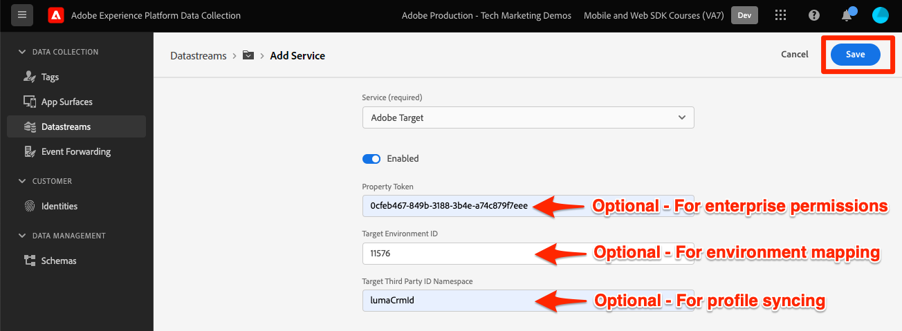
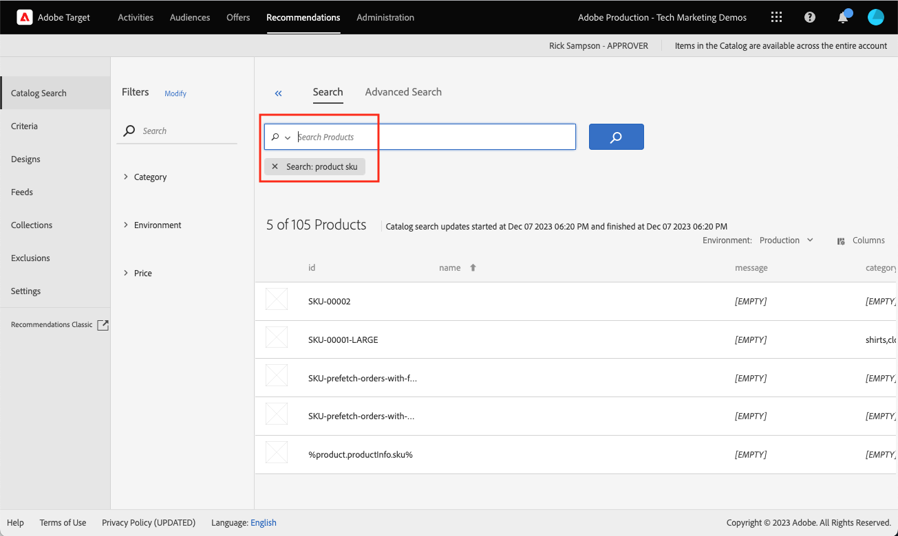
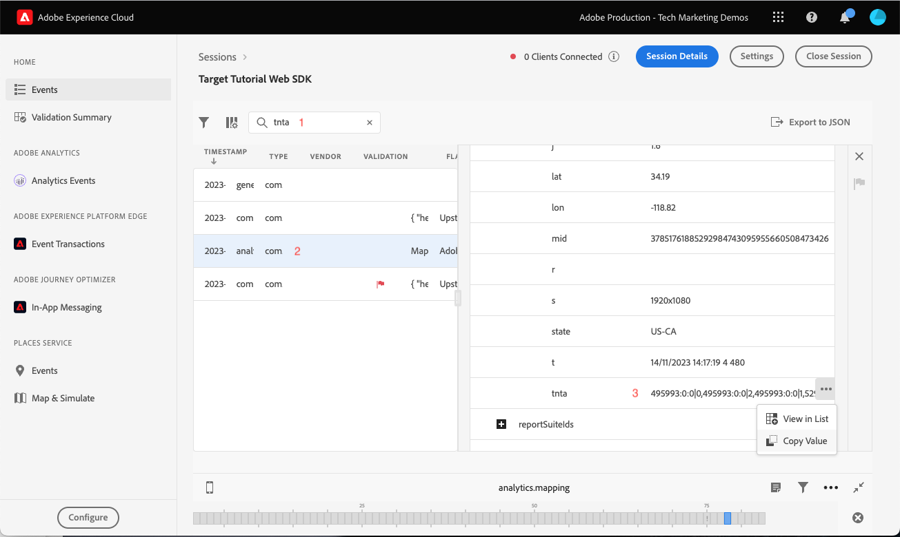

# Configurar o Adobe Target com o SDK da Web da plataforma

Saiba como implementar o Adobe Target usando o SDK da web da Adobe Experience Platform. Saiba como fornecer experiências e transmitir parâmetros adicionais para o Target.

[Adobe Target](https://experienceleague.adobe.com/en/docs/target/using/target-home) O é o aplicativo da Adobe Experience Cloud que oferece tudo o que você precisa para ajustar e personalizar a experiência do cliente e maximizar a receita em sites da Web e móveis, aplicativos e outros canais digitais.


## Objetivos de aprendizagem

No final desta lição, você poderá fazer o seguinte com uma implementação do SDK da Web do Target:

* Adicionar o trecho pré-ocultação para evitar cintilação
* Configurar um fluxo de dados para habilitar a funcionalidade do Target
* Renderizar atividades do visual experience composer
* Renderizar atividades do compositor de formulários
* Envio de dados XDM para o Target e compreensão do mapeamento para parâmetros do Target
* Enviar dados personalizados para o Target, como parâmetros de perfil e entidade
* Validar uma implementação do Target
* Separar solicitações de personalização de solicitações de análise

>[!TIP]
>
>Consulte nossa [Migração do Target da at.js 2.x para o SDK da Web da plataforma](/help/tutorial-migrate-target-websdk/introduction.md) tutorial para um guia passo a passo para migrar sua implementação at.js existente.


## Pré-requisitos

Para concluir as lições desta seção, primeiro você deve:

* Completar todas as lições para a configuração inicial do SDK da Web da Platform, incluindo a configuração de elementos de dados e regras.
* Certifique-se de que você tenha uma [Função de Editor ou Aprovador](https://experienceleague.adobe.com/en/docs/target/using/administer/manage-users/enterprise/properties-overview#section_8C425E43E5DD4111BBFC734A2B7ABC80) no Adobe Target.
* Instale o [Extensão auxiliar do Visual Experience Composer](https://experienceleague.adobe.com/en/docs/target/using/experiences/vec/troubleshoot-composer/vec-helper-browser-extension) se estiver usando o navegador Google Chrome.
* Saber como configurar atividades no Target. Se você precisar de uma atualização, os seguintes tutoriais e guias serão úteis para esta lição:
   * [Usar a extensão auxiliar do Visual Experience Composer (VEC)](https://experienceleague.adobe.com/en/docs/target/using/experiences/vec/troubleshoot-composer/vec-helper-browser-extension)
   * [Usar o Visual Experience Composer](https://experienceleague.adobe.com/en/docs/target-learn/tutorials/experiences/use-the-visual-experience-composer)
   * [Usar o Experience Composer baseado em formulário](https://experienceleague.adobe.com/en/docs/target-learn/tutorials/experiences/use-the-form-based-experience-composer)
   * [Criar atividades de direcionamento de experiência](https://experienceleague.adobe.com/en/docs/target-learn/tutorials/activities/create-experience-targeting-activities)

## Adicionar tratamento de cintilação

Antes de iniciar, determine se é necessária uma solução extra de tratamento de cintilação, dependendo de como a biblioteca de tags é carregada.

>[!NOTE]
>
>Este tutorial usa o [Site Luma](https://luma.enablementadobe.com/content/luma/us/en.html){target=_blank}, que tem uma implementação assíncrona de tags e mitigação de cintilação em vigor. Esta seção é para referência para entender como a mitigação de cintilação funciona com o SDK da Web da Platform.


### Implementação assíncrona

Quando uma biblioteca de tags é carregada de forma assíncrona, a página pode terminar a renderização antes que o Target substitua o conteúdo padrão pelo conteúdo personalizado. Esse comportamento pode levar ao que é conhecido como &quot;oscilação&quot;, onde o conteúdo padrão é exibido brevemente antes de ser substituído pelo conteúdo personalizado. Caso deseje evitar essa oscilação, o Adobe recomenda adicionar um trecho especial de pré-ocultação imediatamente antes do código incorporado da tag assíncrona.

Este trecho já está presente no site Luma, mas vamos examinar mais de perto para entender o que esse código faz:

```html
<script>
  !function(e,a,n,t){var i=e.head;if(i){
  if (a) return;
  var o=e.createElement("style");
  o.id="alloy-prehiding",o.innerText=n,i.appendChild(o),setTimeout(function(){o.parentNode&&o.parentNode.removeChild(o)},t)}}
  (document, document.location.href.indexOf("adobe_authoring_enabled") !== -1, ".personalization-container { opacity: 0 !important }", 3000);
</script>
```

O trecho pré-ocultação cria uma tag de estilo no cabeçalho da página com a definição CSS de sua escolha. Essa tag de estilo é removida quando uma resposta do Target é recebida ou o tempo limite é atingido.

O comportamento de pré-ocultação é controlado por duas configurações no final do trecho.

* `body { opacity: 0 !important }` especifica a definição de CSS a ser usada para a pré-ocultação até o Target ser carregado. Por padrão, a página inteira fica oculta. É possível atualizar essa definição para os seletores que deseja pré-ocultar junto com a forma como deseja ocultá-los. Você pode incluir várias definições, pois esse valor é simplesmente o que está inserido na tag de estilo de pré-ocultação. Se você tiver um elemento de contêiner de fácil identificação que abranja o conteúdo abaixo de sua navegação, poderá usar essa configuração para limitar a pré-ocultação a esse elemento do contêiner.
* `3000` especifica o tempo limite em milissegundos para a pré-ocultação. Se uma resposta do Target não for recebida antes do tempo limite, a tag de estilo de pré-ocultação será removida. Atingir esse tempo limite deve ser raro.

>[!NOTE]
>
>O trecho pré-ocultação do SDK da Web da Platform é um pouco diferente do usado com a biblioteca at.js do Target. Certifique-se de usar o trecho correto para o SDK da Web da plataforma, pois ele usa uma ID de estilo diferente de `alloy-prehiding`. Se o trecho de pré-ocultação da at.js for usado, talvez ele não funcione corretamente.

O trecho de pré-ocultação também está disponível nas tags:

1. Vá para a **[!UICONTROL Extensões]** seção de tags
1. Selecionar **[!UICONTROL Configurar]** para a extensão SDK da Web da Adobe Experience Platform
1. Selecione o **[!UICONTROL Copiar trecho oculto previamente na área de transferência]** botão

   

   >[!NOTE]
   >
   >O trecho pré-ocultação padrão copiado da extensão SDK da Web da Platform pode incluir uma definição CSS que não existe no site, como `.personalization-container { opacity: 0 !important }`. Verifique e modifique o trecho pré-ocultação apropriadamente para o seu site.

### Implementação síncrona

O Adobe recomenda implementar tags de forma assíncrona, conforme demonstrado no site Luma. No entanto, se a biblioteca de tags for carregada de forma síncrona, o trecho pré-ocultação não será necessário. Em vez disso, o estilo de pré-ocultação é especificado nas configurações de extensão do SDK da Web da Platform.

O estilo de pré-ocultação para implementações síncronas pode ser configurado da seguinte maneira:

1. Vá para a **[!UICONTROL Extensões]** seção de tags
1. Selecione o **[!UICONTROL Configurar]** botão para a extensão SDK da Web da plataforma
1. Selecione o **[!UICONTROL Editar estilo de pré-ocultação]** botão

   

1. Modifique o CSS para incluir os seletores e ocultar os métodos que gostaria de usar, por exemplo: `body { opacity: 0 !important }` se quiser pré-ocultar todo o corpo da página.
1. Salvar as alterações e criar em uma biblioteca

>[!NOTE]
>
>A configuração de estilo de pré-ocultação deve ser usada somente para implementações síncronas. Esse estilo deve estar em branco ou ser comentado se estiver usando uma implementação assíncrona de tags.

Para saber mais sobre como o SDK da Web da Platform pode gerenciar a cintilação, consulte a seção do guia: [gerenciamento de cintilação para experiências personalizadas](https://experienceleague.adobe.com/en/docs/experience-platform/edge/personalization/manage-flicker).


## Configurar o fluxo de dados

O Target deve ser ativado na configuração da sequência de dados para que qualquer atividade do Target possa ser entregue pelo SDK da Web da plataforma.

Para configurar o Target na sequência de dados:

1. Vá para a [Coleta de dados](https://experience.adobe.com/#/data-collection){target="blank"} interface
1. Na navegação à esquerda, selecione **[!UICONTROL Datastreams]**
1. Selecione o criado anteriormente `Luma Web SDK: Development Environment` sequência de dados

   

1. Selecionar **[!UICONTROL Adicionar serviço]**
   
1. Selecionar **[!UICONTROL Adobe Target]** como o **[!UICONTROL Serviço]**
1. Insira os detalhes opcionais sobre a implementação do Target, se desejado, seguindo as orientações abaixo.
1. Selecionar **[!UICONTROL Salvar]**

   

### Token de propriedade

Os clientes do Target Premium têm a opção de gerenciar permissões de usuário com propriedades. As propriedades do Target permitem que você estabeleça limites em torno de onde os usuários podem executar atividades do Target. Consulte a [Permissões empresariais](https://experienceleague.adobe.com/en/docs/target/using/administer/manage-users/enterprise/properties-overview) seção da documentação do Target para obter mais detalhes.

Para configurar ou localizar tokens de propriedade, navegue até **Adobe Target** > **[!UICONTROL Administração]** > **[!UICONTROL Propriedades]**. A variável `</>` O ícone exibe o código de implementação. A variável `at_property` value é o token de propriedade que você usaria no fluxo de dados.


<a id="advanced-pto"></a>

Somente um token de propriedade pode ser especificado por sequência de dados, mas as substituições de token de propriedade permitem que você especifique tokens de propriedade alternativos para substituir o token de propriedade primária definido na sequência de dados. Uma atualização do `sendEvent` também é necessária uma ação para substituir a sequência de dados.


### ID do ambiente de destino

[Ambientes](https://experienceleague.adobe.com/en/docs/target/using/administer/environments) no Target ajudam a gerenciar a implementação em todos os estágios de desenvolvimento. Essa configuração opcional especifica qual ambiente do Target você usará com cada fluxo de dados.

A Adobe recomenda definir a ID de ambiente do Target de forma diferente para cada um dos fluxos de dados de desenvolvimento, preparo e produção para simplificar as coisas. Como alternativa, você pode organizar seus ambientes na interface do Target usando o [hosts](https://experienceleague.adobe.com/en/docs/target/using/administer/hosts) recurso.

Para configurar ou localizar IDs de ambiente, navegue até **Adobe Target** > **[!UICONTROL Administração]** > **[!UICONTROL Ambientes]**.


>[!NOTE]
>
>Se nenhuma ID de ambiente de destino for especificada, o ambiente de produção do Target será considerado.

### Namespace de ID de terceiros do Target

Essa configuração opcional permite especificar qual símbolo de identidade usar para a ID de terceiros do Target. O Target só oferece suporte à sincronização de perfis em um único símbolo de identidade ou namespace. Para obter mais informações, consulte a [sincronização de perfil em tempo real para mbox3rdPartyId](https://experienceleague.adobe.com/en/docs/target/using/audiences/visitor-profiles/3rd-party-id) seção do guia do Target.

Os Símbolos de identidade são encontrados na lista de identidades em **Coleta de dados** > **[!UICONTROL Cliente]** > **[!UICONTROL Identidades]**.


Para os propósitos deste tutorial usando o site Luma, use o Símbolo de identidade `lumaCrmId` configurar durante a lição sobre [Identidades](configure-identities.md).


## Renderizar decisões de personalização visual

As decisões de personalização visual se referem às experiências criadas no Visual Experience Composer do Adobe Target. Primeiro, você deve entender a terminologia usada nas interfaces do Target e das tags:

* **Atividade**: um conjunto de experiências direcionadas para um ou mais públicos. Por exemplo, um teste A/B simples pode ser uma atividade com duas experiências.
* **Experiência**: um conjunto de ações direcionadas a um ou mais locais ou escopos de decisão.
* **Escopo da decisão**: um local onde uma experiência do Target é entregue. Os escopos de decisão são equivalentes às &quot;mboxes&quot; se você estiver familiarizado com o uso de versões mais antigas do Target.
* **Decisão da Personalization**: uma ação que o servidor determina que deve ser aplicada. Essas decisões podem ser baseadas nos critérios de público-alvo e na priorização de atividades do Target.
* **Apresentação**: o resultado das decisões tomadas pelo servidor, que são entregues na resposta do SDK da Web da plataforma. Por exemplo, trocar uma imagem de banner seria uma proposta.

### Atualize o [!UICONTROL Enviar evento] ação

As decisões de personalização visual do Target são entregues pelo SDK da Web da plataforma, se o Target estiver ativado na sequência de dados. No entanto, _eles não são renderizados automaticamente_. Você deve atualizar o [!UICONTROL Enviar evento] ação para ativar a renderização automática.

1. No [Coleta de dados](https://experience.adobe.com/#/data-collection){target="blank"} abra a propriedade de tag que você está usando para este tutorial
1. Abra o `all pages - library loaded - send event - 50` regra
1. Selecione o `Adobe Experience Platform Web SDK - Send event` ação
1. Ativar **[!UICONTROL Renderizar decisões de personalização visual]** com a caixa de seleção

   

<!--
1. In the **[!UICONTROL Datastream configuration overrides**] the **[!UICONTROL Target Property Token]** can be overridden either as a static value or with a data element. Only property tokens defined in the [**Advanced Property Token Overrides**](#advanced-pto) section in **Datastream Configuration** will return results.
   
   
   -->

1. Salve as alterações e crie na biblioteca

A configuração de renderizar decisões de personalização visual faz com que o SDK da Web da Platform aplique automaticamente quaisquer modificações que tenham sido especificadas usando o Visual Experience Composer do Target ou &quot;mbox global&quot;.

>[!NOTE]
>
>Normalmente, a variável [!UICONTROL Renderizar decisões de personalização visual] A configuração só deve ser ativada para uma única ação Enviar evento por carregamento de página completo. Se várias ações Enviar evento tiverem essa configuração ativada, as solicitações de renderização subsequentes serão ignoradas.

Se preferir renderizar ou executar ações nessas decisões usando o código personalizado, você pode deixar a opção [!UICONTROL Renderizar decisões de personalização visual] configuração desativada. O SDK da Web da Platform é flexível e fornece esse recurso para fornecer controle total. Consulte o guia para obter mais informações sobre [renderização manual do conteúdo personalizado](https://experienceleague.adobe.com/en/docs/experience-platform/edge/personalization/rendering-personalization-content).


### Configurar uma atividade do Target com o Visual Experience Composer

Agora que a parte de implementação básica foi concluída, crie uma atividade de Direcionamento de experiência (XT) no Target para validar se tudo está funcionando corretamente. Você pode consultar o tutorial do Target para [criação de atividades de Direcionamento de experiência](https://experienceleague.adobe.com/en/docs/target-learn/tutorials/activities/create-experience-targeting-activities) se precisar de assistência.

>[!NOTE]
>
>Se estiver usando o Google Chrome como navegador, a variável [Extensão de ajuda do Visual Experience Composer (VEC)](https://experienceleague.adobe.com/en/docs/target/using/experiences/vec/troubleshoot-composer/vec-helper-browser-extension) O é necessário para carregar o site corretamente para edição no VEC.

1. Navegar até a interface do Adobe Target
1. Crie uma atividade de Direcionamento de experiência (XT) usando a página inicial do Luma para o URL da atividade

   

1. Modifique a página, por exemplo, altere o texto no banner principal da página inicial.  Quando terminar, selecione **[!UICONTROL Salvar]** depois **[!UICONTROL Próxima]**.

   

1. Atualize o nome do evento e selecione **[!UICONTROL Próxima]**.

   

1. Escolha Adobe Analytics como fonte de relatórios com o conjunto de relatórios apropriado e a métrica Pedidos como meta

   

   >[!NOTE]
   >
   >Se você não usar o Adobe Analytics, selecione Target como origem de relatório e escolha uma métrica diferente como **Engajamento > Exibições de página** em vez disso. Uma métrica de meta é necessária para salvar e visualizar a atividade.

1. Salvar a atividade
1. Se você estiver confortável com as alterações, será possível ativar a atividade. Caso contrário, se quiser visualizar a experiência sem ativá-la, copie a variável [URL de visualização de garantia da qualidade](https://experienceleague.adobe.com/en/docs/target/using/activities/activity-qa/activity-qa).
1. Carregue a página inicial do Luma e você deverá ver suas alterações aplicadas
1. Após algumas horas, você poderá ver os dados e as conversões da atividade do Target no Adobe Analytics. Consulte o Guia do Target para obter informações detalhadas sobre [Relatórios do Analytics for Target (A4T)](https://experienceleague.adobe.com/en/docs/target/using/integrate/a4t/reporting).


### Validar com o Debugger

Se você configurar uma atividade, verá seu conteúdo renderizado na página. No entanto, mesmo se nenhuma atividade estiver ativa, você também pode examinar a chamada de rede Enviar evento para confirmar se o Target está configurado corretamente.

>[!CAUTION]
>
>Se estiver usando o Google Chrome e tiver o [Extensão de ajuda do Visual Experience Composer (VEC)](https://experienceleague.adobe.com/en/docs/target/using/experiences/vec/troubleshoot-composer/vec-helper-browser-extension) instalado, verifique se **Inserir bibliotecas do Target** está desabilitada. Ativar essa configuração resultará em solicitações adicionais do Target.

1. Abra a extensão do navegador Adobe Experience Platform Debugger
1. Vá para a [Site de demonstração Luma](https://luma.enablementadobe.com/content/luma/us/en.html) e use o depurador para [alterne a propriedade da tag no site para sua própria propriedade de desenvolvimento](validate-with-debugger.md#use-the-experience-platform-debugger-to-map-to-your-tags-property)
1. Recarregar a página
1. Selecione o **[!UICONTROL Rede]** ferramenta no depurador
1. Filtrar por **[!UICONTROL Experience Platform Web SDK]**
1. Selecionar o valor na linha de eventos para a primeira chamada

   

1. Observe que há chaves em `query` > `personalization` e  `decisionScopes` tem um valor de `__view__`. Este escopo é equivalente ao `target-global-mbox`. Esta chamada do SDK da Web da Platform solicitou decisões do Target.

   

1. Feche a sobreposição e selecione os detalhes do evento para a segunda chamada de rede. Esta chamada só estará presente se o Target retornar uma atividade.
1. Observe que há detalhes sobre a atividade e a experiência retornadas do Target. Essa chamada de SDK da Web da Platform envia uma notificação de que uma atividade do Target foi renderizada para o usuário e aumenta uma impressão.

   

## Configurar e renderizar um escopo de decisão personalizado

Escopos de decisão personalizados (conhecidos formalmente como &quot;mboxes&quot;) podem ser usados para fornecer conteúdo em HTML ou JSON de maneira estruturada usando o Experience Composer baseado em formulário do Target. O conteúdo entregue a um desses escopos personalizados não é renderizado automaticamente pelo SDK da Web da Platform. Ele pode ser renderizado usando uma ação em Tags.

### Adicione um escopo à [!UICONTROL Enviar ação de evento]

Modifique sua regra de carregamento de página para adicionar um escopo de decisão personalizado:

1. Abra o `all pages - library loaded - send event - 50` regra
1. Selecione o `Adobe Experience Platform Web SDK - Send Event` ação
1. Adicione um ou mais escopos que deseja usar. Neste exemplo, use `homepage-hero`.

   

1. Salve as alterações e crie na biblioteca

>[!TIP]
>
>Neste tutorial, você usará um único escopo definido manualmente para fins de demonstração. Se você decidir usar vários escopos de decisão destinados a páginas específicas, considere usar um elemento de dados que retorne uma matriz de escopos condicionalmente, dependendo do caminho da página. Essa abordagem ajuda a manter sua implementação simples e escalável.

### Processar a resposta do Target

Agora que você configurou o SDK da Web da Platform para solicitar conteúdo para o `homepage-hero` escopo, você deve fazer algo com a resposta. A extensão de tag do SDK da Web da Platform fornece uma [!UICONTROL Enviar evento concluído] evento, que pode ser usado para acionar imediatamente uma nova regra quando uma resposta de um [!UICONTROL Enviar evento] ação for recebida.

1. Crie uma regra chamada `homepage - send event complete - render homepage-hero`.
1. Adicione um evento à regra. Use o **Adobe Experience Platform Web SDK** e a extensão **[!UICONTROL Enviar evento concluído]** tipo de evento.
1. Adicione uma condição para restringir a regra à página inicial do Luma (caminho sem string de consulta igual a `/content/luma/us/en.html`).
1. Adicione uma ação à regra. Use o **Adobe Experience Platform Web SDK** extensão e **Aplicar apresentações** tipo de ação.

   

   >[!TIP]
   >
   >Dê nomes descritivos aos eventos, condições e ações da regra em vez de usar os nomes padrão. Nomes robustos de componentes de regras tornam os resultados da pesquisa muito mais úteis.

1. Enter `%event.propositions%` no campo Propostas, à medida que usamos o evento &quot;Enviar evento concluído&quot; como acionador dessa regra.
1. Na seção &quot;proposition metadata&quot;, selecione a variável **[!UICONTROL Usar um formulário]**
1. Para o **[!UICONTROL Escopo]** entrada de campo `homepage-hero`
1. Para o **[!UICONTROL Seletor]** entrada de campo `div.heroimage`
1. Para **[!UICONTROL Tipo de ação]** selecionar **[!UICONTROL Definir HTML]**
1. Selecionar **[!UICONTROL Manter alterações]**

   

   Além de renderizar a atividade, você deve fazer uma chamada adicional para o Target para indicar que a atividade baseada em formulário foi renderizada:

1. Adicione outra ação à regra. Use o **Núcleo** e a extensão **[!UICONTROL Código personalizado]** tipo de ação:
1. Cole o seguinte código JavaScript:

   ```javascript
   var propositions = event.propositions;
   var heroProposition;
   if (propositions) {
      // Find the hero proposition, if it exists.
      for (var i = 0; i < propositions.length; i++) {
         var proposition = propositions[i];
         if (proposition.scope === "homepage-hero") {
            heroProposition = proposition;
            break;
         }xw
      }
   }
   // Send a "display" event
   if (heroProposition !== undefined){
      alloy("sendEvent", {
         xdm: {
            eventType: "display",
            _experience: {
               decisioning: {
                  propositions: [{
                     id: heroProposition.id,
                     scope: heroProposition.scope,
                     scopeDetails: heroProposition.scopeDetails
                  }]
               }
            }
         }
      });
   }
   ```

   

1. Selecionar **[!UICONTROL Manter alterações]**

1. Salve as alterações e crie na biblioteca
1. Carregue a página inicial do Luma algumas vezes, o que deve ser suficiente para criar a nova `homepage-hero` registro de escopo de decisão na interface do Target.


### Configurar uma atividade do Target com o Experience Composer baseado em formulário

Agora que você tem uma regra para renderizar manualmente um escopo de decisão personalizado, pode criar outra atividade de Direcionamento de experiência (XT) no Target. Desta vez, use o Experience Composer baseado em formulário.

1. Abertura [Adobe Target](https://experience.adobe.com/target)
1. Desativar a atividade usada para a lição anterior
1. Crie uma atividade de Direcionamento de experiência (XT) usando a opção Experience Composer baseado em formulário

   

1. Selecione o **`homepage-hero`** localização no menu suspenso de localização e **[!UICONTROL Criar oferta de HTML]** na lista suspensa de conteúdo. Se a localização não estiver disponível, você poderá digitá-la. O Target preenche periodicamente novos nomes de locais depois de receber solicitações para esse local ou escopo.

   

1. Cole o código a seguir na caixa de conteúdo. Este código é um banner principal básico com uma imagem de fundo diferente:

   ```html
   <div class="we-HeroImage jumbotron" style="background-image: url('/content/luma/us/en/women/_jcr_content/root/hero_image.coreimg.jpeg');">
      <div class="container cq-dd-image">
         <div class="we-HeroImage-wrapper">
            <p class="h3">New Luma Yoga Collection</p>
            <strong class="we-HeroImage-title h1">Be active with style&nbsp;</strong>
            <p>
               <a class="btn btn-primary btn-action" href="/content/luma/us/en/products.html" role="button">Shop Now</a>
            </p>
         </div>
      </div>
   </div>
   ```

1. No [!UICONTROL Metas e configurações] escolha Adobe Target como fonte de geração de relatórios e [!UICONTROL Envolvimento] > [!UICONTROL Exibições de página] como meta
1. Salvar a atividade
1. Se você estiver confortável com as alterações, será possível ativar a atividade. Caso contrário, se quiser visualizar a experiência sem ativá-la, copie a variável [URL de visualização de garantia da qualidade](https://experienceleague.adobe.com/en/docs/target/using/activities/activity-qa/activity-qa).
1. Carregue a página inicial do Luma e você deverá ver suas alterações aplicadas

>[!NOTE]
>
>A meta de conversão &quot;Clicou na mbox&quot; não funciona automaticamente. Como o SDK da Web da Platform não renderiza automaticamente escopos personalizados, ele não rastreia cliques em locais escolhidos para aplicar o conteúdo. Você pode criar seu próprio rastreamento de cliques para cada escopo usando a variável &quot;click&quot; `eventType` com o aplicável `_experience` detalhes usando o `sendEvent` ação.

### Validar com o Debugger

Se você ativou sua atividade, deve ver a renderização do conteúdo na página. No entanto, mesmo se nenhuma atividade estiver ativa, você também poderá observar o [!UICONTROL Enviar evento] chamada de rede para confirmar se o Target está solicitando conteúdo para seus escopos personalizados.

1. Abra a extensão do navegador do Adobe Experience Platform Debugger
1. Vá para a [Site de demonstração Luma](https://luma.enablementadobe.com/content/luma/us/en.html) e use o depurador para [alterne a propriedade da tag no site para sua própria propriedade de desenvolvimento](validate-with-debugger.md#use-the-experience-platform-debugger-to-map-to-your-tags-property)
1. Recarregar a página
1. Selecione o **[!UICONTROL Rede]** no Debugger
1. Filtrar por **[!UICONTROL Adobe Experience Platform Web SDK]**
1. Selecionar o valor na linha de eventos para a primeira chamada

   

1. Observe que há chaves em `query` > `personalization` e  `decisionScopes` tem um valor de `__view__` como antes, mas agora também há um `homepage-hero` escopo incluído. Esta chamada de SDK da Web da Platform solicitou decisões do Target para alterações feitas usando o VEC e a interface `homepage-hero` localização.

   

1. Feche a sobreposição e selecione os detalhes do evento para a segunda chamada de rede. Esta chamada só estará presente se o Target retornar uma atividade.
1. Observe que há detalhes sobre a atividade e a experiência retornadas do Target. Essa chamada de SDK da Web da Platform envia uma notificação de que uma atividade do Target foi renderizada para o usuário e aumenta uma impressão. Ela foi iniciada pela ação de código personalizado que você adicionou anteriormente.

   

## Enviar parâmetros para o Target

Nesta seção, você passará dados específicos do Target e examinará em mais detalhes como os dados XDM são mapeados para parâmetros do Target.

### Parâmetros de página (mbox) e XDM

Todos os campos XDM são automaticamente passados para o Target como [parâmetros de página](https://experienceleague.adobe.com/en/docs/target-dev/developer/implementation/methods/page-parameters) ou mbox.

Alguns desses campos XDM serão mapeados para objetos especiais no back-end do Target. Por exemplo, `web.webPageDetails.URL` estarão automaticamente disponíveis para criar condições de direcionamento baseadas em URL ou conforme `page.url` ao criar scripts de perfil.

Você também pode adicionar parâmetros de página usando o objeto de dados.

### Parâmetros especiais e o objeto de dados

Há alguns pontos de dados que podem ser úteis para o Target que não são mapeados a partir do objeto XDM. Estes parâmetros especiais do Target incluem:

* [Atributos do perfil](https://experienceleague.adobe.com/en/docs/target-dev/developer/implementation/methods/in-page-profile-attributes)
* [Atributos de entidade do Recommendations](https://experienceleague.adobe.com/en/docs/target/using/recommendations/entities/entity-attributes)
* [Parâmetros reservados do Recommendations](https://experienceleague.adobe.com/en/docs/target/using/recommendations/plan-implement#pass-behavioral)
* Valores de categoria para [afinidade de categorias](https://experienceleague.adobe.com/en/docs/target/using/audiences/visitor-profiles/category-affinity)

Esses parâmetros devem ser enviados no `data` em vez de na variável `xdm` objeto. Além disso, os parâmetros de página (ou mbox) também podem ser incluídos na `data` objeto.

Para preencher o objeto de dados, crie o seguinte elemento de dados, reutilizando elementos de dados criados na [Criar elementos de dados](create-data-elements.md) lição:

* **`data.content`** usando o seguinte código personalizado:

  ```javascript
  var data = {
     __adobe: {
        target: {
           "entity.id": _satellite.getVar("product.productInfo.sku"),
           "entity.name": _satellite.getVar("product.productInfo.title"),
           "profile.loggedIn": _satellite.getVar("user.profile.attributes.loggedIn"),
           "user.categoryId": _satellite.getVar("product.category")
        }
     }
  }
  return data;
  ```


### Atualizar a regra de carregamento da página

Transmitir dados adicionais para o Target fora do objeto XDM requer a atualização de todas as regras aplicáveis. Para este exemplo, a única modificação que você deve fazer é incluir o novo **data.content** elemento de dados para a regra de carregamento de página genérica e a regra de exibição de página do produto.

1. Abra o `all pages - library loaded - send event - 50` regra
1. Selecione o `Adobe Experience Platform Web SDK - Send event` ação
1. Adicione o `data.content` elemento de dados para o campo Dados

   

1. Salve as alterações e crie na biblioteca

>[!NOTE]
>
>O exemplo acima usa um `data` objeto que não está completamente preenchido em todos os tipos de página. As tags lidam adequadamente com essa situação e omitem chaves com valor indefinido. Por exemplo, `entity.id` e `entity.name` não seriam repassadas em nenhuma página além dos detalhes do produto.


## Divisão de solicitações do Personalization e do Analytics

A camada de dados no site Luma é completamente definida antes do código incorporado das tags. Isso nos permite usar uma única chamada para buscar conteúdo personalizado (por exemplo, do Adobe Target) e enviar dados de análise (por exemplo, para o Adobe Analytics).

No entanto, em muitos sites, a camada de dados não pode ser carregada com antecedência suficiente ou rapidez suficiente para usar uma única chamada para ambos os aplicativos. Nessas situações, você pode usar dois [!UICONTROL Enviar evento] as ações do em uma única página carregam e usam a primeira para personalização e a segunda para o analytics. Separar os eventos dessa maneira permite que o evento de personalização seja acionado o mais rápido possível, enquanto aguarda que a camada de dados seja carregada completamente antes de enviar o evento do Analytics. É semelhante a muitas implementações pré-SDK da Web, em que o Adobe Target acionaria o `target-global-mbox` na parte superior da página, e o Adobe Analytics acionaria o `s.t()` chamar na parte inferior da página

Para criar a solicitação de personalização integrada:

1. Abra o `all pages - library loaded - send event - 50` regra
1. Abra o **Enviar evento** ação
1. Selecionar **[!UICONTROL Usar eventos guiados]** e selecione **[!UICONTROL Solicitar personalização]**
1. Isso bloqueia a **Tipo** as **[!UICONTROL Busca de apresentação de decisão]**

   

Para criar a solicitação do Analytics na parte inferior:

1. Crie uma nova regra chamada `all pages - page bottom - send event - 50`
1. Adicione um evento à regra. Use o **Núcleo** e a extensão **[!UICONTROL Page Bottom]** tipo de evento
1. Adicione uma ação à regra. Use o **Adobe Experience Platform Web SDK** extensão e **Enviar evento** tipo de ação
1. Selecionar **[!UICONTROL Usar eventos guiados]** e selecione **[!UICONTROL Coletar análises]**
1. Isso bloqueia a **[!UICONTROL Incluir notificações de exibição pendentes]** caixa de seleção marcada para que a notificação de exibição em fila da solicitação de decisão seja enviada.


>[!TIP]
>
>Se o evento para o qual você está buscando uma Proposta de decisão não tiver um evento do Adobe Analytics seguindo, use o **Estilo de evento guiado** **[!UICONTROL Não guiado - mostrar todos os campos]**. É necessário selecionar todas as opções manualmente, mas isso desbloqueia a opção para **[!UICONTROL enviar automaticamente uma notificação de exibição]** junto com a solicitação de busca.


### Validar com o Debugger

Agora que as regras foram atualizadas, é possível validar se os dados estão sendo transmitidos corretamente usando o Adobe Debugger.

1. Navegue até a [Site de demonstração Luma](https://luma.enablementadobe.com/content/luma/us/en.html) e faça logon com o email `test@adobe.com` e senha `test`
1. Navegar até a página de detalhes do produto
1. Abra a extensão do navegador do Adobe Experience Platform Debugger e [alterne a propriedade da tag para sua própria propriedade de desenvolvimento](validate-with-debugger.md#use-the-experience-platform-debugger-to-map-to-your-tags-property)
1. Recarregar a página
1. Selecione o **Rede** no Debugger e filtrar por **Adobe Experience Platform Web SDK**
1. Selecionar o valor na linha de eventos para a primeira chamada
1. Observe que há chaves em `data` > `__adobe` > `target` e são preenchidos com informações sobre o produto, a categoria e o estado de logon.

   

### Validar na interface do Target

Em seguida, examine a interface do Target para confirmar se os dados foram recebidos e estão disponíveis para uso em públicos-alvo e atividades. Os dados do XDM são mapeados automaticamente para parâmetros do Target personalizados. Você pode validar se os dados XDM foram recebidos pelo Target e estão disponíveis ao criar um público-alvo.

1. Abertura [Adobe Target](https://experience.adobe.com/target)
1. Navegue até a **[!UICONTROL Públicos-alvo]** seção
1. Crie um público-alvo e escolha o **[!UICONTROL Personalizado]** tipo de atributo
1. Pesquise o **[!UICONTROL Parâmetro]** campo para `web`. O menu suspenso deve ser preenchido com todos os campos XDM relacionados aos detalhes da página da Web.

   

Em seguida, valide se o atributo de perfil de estado de logon foi passado com êxito.

1. Escolha o **[!UICONTROL Perfil do visitante]** tipo de atributo
2. Pesquisar por `loggedIn`. Se o atributo estiver disponível no menu suspenso, o atributo foi passado corretamente para o Target. Novos atributos podem levar vários minutos para serem disponibilizados na interface do usuário do Target.

   

Se você tiver o Target Premium, também poderá validar se os dados da entidade foram passados corretamente e se os dados do produto foram gravados no catálogo de produtos da Recommendations.

1. Navegue até a **[!UICONTROL Recommendations]** seção
1. Selecionar **[!UICONTROL Pesquisa no catálogo]** no lado esquerdo da navegação
1. Procure o SKU do produto ou o nome do produto que você visitou anteriormente no site Luma. O produto deve ser exibido no catálogo de produtos. Os novos produtos podem levar vários minutos para serem pesquisados no catálogo de produtos da Recommendations.

   

### Validar com garantia

Além disso, você pode usar o Assurance onde for apropriado para confirmar se as solicitações de decisão do Target estão obtendo os dados corretos e se qualquer transformação do lado do servidor está ocorrendo corretamente. Você também pode confirmar se as informações de campanha e experiência estão contidas nas chamadas do Adobe Analytics, mesmo quando as chamadas de decisão e do Adobe Analytics do Target são enviadas separadamente.

1. Abertura [Assurance](https://experience.adobe.com/assurance)
1. Inicie uma nova sessão de garantia, insira o **[!UICONTROL nome da sessão]** e insira o **[!UICONTROL url base]** para o seu site ou qualquer outra página que você estiver testando
1. Clique em **[!UICONTROL Próxima]**

   

1. Selecione o método de conexão, nesse caso, usaremos **[!UICONTROL copiar link]**
1. Copiar o link e colá-lo em uma nova guia do navegador
1. Clique em **[!UICONTROL Concluído]**

   

1. Depois que a sessão do Assurance for iniciada, você verá os eventos sendo preenchidos na guia Eventos
1. Filtrar por &quot;tnta&quot;
1. Selecione a chamada mais recente e expanda as mensagens para garantir que esteja preenchendo corretamente e observe os valores de &quot;tnta&quot;

   

1. Em seguida, mantenha o filtro &quot;tnta&quot; e selecione o evento analytics.mapping que ocorre após o evento de destino que acabamos de visualizar.
1. Examine o &quot;context.mappedQueryParams.\&lt;yourschemaname>&quot; valor para confirmar se contém um atributo &quot;tnta&quot; com uma cadeia de caracteres concatenada que corresponde aos valores &quot;tnta&quot; encontrados no evento target anterior.

   

Isso confirma que as informações do A4T que estavam na fila para transmissão posterior quando fizemos a chamada do Target Decisioning foram enviadas corretamente quando a chamada de rastreamento do Analytics foi acionada posteriormente na página.

Agora que concluiu esta lição, você deve ter uma implementação funcional do Adobe Target usando o SDK da Web da plataforma.

[Próximo: ](setup-web-channel.md)

>[!NOTE]
>
>Obrigado por investir seu tempo aprendendo sobre o Adobe Experience Platform Web SDK. Se você tiver dúvidas, quiser compartilhar feedback geral ou tiver sugestões sobre conteúdo futuro, compartilhe-as nesta [Publicação de discussão da comunidade do Experience League](https://experienceleaguecommunities.adobe.com/t5/adobe-experience-platform-data/tutorial-discussion-implement-adobe-experience-cloud-with-web/td-p/444996)
