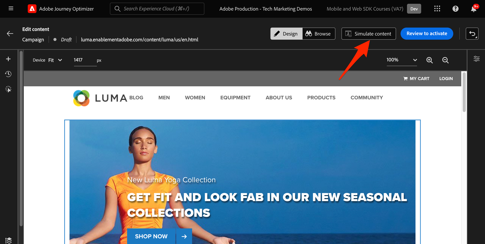

# Configurar o canal da Web do Journey Optimizer com o Web SDK

Saiba como implementar o [canal da Web](https://experienceleague.adobe.com/en/docs/journey-optimizer/using/web/get-started-web) do Adobe Journey Optimizer usando o Adobe Experience Platform Web SDK. Esta lição aborda os pré-requisitos básicos do canal da Web, as etapas detalhadas de configuração e um aprofundamento sobre um caso de uso centrado no status de fidelidade.

Ao seguir esta lição, os usuários do Journey Optimizer estão equipados para usar o canal da Web para personalização online avançada usando o web designer do Journey Optimizer.

## Objetivos de aprendizagem

No final desta lição, você poderá:

* Entenda a função e o significado do Web SDK no fornecimento da experiência de canal da Web.
* Entenda o processo de criação de uma campanha de canal da Web do início ao fim utilizando o caso de uso de amostra do Luma Loyalty Rewards.
* Configure propriedades, ações e agendamentos da campanha na interface.
* Entenda a funcionalidade e os benefícios da extensão Auxiliar de edição visual do Adobe Experience Cloud.
* Saiba como editar o conteúdo da página da Web, incluindo imagens, cabeçalhos e outros elementos, usando o web designer.
* Saiba como inserir ofertas em uma página da Web usando o componente Offer decision.
* Familiarize-se com as práticas recomendadas para garantir a qualidade e o sucesso de uma campanha de canal da Web.

## Pré-requisitos

Para concluir as lições desta seção, primeiro você deve:

* Conclua todas as lições para a configuração inicial do Platform Web SDK, incluindo a configuração de elementos de dados e regras.
* Verifique se a versão da extensão de tags da Adobe Experience Platform Web SDK é 2.16 ou superior.
* Se você estiver usando o web designer da Journey Optimizer para criar sua experiência de canal na Web, verifique se está usando os navegadores Google Chrome ou Microsoft® Edge.
* Além disso, verifique se você baixou e habilitou a [extensão de navegador Auxiliar de edição visual do Adobe Experience Cloud](https://chromewebstore.google.com/detail/adobe-experience-cloud-vi/kgmjjkfjacffaebgpkpcllakjifppnca).
* Verifique se os cookies de terceiros são permitidos em seu navegador. Talvez seja necessário desativar os bloqueadores de anúncios no navegador também.

  >[!CAUTION]
  >
  > No web designer do Journey Optimizer, alguns sites podem não ser abertos de forma confiável devido a um dos seguintes motivos:
  > 
  > 1. O site tem políticas de segurança rigorosas.
  > 1. O site é incorporado em um iframe.
  > 1. O site de controle de qualidade ou preparo do cliente não está acessível externamente (é um site interno).

* Ao criar experiências na Web e incluir conteúdo da biblioteca do Adobe Experience Manager Assets Essentials, é necessário [configurar o subdomínio para publicar este conteúdo](https://experienceleague.adobe.com/en/docs/journey-optimizer/using/web/configure-web-channel/web-delegated-subdomains).
* Se estiver usando o recurso de experimentação de conteúdo, verifique se o conjunto de dados da Web também está incluído na configuração de relatórios.
* Atualmente, há suporte para dois tipos de implementações para habilitar a criação e o delivery de campanhas de canal da Web nas propriedades da Web:
   * Somente no lado do cliente: para modificar seu site, você deve implementar o Adobe Experience Platform Web SDK.
   * Modo híbrido: você pode utilizar a API do Platform Edge Network Server para solicitar personalização no lado do servidor. A resposta da API é então fornecida ao Adobe Experience Platform Web SDK para renderizar modificações no lado do cliente. Para obter mais informações, consulte a documentação da API do Adobe Experience Platform Edge Network Server. Detalhes adicionais e amostras de implementação para o modo híbrido podem ser encontrados nesta publicação do blog.

  >[!NOTE]
  >
  >A implementação somente do lado do servidor não é compatível no momento.

## Terminologia

Primeiro, você deve entender a terminologia usada nas campanhas de canal da Web.

* **Canal da Web**: um meio de comunicação ou entrega de conteúdo pela Web. No contexto deste guia, ele se refere ao mecanismo pelo qual o conteúdo personalizado é entregue aos visitantes do site usando o Platform Web SDK, no Adobe Journey Optimizer.
* **Superfície da Web**: refere-se a uma propriedade da Web identificada por uma URL na qual o conteúdo é entregue. Pode abranger uma ou várias páginas da Web.
* **Journey Optimizer web designer**: uma ferramenta ou interface específica dentro da Journey Optimizer na qual os usuários podem criar suas experiências de canal da Web.
* **Auxiliar de edição visual do Adobe Experience Cloud**: uma extensão de navegador que ajuda a editar visualmente e criar experiências de canal da Web.
* **Sequência de dados**: uma configuração no serviço Adobe Experience Platform que garante que as experiências do canal da Web possam ser entregues.
* **Política de mesclagem**: uma configuração que garante a ativação precisa e a publicação de campanhas de entrada.
* **Público-alvo**: um segmento específico de usuários ou visitantes do site que atendem a determinados critérios.
* **Web Designer**: uma interface ou ferramenta que ajuda a editar visualmente e criar experiências na Web sem mergulhar no código.
* **Editor de expressão**: uma ferramenta no designer da Web que permite aos usuários adicionar personalização ao conteúdo da Web, possivelmente com base em atributos de dados ou outros critérios.
* **Componente do Offer Decision**: um componente no web designer que ajuda a decidir qual oferta é mais adequada para ser exibida a um visitante específico com base na gestão de decisões.
* **Experimento de conteúdo**: um método para testar diferentes variações de conteúdo para descobrir qual tem o melhor desempenho em termos da métrica desejada, como cliques de entrada.
* **Tratamento**: no contexto de experimentos de conteúdo, um tratamento se refere a uma variação específica do conteúdo que está sendo testado em relação a outro.
* **Simulação**: um mecanismo de visualização para visualizar a experiência de canal da Web antes de ativá-la para públicos-alvo ao vivo.

## Configurar o fluxo de dados

Você já adicionou o serviço Adobe Experience Platform ao seu fluxo de dados. Agora é necessário habilitar a opção Adobe Journey Optimizer para fornecer experiências de canal da Web.

Para configurar o Adobe Journey Optimizer na sequência de dados:

1. Vá para a interface [Coleção de Dados](https://experience.adobe.com/#/data-collection){target="blank"}.
1. Na navegação à esquerda, selecione **[!UICONTROL Datastreams]**.
1. Selecione a sequência de dados do Luma Web SDK criada anteriormente.

   

1. Selecione **[!UICONTROL Editar]** no serviço Adobe Experience Platform.

   

1. Marque a caixa **[!UICONTROL Adobe Journey Optimizer]**.

   

1. Selecione **[!UICONTROL Salvar]**.

Isso garante que os eventos de entrada do Journey Optimizer sejam manipulados corretamente pela Adobe Experience Platform Edge Network.

## Configurar a política de mesclagem

Verifique se uma política de mesclagem está definida com a opção **[!UICONTROL Política de mesclagem Ative-On-Edge]** habilitada. Essa opção de política de mesclagem é empregada pelos canais de entrada do Journey Optimizer para garantir a ativação e a publicação precisas de campanhas de entrada na borda.

Para configurar a opção na política de mesclagem:

1. Vá para a página **[!UICONTROL Cliente]** > **[!UICONTROL Perfis]** na interface do Experience Platform ou do Journey Optimizer.
1. Selecione a guia **[!UICONTROL Políticas de mesclagem]**.
1. Selecione sua política (geralmente é melhor usar a política [!UICONTROL Timebased] Padrão) e alterne a opção **[!UICONTROL Política de Mesclagem Ative-On-Edge]** na etapa **[!UICONTROL Configurar]**.

   

## Configurar o conjunto de dados da Web para experimentação de conteúdo

Para usar experimentos de conteúdo em campanhas de canal da Web, você deve garantir que o conjunto de dados da Web usado também seja incluído na configuração dos relatórios. O sistema de relatórios do Journey Optimizer usa o conjunto de dados somente leitura para preencher relatórios de experimentação de conteúdo prontos para uso.

[A adição de conjuntos de dados para os relatórios de experimento de conteúdo está detalhada nesta seção](https://experienceleague.adobe.com/en/docs/journey-optimizer/using/reporting/channel-report/reporting-configuration#add-datasets).

## Visão geral do caso de uso - Recompensas de fidelidade

Nesta lição, um exemplo de caso de uso de Recompensas de fidelidade é usado para detalhar a implementação de uma experiência de canal da Web usando o Web SDK.

Esse caso de uso permite entender melhor como o Journey Optimizer pode ajudar a fornecer as melhores experiências de entrada aos seus clientes, utilizando campanhas do Journey Optimizer e o web designer.

Como este tutorial é destinado aos implementadores, vale a pena observar que esta lição envolve um trabalho de interface substancial no Journey Optimizer. Embora essas tarefas de interface sejam normalmente tratadas por profissionais de marketing, pode ser benéfico para os implementadores obter o insight no processo, mesmo que eles não sejam normalmente responsáveis pela criação da campanha de canal da Web.

### Criar campanha de recompensas de fidelidade

Agora que você assimilou nossos dados de fidelidade de amostra e criou nosso segmento, crie a campanha do canal da Web Loyalty Rewards no Adobe Journey Optimizer.

Para criar a campanha de amostra:

1. Abrir a interface [Journey Optimizer](https://experience.adobe.com/journey-optimizer/home){target="_blank"}

   >[!NOTE]
   >
   > Esquema, conjuntos de dados e públicos-alvo também podem ser criados na interface do Journey Optimizer, pois são construções comuns do Experience Platform.

1. Navegue até **[!UICONTROL Gerenciamento de Jornadas]** > **[!UICONTROL Campanhas]** na navegação à esquerda
1. Clique em **[!UICONTROL Criar campanha]** no canto superior direito.
1. Na seção **[!UICONTROL Properties]**, especifique como deseja executar a campanha. Para o caso de uso do Loyalty Rewards, escolha **Agendado**.

   

1. Na seção **[!UICONTROL Ações]**, escolha o **[!UICONTROL canal da Web]**. Como a **[!UICONTROL superfície da Web]**, selecione a **[!UICONTROL URL da Página]**.

   >[!NOTE]
   >
   >Uma superfície da Web se refere a uma propriedade da Web identificada por um URL em que o conteúdo é entregue. Ele pode corresponder a um único URL de página ou abranger várias páginas, permitindo aplicar modificações em uma ou várias páginas da Web.

1. Escolha a opção de superfície da Web **[!UICONTROL URL da Página]** para implantar a experiência em uma página para esta campanha. Insira a URL da página Luma, `https://luma.enablementadobe.com/content/luma/us/en.html`

1. Depois que a superfície da web for definida, selecione **[!UICONTROL Criar]**.

   

1. Agora, adicione alguns detalhes adicionais à nova campanha de canal da Web. Primeiro, nomeie a campanha. Chame de `Luma Loyalty Rewards – Gold Status`. Opcionalmente, é possível adicionar uma descrição à campanha. Adicione também **[!UICONTROL Tags]** para melhorar a taxonomia geral da campanha.

   

1. Por padrão, a campanha está ativa para todos os visitantes do site. Para os fins deste caso de uso, somente os membros do prêmio gold status devem ver a experiência. Para habilitar isso, clique em **[!UICONTROL Selecionar público-alvo]** e escolha o público-alvo `Luma Loyalty Rewards – Gold Status`.

1. No campo **[!UICONTROL Namespace de identidade]**, selecione o namespace para identificar indivíduos dentro do segmento escolhido. Como você está implantando a campanha no site Luma, é possível escolher o namespace da ECID. Os perfis no público-alvo `Luma Loyalty Rewards – Gold Status` que não têm o namespace ECID entre suas várias identidades não são direcionados pela campanha do canal da Web.

   

1. Agende a campanha para começar na data de hoje usando a opção **[!UICONTROL Início da campanha]** e terminar em uma semana usando a opção **[!UICONTROL Término da campanha]**.

   

>[!NOTE]
>
>Lembre-se de que, para campanhas de canal da Web, a experiência da Web é mostrada quando o visitante abre a página. Portanto, ao contrário de outros tipos de campanhas no Adobe Journey Optimizer, a seção **[!UICONTROL Acionadores de ação]** não é configurável.

### Experimento com conteúdo de recompensas de fidelidade

Se você rolar a tela de volta para cima, na seção **[!UICONTROL Ação]**, poderá criar opcionalmente um experimento para testar qual conteúdo funciona melhor para o público-alvo `Luma Loyalty Rewards – Gold Status`. Vamos criar e testar dois tratamentos como um componente da configuração da campanha.

Para criar o experimento de conteúdo:

1. Clique em **[!UICONTROL Criar experimento]**.

   

1. Escolha primeiro uma **[!UICONTROL métrica de sucesso]**. Essa é a métrica para determinar a eficácia do conteúdo. Escolha **[!UICONTROL Cliques de Entrada Exclusivos]**, para ver qual tratamento de conteúdo gera mais cliques na Web Experience CTA.

   

1. Ao configurar um experimento usando o canal da Web e escolhendo as métricas **[!UICONTROL Cliques de Entrada]**, **[!UICONTROL Cliques de Entrada Exclusivos]**, **[!UICONTROL Exibições de Página]** ou **[!UICONTROL Exibições de Página Exclusivas]**, o menu suspenso **[!UICONTROL Ação de Clique]** permite que você rastreie e monitore precisamente os cliques e exibições em páginas específicas.

1. Opcionalmente, você pode designar um **[!UICONTROL Holdout]** que não recebe nenhum dos dois tratamentos. Deixe essa opção desmarcada por enquanto.

1. Também é possível optar por **[!UICONTROL Distribuir uniformemente]**. Marque esta opção para garantir que as divisões de tratamento sejam sempre divididas uniformemente.

[Saiba mais sobre experimentos de conteúdo no canal da Web do Adobe Journey Optimizer](https://experienceleague.adobe.com/pt-br/docs/journey-optimizer/using/content-management/content-experiment/get-started-experiment).

### Editar conteúdo usando o Auxiliar visual

Agora, vamos criar a experiência de canal da Web. Para fazer isso, use o **[!UICONTROL Auxiliar visual]** do Adobe Experience Cloud. Esta ferramenta é uma extensão de navegador compatível com o Google Chrome e Microsoft® Edge. Verifique se você baixou a extensão antes de tentar criar suas experiências. Além disso, verifique se a página da Web inclui o Web SDK.

1. Na guia **[!UICONTROL Ação]** da campanha, clique em **[!UICONTROL Editar conteúdo]**. Como você inseriu uma URL de página única como superfície, você deve estar pronto para começar a trabalhar no compositor.

   

1. Agora, clique em **[!UICONTROL Editar página da Web]** para começar a criação.

   

1. Comece editando alguns elementos com o web composer. Use o menu contextual para editar o cabeçalho de imagem herói Luma. Ajuste o estilo do painel contextual à direita.

   

1. Adicione também personalização ao contêiner usando o **[!UICONTROL Editor de expressão]**.

   

1. Verifique se a experiência está sendo rastreada adequadamente para cliques. Escolha **[!UICONTROL Clicar em rastrear elemento]** no menu contextual.

   

1. Use o **[!UICONTROL Componente da Offer Decision]** para inserir ofertas na página da Web. Este componente usa o **[!UICONTROL Gerenciamento de decisão]** para escolher a melhor oferta a ser entregue aos visitantes da Luma.

### Alterações no design do HTML

Há alguns métodos disponíveis caso você queira fazer alterações mais avançadas ou personalizadas no site como um componente da campanha de Recompensas de Fidelidade.

Use o painel **[!UICONTROL Componentes]** para adicionar o HTML ou outro conteúdo diretamente ao site Luma.

Adicione um novo componente do HTML na parte superior da página. Edite a HTML no componente a partir da interface de design ou do painel **[!UICONTROL Contextual]**.

Como alternativa, adicione edições de HTML a partir do painel **[!UICONTROL Modificações]**. Esse painel permite selecionar um componente na página e editá-lo na interface do designer.

No editor, adicione a HTML para o público-alvo `Luma Loyalty Rewards – Gold Status`. Selecione **[!UICONTROL Validar]**.

Agora, revise o novo componente personalizado do HTML para adequação e funcionalidade.

Edite um componente específico usando a modificação **[!UICONTROL tipo de seletor de CSS]**.

Adicione o código personalizado usando a modificação **Page `<head>` type**.

As possibilidades são infinitas usando o **[!UICONTROL Auxiliar Visual]**.

### Simular conteúdo de prêmios de fidelidade

Visualize a página da Web modificada antes de ativar a campanha. Lembre-se de que você deve ter perfis de teste configurados para simular experiências de canal da Web.

Para simular a experiência:

1. Selecione **[!UICONTROL Simular conteúdo]** dentro da campanha.

   

1. Escolha um perfil de teste para receber a simulação. Lembre-se de que o perfil de teste deve estar no público-alvo `Luma Loyalty Rewards – Gold Status` para receber o tratamento adequado.

1. A visualização é exibida para o perfil de teste.

### Ativação da campanha de prêmios de fidelidade

Por fim, ative a campanha do canal Web.

1. Selecione **Revisar para ativar**.

1. Você será solicitado a confirmar os detalhes da campanha uma última vez. Selecione **[!UICONTROL Ativar]**. Pode levar até 15 minutos para que a campanha seja ativada no site.

### Garantia de qualidade das recompensas de fidelidade

Você pode usar alguns logons para simular usuários com o &quot;status gold&quot; e se qualificar para a sua campanha:

1. `cleavlandeuler@emailsim.io`/`test`
1. `leftybeagen@emailsim.io`/`test`
1. `jenimartinho@emailsim.io`/`test`

Como prática recomendada, monitore a guia **[!UICONTROL Web]** dos relatórios global e em tempo real da campanha para os KPIs específicos da campanha. Para esta campanha, monitore as impressões da experiência e a taxa de cliques.

### Validação de canal da Web usando o Adobe Experience Platform Debugger

A extensão do Adobe Experience Platform Debugger, disponível para o Chrome e o Firefox, analisa suas páginas da Web para identificar problemas na implementação de soluções da Adobe Experience Cloud.

Você pode usar o depurador no site Luma para validar a experiência do canal da Web em produção. Esta é uma prática recomendada depois que o caso de uso de Recompensas de fidelidade estiver em execução, para garantir que tudo seja configurado corretamente.

[Saiba como configurar o depurador em seu navegador usando o guia aqui](https://experienceleague.adobe.com/en/docs/platform-learn/data-collection/debugger/overview).

Para iniciar a validação usando o depurador:

1. Navegue até a página da Web do Luma com a experiência do canal da Web.
   <!--
    
    -->
1. Na página da Web, abra o **[!UICONTROL Adobe Experience Platform Debugger]**.
   <!--
    
    -->
1. Navegue até **Resumo**. Verifique se a **[!UICONTROL ID da sequência de dados]** corresponde à **[!UICONTROL sequência de dados]** da **[!UICONTROL Coleção de dados da Adobe]** para a qual você habilitou o Adobe Journey Optimizer.
   <!--
    
    -->
1. Em seguida, você pode fazer logon no site com várias contas de fidelidade Luma e usar o depurador para validar as solicitações enviadas para o Adobe Experience Platform Edge Network.
   <!--
    
    -->
1. Em **[!UICONTROL Soluções]**, navegue até a **[!UICONTROL Experience Platform Web SDK]**.
   <!--
    
    -->
1. Na guia **Configuração**, ative **[!UICONTROL Habilitar Depuração]**. Isso habilita o log da sessão em uma sessão **[!UICONTROL Adobe Experience Platform Assurance]**.
   <!--
    
    -->
1. Faça logon no site com várias contas de fidelidade Luma e use o depurador para validar as solicitações enviadas para a **[!UICONTROL rede Edge do Adobe Experience Platform]**. Todas estas solicitações devem ser capturadas no **[!UICONTROL Assurance]** para rastreamento de log.
<!--
   
-->

[Próximo: ](setup-decision-management.md)

>[!NOTE]
>
>Obrigado por investir seu tempo aprendendo sobre o Adobe Experience Platform Web SDK. Se você tiver dúvidas, quiser compartilhar comentários gerais ou tiver sugestões sobre conteúdo futuro, compartilhe-as nesta [postagem de discussão da Comunidade Experience League](https://experienceleaguecommunities.adobe.com/t5/adobe-experience-platform-data/tutorial-discussion-implement-adobe-experience-cloud-with-web/td-p/444996)
