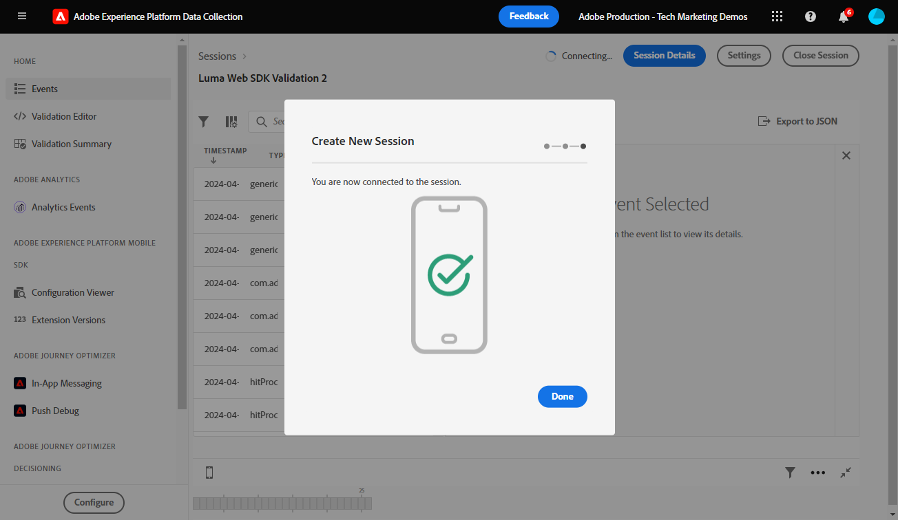

# Validar implementações do Web SDK com o Experience Platform Assurance

O Adobe Experience Platform Assurance é um recurso que ajuda a inspecionar, testar, simular e validar a maneira como você coleta dados ou serve experiências. Leia mais sobre o [Adobe Assurance](https://experienceleague.adobe.com/pt-br/docs/experience-platform/assurance/home).

## Objetivos de aprendizagem

No final desta lição, você poderá:

* Iniciar uma sessão do Assurance
* Exibir solicitações enviadas para e do Platform Edge Network

## Pré-requisitos

Você está familiarizado com as tags da Coleção de dados e o [site de demonstração Luma](https://newluma.enablementadobe.com){target="_blank"} e concluiu as lições anteriores no tutorial:

* [Configurar um esquema XDM](configure-schemas.md)
* [Configurar um namespace de identidade](configure-identities.md)
* [Configurar uma sequência de dados](configure-datastream.md)
* [Extensão do Web SDK instalada na propriedade da tag](install-web-sdk.md)
* [Criar elementos de dados](create-data-elements.md)
* [Criar identidades](create-identities.md)
* [Criar uma regra de tag](create-tag-rule.md)
* [Validar com o Debugger](validate-with-debugger.md)

## Iniciar e exibir uma sessão do Assurance

Há várias maneiras de iniciar uma sessão do Assurance.

### Iniciar uma sessão do Assurance no Debugger

Toda vez que você ativa o Edge Trace no Adobe Experience Platform Debugger, uma sessão do Assurance é iniciada em segundo plano.

Analisar como fizemos isso na lição Debugger:

1. Vá para o [site de demonstração Luma](https://newluma.enablementadobe.com) e use o depurador para [alternar a propriedade da marca no site para sua própria propriedade de desenvolvimento](validate-with-debugger.md#use-the-experience-platform-debugger-to-map-to-your-tags-property)
1. Na navegação à esquerda do **[!UICONTROL Experience Platform Debugger]**, selecione **[!UICONTROL Logs]**
1. Selecione a guia **[!UICONTROL Edge]** e selecione **[!UICONTROL Conectar]**

   
1. Com o Edge Trace ativado, você pode ver um ícone de link de saída na parte superior. Selecione o ícone para abrir o Assurance.

   

1. Uma nova guia do navegador é aberta com a interface do Assurance.

### Iniciar uma sessão do Assurance na interface do Assurance

1. Abra a [interface da Coleção de Dados](https://experience.adobe.com/#/data-collection/home){target="_blank"}
1. Selecione Assurance na navegação à esquerda
1. Selecione Criar sessão
   
1. Selecionar Início
1. Nomeie a sessão, por exemplo, `Luma Web SDK validation`
1. Como a **[!UICONTROL URL Base]**, digite `https://newluma.enablementadobe.com/`
   
1. Na próxima tela, selecione **[!UICONTROL Copiar Link]**
1. Selecione o ícone para copiar o link para a área de transferência
1. Cole a URL no seu navegador, que abrirá o site Luma com um parâmetro de URL especial `adb_validation_sessionid` e iniciará a sessão
1. Na interface do Assurance, você deve ver uma mensagem indicando que se conectou com êxito à sessão e deve ver eventos capturados na interface do Assurance.
   

## Validar o estado atual da implementação do Web SDK

Há informações limitadas para exibir neste estágio da implementação. Um valor que podemos ver é sua Experience Cloud Id (ECID) gerada na Platform Edge Network:

1. Selecione a linha com o evento chamado `Alloy Response Handle`.
1. Um menu é exibido à direita. Selecione o sinal de `+` ao lado de `[!UICONTROL ACPExtensionEventData]`
1. Detalhe selecionando `[!UICONTROL payload > 0 > payload > 0 > namespace]`. A ID mostrada no último `0` corresponde ao `ECID`. Você sabe que pelo valor que aparece abaixo de `namespace` correspondendo a `ECID`

   

   >[!CAUTION]
   >
   >Você pode ver um valor de ECID truncado devido à largura da janela. Basta selecionar a barra de alças na interface e arrastar para a esquerda para visualizar toda a ECID.

Nas lições futuras, você usa o Assurance para validar cargas totalmente processadas que chegam a um aplicativo do Adobe habilitado no fluxo de dados.

Com um objeto XDM sendo acionado agora em uma página e sabendo como validar sua coleção de dados, você estará pronto para configurar o Experience Platform e os aplicativos individuais da Adobe usando o Platform Web SDK.

>[!NOTE]
>
>Obrigado por investir seu tempo aprendendo sobre o Adobe Experience Platform Web SDK. Se você tiver dúvidas, quiser compartilhar comentários gerais ou tiver sugestões sobre conteúdo futuro, compartilhe-as nesta [postagem de discussão da Comunidade Experience League](https://experienceleaguecommunities.adobe.com/t5/adobe-experience-platform-data/tutorial-discussion-implement-adobe-experience-cloud-with-web/td-p/444996)
