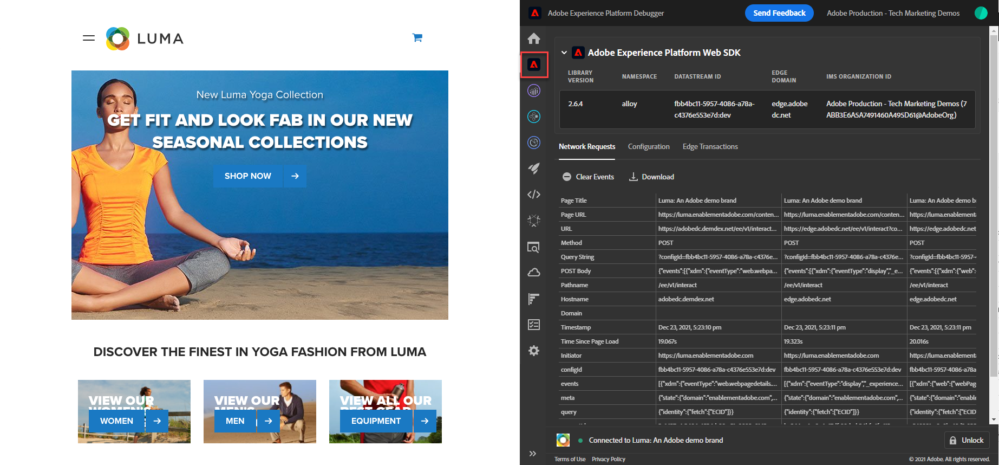

# Validar implementações do Web SDK com o Experience Platform Debugger

Saiba como validar a implementação do SDK da web da Adobe Experience Platform com o Adobe Experience Platform Debugger.

O Experience Platform Debugger é uma extensão disponível para os navegadores Chrome e Firefox, que ajuda a visualizar a tecnologia do Adobe implementada nas páginas da Web. Baixe a versão do seu navegador de preferência:

* [Extensão do Firefox](https://addons.mozilla.org/pt-BR/firefox/addon/adobe-experience-platform-dbg/)
* [Extensão do Chrome](https://chromewebstore.google.com/detail/adobe-experience-platform/bfnnokhpnncpkdmbokanobigaccjkpob)

Se você nunca usou o depurador antes, assista a este vídeo de visão geral de cinco minutos:

>[!VIDEO](https://video.tv.adobe.com/v/32156?learn=on&enablevpops)

Nesta lição, você usa a [extensão do Adobe Experience Platform Debugger](https://chromewebstore.google.com/detail/adobe-experience-platform/bfnnokhpnncpkdmbokanobigaccjkpob) para substituir a propriedade de tag codificada no [site de demonstração Luma](https://luma.enablementadobe.com/content/luma/us/en.html) com sua própria propriedade.

Essa técnica é chamada de alternação de ambiente e será útil posteriormente, ao trabalhar com tags em seu próprio site. Ele permite carregar o site de produção em seu navegador, mas com sua biblioteca de tags de *desenvolvimento*. Essa capacidade permite fazer e validar de forma segura as alterações nas tags independentemente das suas versões de código normais. Afinal, essa separação das versões de tag de marketing das versões regulares de código é um dos principais motivos pelos quais os clientes usam tags!

## Objetivos de aprendizagem

No final desta lição, você poderá usar o depurador para:

* Carregar uma biblioteca de tags alternativa
* Validar se o evento XDM do lado do cliente está capturando e enviando dados conforme esperado para o Platform Edge Network
* Ativar o Edge Trace para exibir solicitações do lado do servidor enviadas pelo Platform Edge Network

## Pré-requisitos

Você está familiarizado com as marcas da Coleção de dados e o [site de demonstração Luma](https://luma.enablementadobe.com/content/luma/us/en.html){target="_blank"} e concluiu as lições anteriores no tutorial:

* [Configurar um esquema XDM](configure-schemas.md)
* [Configurar um namespace de identidade](configure-identities.md)
* [Configurar uma sequência de dados](configure-datastream.md)
* [Extensão do Web SDK instalada na propriedade da tag](install-web-sdk.md)
* [Criar elementos de dados](create-data-elements.md)
* [Criar identidades](create-identities.md)
* [Criar regras de tag](create-tag-rule.md)

## Carregar bibliotecas de tags alternativas com o Debugger

O Experience Platform Debugger tem um recurso interessante que permite substituir uma biblioteca de tags existente por outra. Essa técnica é útil para validação e permite ignorar muitas etapas de implementação neste tutorial.

1. Verifique se você está com o [site de demonstração do Luma](https://luma.enablementadobe.com/content/luma/us/en.html){target="_blank"} aberto e selecione o ícone de extensão do Experience Platform Debugger
1. O Debugger abrirá e mostrará alguns detalhes da implementação codificada (talvez seja necessário recarregar o site Luma depois de abrir o Debugger)
1. Confirme se o Depurador está &quot;**[!UICONTROL Conectado ao Luma]**&quot;, como mostrado abaixo, e selecione o ícone &quot;**[!UICONTROL bloquear]**&quot; para bloquear o Depurador no site Luma.
1. Selecione o botão **[!UICONTROL Entrar]** e entre no Adobe Experience Cloud usando sua Adobe Id.
1. Agora, vá para **[!UICONTROL Tags do Experience Platform]** no painel de navegação esquerdo

   

1. Selecione a guia **[!UICONTROL Configuração]**
1. À direita do local onde ele mostra os **[!UICONTROL Códigos incorporados de página]**, abra a lista suspensa **[!UICONTROL Ações]** e selecione **[!UICONTROL Substituir]**

   

1. Como você está autenticado, o Debugger extrairá suas propriedades e ambientes de tag disponíveis. Selecione sua propriedade
1. Selecione seu ambiente `Development`
1. Selecione o botão **[!UICONTROL Aplicar]**

   

1. O site Luma recarregará agora _com sua própria propriedade de tag_.

   

À medida que você prossegue no tutorial, usa essa técnica de mapear o site Luma para sua própria propriedade de tag para validar a implementação do Platform Web SDK. Ao usar tags em seu próprio site, você pode usar essa mesma técnica para validar bibliotecas de tags de desenvolvimento em seu site de produção.

## Validar solicitações de rede do lado do cliente com o Experience Platform Debugger

Você pode usar o Debugger para validar beacons do lado do cliente acionados a partir da implementação do Platform Web SDK para exibir os dados enviados para o Platform Edge Network:

1. Vá para **[!UICONTROL Resumo]** na navegação à esquerda para ver os detalhes da propriedade da marca

   

1. Agora, vá para **[!UICONTROL Experience Platform Web SDK]** na navegação à esquerda para ver as **[!UICONTROL Solicitações de Rede]**
1. Abrir a linha **[!UICONTROL eventos]**

   

1. Observe como você pode ver o tipo de evento `web.webpagedetails.pageView` especificado na ação [!UICONTROL Atualizar variável] e outras variáveis prontas para uso que seguem o grupo de campos `AEP Web SDK ExperienceEvent`

   

1. Role para baixo até o objeto `web`, selecione para abri-lo e inspecionar `webPageDetails.name`, `webPageDetails.server` e `webPageDetails.siteSection`. Eles devem corresponder às `digitalData` variáveis de camada de dados correspondentes na página inicial

>[!TIP]
>
> Para exibir e comparar a camada de dados `digitalData` na página inicial:
>
> 1. Na página inicial do Luma, abra as ferramentas de desenvolvedor do navegador. No caso do Chrome, selecione o botão `F12` no teclado
> 1. Selecione a guia **[!UICONTROL Console]**
> 1. Digite `digitalData` e selecione `Enter` no teclado para exibir os valores da camada de dados

Também é possível validar os detalhes do Mapa de identidade:

1. Faça logon no site Luma usando as credenciais `test@adobe.com`/`test`

1. Retorne à [página inicial do Luma](https://luma.enablementadobe.com/content/luma/us/en.html)

1. Abra a seção **[!UICONTROL Experience Platform Web SDK]** na navegação à esquerda

   

1. Selecione a linha **[!UICONTROL eventos]** para abrir os detalhes em um pop-up

   

1. Procure por **identityMap** na janela pop-up. Aqui você deve ver `lumaCrmId` com três chaves de authenticatedState, id e primary:
   

### Validar solicitações do lado do cliente com ferramentas de desenvolvimento do navegador

Esses tipos de detalhes de solicitação também estão visíveis na guia **Rede** das ferramentas de desenvolvedor da Web do navegador (supondo que o site esteja carregando sua biblioteca de marcas).

1. Abra a guia **Rede** das ferramentas de desenvolvedor da Web do navegador e recarregue a página. Filtrar chamadas com `/ee` para localizar a chamada, selecioná-la e procurar na guia **Cabeçalhos** e na guia **Carga**

   

1. Vá para a guia **Resposta** e observe como o valor da ECID é incluído na resposta.

   

   >[!NOTE]
   >
   > O valor da ECID está visível na resposta da rede. Ela não está incluída na parte `identityMap` da solicitação de rede, nem está armazenada nesse formato em um cookie.

## Validar solicitações de rede do lado do servidor com o Experience Platform Debugger

Conforme você aprendeu na lição [Configurar uma sequência de dados](configure-datastream.md), o Platform Web SDK envia dados da sua propriedade digital para o Platform Edge Network. Em seguida, o Platform Edge Network faz solicitações adicionais do lado do servidor para os serviços correspondentes ativados no fluxo de dados. Você pode validar as solicitações do lado do servidor feitas pelo Platform Edge Network usando o Edge Trace no Debugger.

<!--Furthermore, you can also validate the fully processed payload after it reaches an Adobe application by using [Adobe Experience Platform Assurance](https://experienceleague.adobe.com/en/docs/experience-platform/assurance/home). -->

### Ativar o Edge Trace

Para ativar o Edge Trace:

1. Na navegação à esquerda do **[!UICONTROL Experience Platform Debugger]**, selecione **[!UICONTROL Logs]**
1. Selecione a guia **[!UICONTROL Edge]** e selecione **[!UICONTROL Conectar]**

   

1. Está vazio por enquanto

   

1. Atualize a [página inicial do Luma](https://luma.enablementadobe.com/) e verifique o **[!UICONTROL Experience Platform Debugger]** novamente para ver os dados aparecerem.

   

Nesse ponto, não é possível visualizar solicitações do Platform Edge Network que vão para aplicativos do Adobe porque você não ativou nenhuma no fluxo de dados. Em lições futuras, use o Edge Trace para exibir as solicitações de saída do lado do servidor para os aplicativos da Adobe e para o encaminhamento de eventos. Mas, primeiro, saiba mais sobre outra ferramenta para validar solicitações do lado do servidor feitas pelo Platform Edge Network — Adobe Experience Platform Assurance!

[Próximo: ](validate-with-assurance.md)

>[!NOTE]
>
>Obrigado por investir seu tempo aprendendo sobre o Adobe Experience Platform Web SDK. Se você tiver dúvidas, quiser compartilhar comentários gerais ou tiver sugestões sobre conteúdo futuro, compartilhe-as nesta [postagem de discussão da Comunidade Experience League](https://experienceleaguecommunities.adobe.com/t5/adobe-experience-platform-data/tutorial-discussion-implement-adobe-experience-cloud-with-web/td-p/444996)
