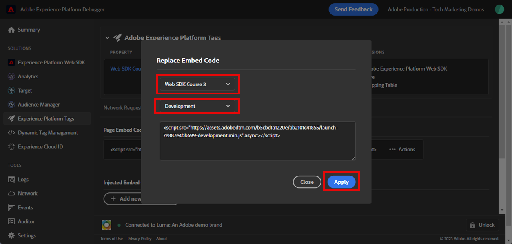

# Validar implementações do SDK da Web com o Experience Platform Debugger

Saiba como validar a implementação do SDK da Web da sua plataforma com o Adobe Experience Platform Debugger.

O Experience Platform Debugger é uma extensão disponível para os navegadores Chrome e Firefox, que ajuda a visualizar a tecnologia de Adobe implementada nas páginas da Web. Baixe a versão do seu navegador de preferência:

* [Extensão do Firefox](https://addons.mozilla.org/pt-BR/firefox/addon/adobe-experience-platform-dbg/)
* [Extensão do Chrome](https://chrome.google.com/webstore/detail/adobe-experience-platform/bfnnokhpnncpkdmbokanobigaccjkpob)

Se você nunca usou o depurador antes (e este é diferente do Adobe Experience Cloud Debugger mais antigo), assista a este vídeo de visão geral de cinco minutos:

>[!VIDEO](https://video.tv.adobe.com/v/32156?learn=on)

Nesta lição, você usará o [Extensão do Adobe Experience Cloud Debugger](https://chrome.google.com/webstore/detail/adobe-experience-cloud-de/ocdmogmohccmeicdhlhhgepeaijenapj) para substituir a propriedade de tag codificada na [Site de demonstração Luma](https://luma.enablementadobe.com/content/luma/us/en.html) com sua própria propriedade.

Essa técnica é chamada de alternação de ambiente e será útil posteriormente, ao trabalhar com tags em seu próprio site. Você pode carregar seu site em produção em seu navegador, mas com seus *desenvolvimento* ambiente de tags. Essa capacidade permite fazer e validar de forma segura as alterações nas tags independentemente das suas versões de código normais. Afinal, essa separação das versões de tag de marketing das versões regulares de código é um dos principais motivos pelos quais os clientes usam tags!

## Objetivos de aprendizagem

No final desta lição, você poderá usar o depurador para:

* Carregar uma biblioteca de tags alternativa
* Validar se o objeto XDM está capturando e enviando dados conforme esperado pela Rede de borda

## Pré-requisitos

Você está familiarizado com as tags de Coleção de dados e a [Site de demonstração Luma](https://luma.enablementadobe.com/content/luma/us/en.html){target="_blank"} e concluíram as seguintes lições anteriores no tutorial:

* [Configurar permissões](configure-permissions.md)
* [Configurar um esquema XDM](configure-schemas.md)
* [Configurar um namespace de identidade](configure-identities.md)
* [Configurar uma sequência de dados](configure-datastream.md)
* [Extensão SDK da Web instalada na propriedade da tag](install-web-sdk.md)
* [Criar elementos de dados](create-data-elements.md)
* [Criar uma regra de tag](create-tag-rule.md)

## Carregar bibliotecas de tags alternativas com o Debugger

Este tutorial usa uma versão hospedada publicamente do [Site de demonstração da Luma](https://luma.enablementadobe.com/content/luma/us/en.html). Abra a página inicial e marque-a como favorito.

O depurador de Experience Platform tem um recurso interessante que permite substituir uma biblioteca de tags existente por outra. Essa técnica é útil para validação e permite ignorar muitas etapas de implementação neste tutorial.

1. Verifique se o site Luma está aberto e selecione o ícone da extensão do Experience Platform Debugger
1. O Debugger abrirá e mostrará alguns detalhes da implementação codificada, que não está relacionada a este tutorial (talvez seja necessário recarregar o site Luma depois de abrir o Debugger)
1. Confirme se o Debugger é &quot;**[!UICONTROL Conectado ao Luma]**&quot; como mostrado abaixo e selecione o &quot;**[!UICONTROL bloquear]**&quot; para bloquear o Debugger no site Luma.
1. Selecione o **[!UICONTROL Conectar]** e faça logon no Adobe Experience Cloud usando sua ID de Adobe.
1. Agora vá para **[!UICONTROL Tags do Experience Platform]** na navegação à esquerda

   

1. Selecione o **[!UICONTROL Configuração]** guia
1. À direita de onde ele mostra a **[!UICONTROL Códigos incorporados de página]**, abra o **[!UICONTROL Ações]** e selecione **[!UICONTROL Substituir]**

   

1. Como você está autenticado, o Debugger extrairá suas propriedades e ambientes de tag disponíveis. Selecione o `Web SDK Course` propriedade
1. Selecione o `Development` ambiente
1. Selecione o **[!UICONTROL Aplicar]** botão

   

1. O site Luma será recarregado agora _com a propriedade da tag_.

   

À medida que você continua o tutorial, usará essa técnica de mapear o site Luma para sua própria propriedade de tag para validar a implementação do SDK da Web da Platform. Ao começar a usar tags no site de produção, você pode usar essa mesma técnica para validar as alterações.

## Validar sua implementação no Experience Platform Debugger

Você pode usar o Debugger para validar a implementação do SDK da Web da Platform e exibir os dados enviados para a Rede de borda da Platform:

1. Ir para **[!UICONTROL Resumo]** na navegação à esquerda, para ver os detalhes da propriedade da tag

   

1. Agora vá para **[!UICONTROL Experience Platform Web SDK]** na navegação à esquerda para ver o **[!UICONTROL Solicitações de rede]**
1. Abra o **[!UICONTROL events]** row (não se preocupe se esta captura de tela mostrar mais solicitações do que a sua, ela inclui solicitações de lições futuras e você pode ignorar por enquanto)

   

1. Observe como podemos ver a `web.webpagedetails.pageView` tipo de evento que especificamos em [!UICONTROL Enviar evento] e outras variáveis prontas para uso que seguem a `AEP Web SDK ExperienceEvent Mixin` formato

   

1. Role para baixo até `web` objeto, selecione para abri-lo e inspecionar o `webPageDetails.name`, `webPageDetails.server`, e `webPageDetails.siteSection`. Eles devem corresponder às variáveis de camada de dados digitais correspondentes na página inicial

   

Também é possível validar os detalhes do Mapa de identidade:

1. Faça logon no site Luma usando as credenciais `test@adobe.com`/`test`

1. Retorne à [página inicial do Luma](https://luma.enablementadobe.com/content/luma/us/en.html)

1. Abra o **[!UICONTROL Experience Platform Web SDK]** na navegação à esquerda

   

1. Selecione o **[!UICONTROL events]** linha para abrir detalhes em um pop-up

   

1. Procure por **identityMap** na janela pop-up. Aqui você deve ver `lumaCrmId` com três chaves de authenticatedState, id e primary:
   

## Validar com ferramentas de desenvolvimento do navegador

Esses tipos de detalhes da solicitação também estão visíveis nas ferramentas do desenvolvedor da Web do navegador **Rede** (supondo que o site esteja carregando a biblioteca de tags).

1. Abra as ferramentas do desenvolvedor da Web do navegador. **Rede** e recarregue a página. Filtrar chamadas com `/ee` para localizar a chamada, selecione-a e procure no **Cabeçalhos** e **Carga** guia

   

1. Vá para a **Resposta** e observe como o valor ECID é incluído na resposta. Copie esse valor como você o usará para validar as informações do perfil no próximo exercício

   

   >[!NOTE]
   >
   >    Talvez você não veja a mesma quantidade de solicitações de carga que a captura de tela acima. Esta disparidade deve-se ao fato de as [configurar o Target](setup-target.md) foram concluídas no momento em que a captura de tela foi feita. Você pode ignorar essa diferença por enquanto.

Com um objeto XDM sendo acionado agora em uma página e sabendo como validar sua coleção de dados, você estará pronto para configurar os aplicativos de Adobe individuais usando o SDK da Web da Platform.

[Próximo: ](setup-experience-platform.md)

>[!NOTE]
>
>Obrigado por investir seu tempo aprendendo sobre o Adobe Experience Platform Web SDK. Se você tiver dúvidas, quiser compartilhar feedback geral ou tiver sugestões sobre conteúdo futuro, compartilhe-as nesta [Publicação de discussão da comunidade do Experience League](https://experienceleaguecommunities.adobe.com/t5/adobe-experience-platform-launch/tutorial-discussion-implement-adobe-experience-cloud-with-web/td-p/444996)
