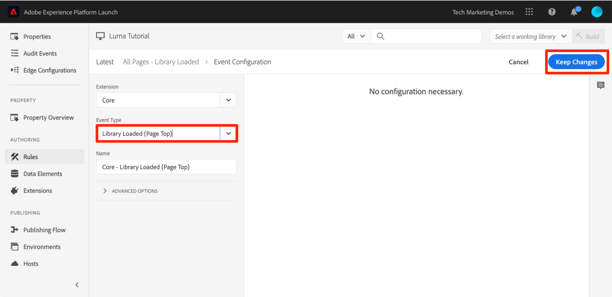

# Adicionar um elemento de dados, uma regra e uma biblioteca

Nesta lição, você criará seu primeiro Elemento de dados, Regra e Biblioteca.

Os elementos e as regras de dados são os blocos que formam a base das tags. Os Elementos de dados armazenam os atributos que você deseja enviar para as soluções de marketing e publicidade, enquanto as Regras acionam as solicitações para essas soluções nas condições certas. As bibliotecas são arquivos JavaScript carregados na página para fazer todo o trabalho. Nesta lição, você usará todos os três para forçar a página de amostra faça algo.

>[!NOTE]
>
>O Adobe Experience Platform Launch está sendo integrado à Adobe Experience Platform como um conjunto de tecnologias de coleção de dados. Várias alterações de terminologia foram implementadas na interface do que você deve estar ciente ao usar esse conteúdo:
>
> * O Platform Launch (lado do cliente) agora é **[[!DNL tags]](https://experienceleague.adobe.com/docs/experience-platform/tags/home.html?lang=pt-BR)**
> * O Platform Launch Server Side agora é **[[!DNL event forwarding]](https://experienceleague.adobe.com/docs/experience-platform/tags/event-forwarding/overview.html)**
> * As configurações do Edge agora são **[[!DNL datastreams]](https://experienceleague.adobe.com/docs/experience-platform/edge/fundamentals/datastreams.html?lang=pt-BR)**

## Objetivos de aprendizagem

No final desta lição, você poderá:

* Criar um elemento de dados
* Criar uma regra
* Criar uma biblioteca
* Adicionar alterações a uma biblioteca
* Validar se a biblioteca está sendo carregada no navegador web
* Use o recurso &quot;Biblioteca de trabalho&quot; para trabalhar com mais eficiência

## Criar um elemento de dados para o Nome da página

Os elementos de dados são a versão das tags de uma camada de dados. Eles podem armazenar valores de seu próprio objeto de camada de dados, de cookies, objetos de armazenamento local, parâmetros da string de consulta, elementos da página, metatags etc. Neste exercício, você criará um elemento de dados para Nome da página, que será usado posteriormente nas implementações do Target e do Analytics.

**Para criar um elemento de dados**

1. Na navegação à esquerda, clique em **[!UICONTROL Elementos de Dados]**

1. Como você ainda não criou elementos de dados nessa propriedade, um breve vídeo é exibido com informações adicionais sobre este tópico. Assista a este vídeo se desejar

1. Clique no botão **[!UICONTROL Criar novo elemento de dados]**:

   

1. Nomeie o elemento de dados, por exemplo `Page Name`

1. Use o tipo de elemento de dados [!UICONTROL Variável JavaScript] para apontar para um valor na camada de dados da página de exemplo: `digitalData.page.pageInfo.pageName`

1. Marque as caixas **[!UICONTROL Forçar valor minúsculo]** e **[!UICONTROL Limpar texto]** para padronizar o caso e remover espaços irrelevantes

1. Deixe **[!UICONTROL Nenhum]** como a configuração de **[!UICONTROL Duração do Armazenamento]**, pois esse valor normalmente será diferente em cada página

1. Clique no botão **[!UICONTROL Salvar]** para salvar o elemento de dados

   .

>[!NOTE]
>
>Os recursos do elemento de dados _podem ser estendidos com Extensões_. Por exemplo, a extensão ContextHub permite adicionar elementos de dados usando recursos da extensão.

## Criar uma regra

Em seguida, você usará esse elemento de dados em uma regra simples. As regras são um dos recursos mais eficientes nas tags e permitem especificar o que deve acontecer quando o visitante interagir com o site. Quando os critérios definidos nas regras são cumpridos, a regra aciona a ação especificada.

Você criará uma regra que transmita o valor do elemento de dados Nome da página para o console do navegador.

**Para criar uma regra**

1. Na navegação à esquerda, clique em **[!UICONTROL Regras]**

1. Como você ainda não criou regras nessa propriedade, um breve vídeo é exibido com informações adicionais sobre este tópico. Assista a este vídeo se desejar

1. Clique no botão **[!UICONTROL Criar nova regra]**:

   

1. Atribua um nome à regra `All Pages - Library Loaded`. Essa convenção de nomenclatura indica onde e quando a regra será acionada, facilitando a identificação e a reutilização da propriedade de tag.

1. Em Eventos, clique em **[!UICONTROL Adicionar]**. O Evento informa as tags quando a regra deve ser acionada e as causas podem ser muitas, incluindo um carregamento de página, um clique, um evento JavaScript personalizado etc.

   

   1. Como Tipo de evento, selecione **[!UICONTROL Biblioteca carregada (Parte superior da página)]**. Observe que quando você seleciona Tipo de evento, as tags preenchem previamente um nome para o evento usando sua seleção. Observe também que a ordem padrão do evento é 50. A ordenação é um recurso poderoso nas tags, que oferece controle preciso sobre a sequência de ações quando várias regras são acionadas pelo mesmo evento. Você usará esse recurso posteriormente no tutorial.

   1. Clique no botão **[!UICONTROL Manter alterações]**

   

1. Como essa regra deve ser acionada em todas as páginas, deixe **[!UICONTROL Condições]** em branco. Se você abrir a modal Condições, verá que as condições podem adicionar restrições e exclusões com base em uma grande variedade de opções, incluindo URLs, valores de elemento de dados, intervalos de datas e muito mais.

1. Em Ações, clique em **[!UICONTROL Adicionar]**

1. Selecione **[!UICONTROL Tipo de Ação > Código Personalizado]**, que neste momento é a única opção. Posteriormente no tutorial, à medida que você adiciona extensões, mais opções serão disponibilizadas.

1. Selecione **[!UICONTROL &lt;/> Abrir editor]** para abrir o editor de código

   

1. Adicione o seguinte ao editor de código. Esse código exibirá o valor do elemento de dados Nome da página no console do navegador para que você possa confirmar se está funcionando:

   ```javascript
   console.log('The page name is '+_satellite.getVar('Page Name'));
   ```

1. Salve o editor de código

   

1. Na tela Configuração de ação, clique em **[!UICONTROL Manter alterações]**

1. Clique em **[!UICONTROL Salvar]** para salvar a regra

Na página Regras, você deve ver sua nova regra:


## Salvar as alterações em uma biblioteca

Depois de configurar uma coleção de extensões, elementos de dados e regras na interface da Coleção de dados, é necessário disponibilizar esses recursos e lógicas em um conjunto de códigos JavaScript que você possa implantar em seu site para que as tags de marketing sejam acionadas quando os visitantes chegarem ao site. Uma biblioteca é o conjunto de códigos JavaScript que faz essa função.

Em uma aula anterior, você implementou o código incorporado de seu ambiente de desenvolvimento na página de exemplo. Quando você carregava a página de exemplo, um erro 404 era retornado para o URL do código incorporado porque uma biblioteca de tags ainda não tinha sido criada e atribuída ao ambiente. Agora, você colocará o novo elemento de dados e nova regra em uma biblioteca para que sua página de exemplo possa fazer algo.

**Para adicionar e criar uma biblioteca**

1. Na navegação à esquerda, clique em **[!UICONTROL Fluxo de publicação]**

1. Clique em **[!UICONTROL Adicionar nova biblioteca]**

   

1. Nomeie a biblioteca, por exemplo, `Initial Setup`

1. Selecione **[!UICONTROL Ambiente > Desenvolvimento]**

1. Clique em **[!UICONTROL Adicionar todos os recursos alterados]**

   

1. Observe que depois de clicar em **[!UICONTROL Adicionar todos os recursos alterados]**, as marcas resumem as alterações que você acabou de fazer.

1. Clique em **[!UICONTROL Salvar e criar para desenvolvimento]**

   

Após alguns minutos, o status fica verde, indicando que a biblioteca foi criada com êxito.


## Validar seu trabalho

Agora, valide se sua regra está funcionando como esperado.

Recarregue sua página de exemplo. Se você observar a guia Ferramentas do desenvolvedor -> Rede, verá agora uma resposta &quot;200&quot; para sua biblioteca de tags.


Se você observar a guia Ferramentas do desenvolvedor -> Console, verá o texto &quot;O nome da página é inicial&quot;


Parabéns, você criou seu primeiro elemento de dados e regra, e criou a sua primeira biblioteca de tags.

## Usar o recurso Biblioteca de trabalho

Quando você faz muitas alterações em tags, é inconveniente abrir a guia Publicação, adicionar alterações e criar a biblioteca toda vez que quiser ver o resultado.  Depois de criar a biblioteca &quot;Configuração inicial&quot;, você pode usar um recurso chamado &quot;Biblioteca de trabalho&quot; para salvar rapidamente as alterações e reconstruir a biblioteca em uma única etapa.

Faça uma pequena alteração na regra &quot;Todas as páginas - Biblioteca carregada&quot;. Na navegação à esquerda, clique em **[!UICONTROL Regras]** e, em seguida, clique na regra `All Pages - Library Loaded` para abri-la.


Na página `Edit Rule`, clique na lista suspensa ***[!UICONTROL Biblioteca de Trabalho]*** e selecione sua biblioteca `Initial Setup`.


Após selecionar a biblioteca, você deve ver que o botão **[!UICONTROL Salvar]** agora assume o padrão **[!UICONTROL Salvar na biblioteca]**. Ao fazer uma alteração nas tags, você pode usar essa opção para adicionar automaticamente a alteração diretamente à biblioteca de trabalho e/ou recriá-la.

Experiente. Abra a ação Código personalizado e adicione um sinal de dois pontos depois do texto &quot;O nome da página é&quot; para que o bloco inteiro de código diga:

```javascript
console.log('The page name is: '+_satellite.getVar('Page Name'));
```

Salve o código, mantenha as alterações na ação e clique no botão **[!UICONTROL Salvar na Biblioteca e Criar]**.


Aguarde até que o ponto verde reapareça ao lado da lista suspensa [!UICONTROL Biblioteca de trabalho]. Agora, recarregue a página de amostra e você deverá ver sua alteração refletida na mensagem do console (talvez seja necessário limpar o cache do navegador e recarregar para ver a alteração na página):


Essa é uma maneira muito mais rápida de trabalhar e você usará essa abordagem no restante do tutorial.

[Próximo &quot;Alternar ambientes com o Experience Cloud Debugger&quot; >](switch-environments.md)
