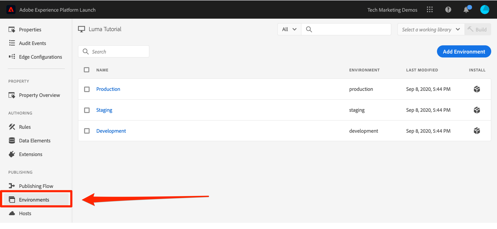

# Adicionar o código incorporado

Nesta lição, você implementará o código incorporado assíncrono do ambiente de desenvolvimento de sua propriedade de tag. Ao longo do caminho, você aprenderá sobre dois conceitos principais de tags: Ambientes e Códigos incorporados.

>[!NOTE]
>
>O Adobe Experience Platform Launch está sendo integrado à Adobe Experience Platform como um conjunto de tecnologias de coleção de dados. Várias alterações de terminologia foram implementadas na interface de que você deve estar ciente ao usar este conteúdo:
>
> * O Platform launch (lado do cliente) agora está **[[!DNL tags]](https://experienceleague.adobe.com/docs/experience-platform/tags/home.html?lang=pt-BR)**
> * Agora o lado do servidor do Platform launch **[[!DNL event forwarding]](https://experienceleague.adobe.com/docs/experience-platform/tags/event-forwarding/overview.html)**
> * As configurações de borda agora são **[[!DNL datastreams]](https://experienceleague.adobe.com/docs/experience-platform/edge/fundamentals/datastreams.html?lang=pt-BR)**


## Objetivos de aprendizagem

No final desta lição, você poderá:

* Obter o código incorporado para sua propriedade de tag
* Entender a diferença entre um ambiente de desenvolvimento, de armazenamento temporário e de produção
* Adicionar um código incorporado de tag a um documento HTML
* Explicar o local ideal do código incorporado da tag em relação a outro código no `<head>` de um documento html

## Copiar o código incorporado

O código incorporado é um `<script>` tag colocada nas páginas da Web para carregar e executar a lógica criada nas tags. Se você carregar a biblioteca de maneira assíncrona, o navegador continuará a carregar a página, recuperará a biblioteca de tags e a executará simultaneamente. Nesse caso, há apenas um código incorporado, que você insere no `<head>`. (Quando as tags são implantadas sincronicamente, há dois códigos incorporados, um que você coloca na variável `<head>` e outra que você colocou antes da `</body>`).

Na tela Visão geral da propriedade, clique em **[!UICONTROL Ambientes]** na navegação à esquerda, vá para a página ambientes . Observe que os ambientes de desenvolvimento, preparo e produção foram criados previamente para você.



Ambientes de desenvolvimento, armazenamento temporário e produção correspondem aos ambientes típicos no desenvolvimento de código e no processo de lançamento O código é escrito pela primeira vez por um desenvolvedor em um ambiente de desenvolvimento. Quando eles concluem o trabalho, eles o enviam para um ambiente de preparo para que o controle de qualidade e outras equipes analisem. Quando o controle de qualidade e outras equipes estão satisfeitos, o código é então publicado no ambiente de produção, que é o ambiente voltado para o público, é o que seus visitantes experimentam quando chegam ao seu site.

As tags permitem ambientes de desenvolvimento adicionais, que são úteis em grandes organizações nas quais vários desenvolvedores estão trabalhando em projetos diferentes ao mesmo tempo.

Esses são os únicos ambientes necessários para concluir o tutorial. Os ambientes permitem que você tenha diferentes versões de trabalho das bibliotecas de tags hospedadas em URLs diferentes, para que você possa adicionar novos recursos com segurança e disponibilizá-los aos usuários certos (por exemplo, desenvolvedores, engenheiros de controle de qualidade, o público etc.) na hora certa.

Agora vamos copiar o código incorporado:

1. Na linha **[!UICONTROL Desenvolvimento]**, clique no  para abrir a modal.

1. Observe que as tags serão padronizadas com os códigos incorporados assíncronos

1. Clique no ícone  para copiar o código incorporado na área de transferência.

1. Clique em **[!UICONTROL Fechar]** para fechar a modal.

   

## Implemente o código incorporado na `<head>` da página HTML de exemplo

O código incorporado deve ser implementado no elemento `<head>` de todas as páginas HTML que compartilham a propriedade. Você pode ter um ou vários arquivos de modelo que controlam a variável `<head>` globalmente em todo o site, tornando-o um processo simples de adicionar tags.

Caso ainda não o tenha feito, baixe [a página html de exemplo](https://www.enablementadobe.com/multi/web/basic-sample.html) (clique com o botão direito do mouse neste link e clique em &quot;Salvar link como&quot;) e abra-o em um editor de código. O [Brackets](https://brackets.io/) é um editor gratuito e de código aberto, se necessário.

Substitua o código incorporado existente na linha 34 ou ao redor dessa linha por um na sua área de transferência e salve a página. Em seguida, abra a página em um navegador da Web. Se você estiver carregando a página usando o protocolo `file://`, será necessário adicionar &quot;https:&quot; no início do URL do código incorporado no editor de códigos). As linhas 33-36 de sua página de exemplo podem parecer mais ou menos com isso:

```html
    <!--Tags Header Embed Code: REPLACE LINE 39 WITH THE EMBED CODE FROM YOUR OWN DEVELOPMENT ENVIRONMENT-->
    <script src="https://assets.adobedtm.com/launch-ENa21cfed3f06f4ddf9690de8077b39e81-development.min.js" async></script>
    <!--/Tags Header Embed Code-->
```

Abra as ferramentas de desenvolvedor do navegador da Web e acesse a guia Rede. Nesse momento, deve aparecer um erro 404 para o URL do ambiente de tags:


O erro 404 é esperado porque você ainda não criou uma biblioteca neste ambiente de Tags. Você fará isso na próxima aula. Se aparecer uma mensagem de &quot;falha&quot; em vez de um erro 404, você provavelmente esqueceu de adicionar o protocolo `https://` no código incorporado. Novamente, você só precisará especificar o protocolo `https://` se estiver carregando a página de exemplo usando o protocolo `file://`. Faça essa alteração e recarregue a página até que o erro 404 apareça.

## Práticas recomendadas de implementação de tags

Vamos consultar algumas das práticas recomendadas de implementação de Tags demonstradas na página de exemplo:

* **Camada de dados**:

   * Recomendamos *fortemente* criar em seu site uma camada de dados contendo todos os atributos necessários para preencher variáveis no Analytics, no Target e em outras soluções de marketing. Essa página de exemplo contém apenas uma camada de dados muito simples, mas uma camada de dados real pode conter muitos mais detalhes sobre a página, como o visitante, os detalhes do carrinho de compras etc. Para obter mais informações sobre camadas de dados, consulte [Camada de dados digitais da experiência do cliente 1.0](https://www.w3.org/2013/12/ceddl-201312.pdf)

   * Defina a camada de dados antes do código incorporado da tag para maximizar o que você pode fazer com as soluções do Experience Cloud.

* **Bibliotecas do helper JavaScript**: Se você já tiver uma biblioteca como a JQuery implementada no `<head>` de suas páginas, carregue-as antes das tags para aproveitar a sintaxe nas tags e no Target

* **Tipo de documento HTML5**: o tipo de documento HTML5 é obrigatório no Target

* **Preconnect (pré-conexão) e dns-prefetch (pré-busca de DNS)**: use o preconnect e o dns-prefetch para melhorar o tempo de carregamento da página. Consulte também: [https://w3c.github.io/resource-hints/](https://w3c.github.io/resource-hints/)

* **ocultar previamente o trecho para implementações assíncronas do Target**: Você aprenderá mais sobre isso na lição do Target, mas quando o Target for implantado por meio de códigos incorporados assíncronos de tags, você deverá codificar um trecho pré-ocultado em suas páginas antes dos códigos incorporados da tag para gerenciar a cintilação de conteúdo

Aqui está um resumo da aparência das práticas recomendadas na ordem sugerida. Observe que existem alguns espaços reservados para detalhes específicos da conta:

```html
<!doctype html>
<html lang="en">
<head>
    <title>Basic Demo</title>
    <!--Preconnect and DNS-Prefetch to improve page load time. REPLACE "techmarketingdemos" WITH YOUR OWN AAM PARTNER ID, TARGET CLIENT CODE, AND ANALYTICS TRACKING SERVER-->
    <link rel="preconnect" href="//dpm.demdex.net">
    <link rel="preconnect" href="//fast.techmarketingdemos.demdex.net">
    <link rel="preconnect" href="//techmarketingdemos.demdex.net">
    <link rel="preconnect" href="//cm.everesttech.net">
    <link rel="preconnect" href="//techmarketingdemos.tt.omtrdc.net">
    <link rel="preconnect" href="//techmarketingdemos.sc.omtrdc.net">
    <link rel="dns-prefetch" href="//dpm.demdex.net">
    <link rel="dns-prefetch" href="//fast.techmarketingdemos.demdex.net">
    <link rel="dns-prefetch" href="//techmarketingdemos.demdex.net">
    <link rel="dns-prefetch" href="//cm.everesttech.net">
    <link rel="dns-prefetch" href="//techmarketingdemos.tt.omtrdc.net">
    <link rel="dns-prefetch" href="//techmarketingdemos.sc.omtrdc.net">
    <!--/Preconnect and DNS-Prefetch-->
    <!--Data Layer to enable rich data collection and targeting-->
    <script>
    var digitalData = {
        "page": {
            "pageInfo" : {
                "pageName": "Home"
                }
            }
    };
    </script>
    <!--/Data Layer-->
    <!--jQuery or other helper libraries-->
    <script src="https://code.jquery.com/jquery-3.3.1.min.js"></script>
    <!--/jQuery-->
    <!--prehiding snippet for Adobe Target with asynchronous tags deployment-->
    <script>
        (function(g,b,d,f){(function(a,c,d){if(a){var e=b.createElement("style");e.id=c;e.innerHTML=d;a.appendChild(e)}})(b.getElementsByTagName("head")[0],"at-body-style",d);setTimeout(function(){var a=b.getElementsByTagName("head")[0];if(a){var c=b.getElementById("at-body-style");c&&a.removeChild(c)}},f)})(window,document,"body {opacity: 0 !important}",3E3);
    </script>
    <!--/prehiding snippet for Adobe Target with asynchronous tags deployment-->
    <!--Tags Header Embed Code: REPLACE LINE 39 WITH THE INSTALL CODE FROM YOUR OWN DEVELOPMENT ENVIRONMENT-->
    <script src="//assets.adobedtm.com/launch-EN93497c30fdf0424eb678d5f4ffac66dc.min.js" async></script>
    <!--/Tags Header Embed Code-->
</head>
<body>
    <h1>Tags Basic Demo</h1>
    <p>This is a very simple page to demonstrate basic concepts of tags</p>
</body>
</html>
```

Agora você sabe como adicionar o código de inserção de tag ao seu site!

[Próximo &quot;Adicionar um elemento de dados, uma regra e uma biblioteca&quot; >](add-data-elements-rules.md)
