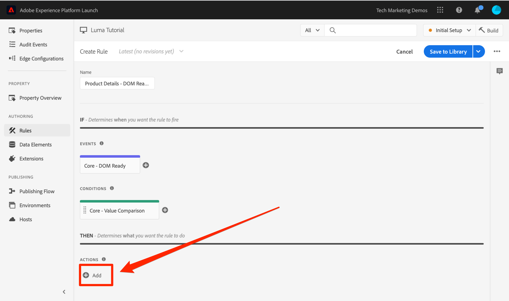
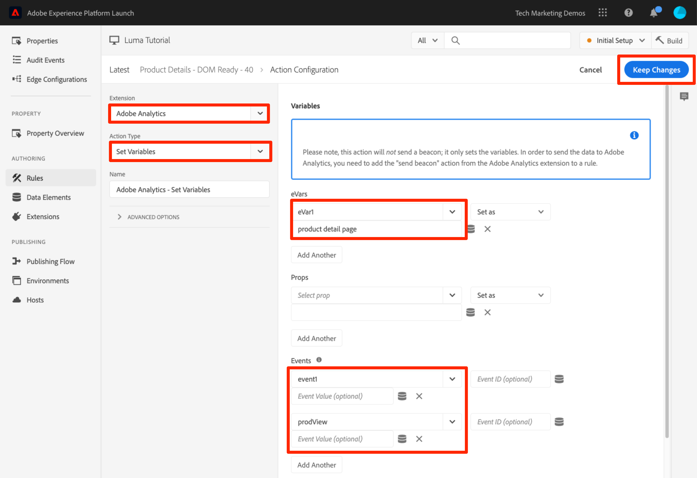
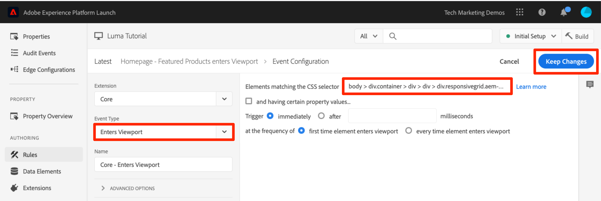

# Adicionar o Adobe Analytics

Nesta lição, você implementará a [extensão Adobe Analytics](https://experienceleague.adobe.com/docs/experience-platform/tags/extensions/adobe/analytics/overview.html?lang=pt-BR) e criará regras para enviar dados ao Adobe Analytics.


>[!WARNING]
>
> O site do Luma usado neste tutorial deve ser substituído durante a semana de 16 de fevereiro de 2026. O trabalho realizado como parte deste tutorial pode não se aplicar ao novo site.

[O Adobe Analytics](https://experienceleague.adobe.com/docs/analytics.html?lang=pt-BR) é uma solução líder do setor que torna você capaz de entender seus clientes como pessoas e orientar seus negócios com informações de inteligência de clientes.

>[!NOTE]
>
>O Adobe Experience Platform Launch está sendo integrado à Adobe Experience Platform como um conjunto de tecnologias de coleção de dados. Várias alterações de terminologia foram implementadas na interface do que você deve estar ciente ao usar esse conteúdo:
>
> * O Platform Launch (lado do cliente) agora é **[[!DNL tags]](https://experienceleague.adobe.com/docs/experience-platform/tags/home.html?lang=pt-BR)**
> * O Platform Launch Server Side agora é **[[!DNL event forwarding]](https://experienceleague.adobe.com/docs/experience-platform/tags/event-forwarding/overview.html?lang=pt-BR)**
> * As configurações do Edge agora são **[[!DNL datastreams]](https://experienceleague.adobe.com/docs/experience-platform/edge/fundamentals/datastreams.html?lang=pt-BR)**

## Objetivos de aprendizagem

No final desta lição, você poderá:

1. Adicionar a extensão do Adobe Analytics
1. Definir variáveis globais usando a extensão
1. Adicionar o sinal de visualização de página
1. Adicionar mais variáveis usando regras
1. Adicionar rastreamento de cliques e outros sinais baseados em eventos
1. Adicionar plug-ins do Analytics

Há muitas coisas que podem ser implementadas para o Analytics em tags. Esta lição não é exaustiva, mas deve oferecer uma visão geral das principais técnicas necessárias para implementação em seu próprio site.

## Pré-requisitos

É necessário que você tenha completado as lições em [Configurar tags](create-a-property.md) e [Adicionar o Serviço de Identidade](id-service.md).

Além disso, você precisará de pelo menos uma ID de conjunto de relatórios e seu servidor de rastreamento. Se você não tiver um conjunto de relatórios de teste/desenvolvimento que pode ser usado para este tutorial, crie um. Se não tiver certeza sobre como fazer isso, consulte [a documentação](https://experienceleague.adobe.com/pt-br/docs/analytics/admin/admin-tools/manage-report-suites/c-new-report-suite/t-create-a-report-suite). Você pode recuperar o servidor de rastreamento da implementação atual, do consultor da Adobe ou do representante do Atendimento ao cliente

## Adicionar a extensão do Analytics

A extensão Analytics consiste em duas partes principais:

1. A configuração da extensão, que gerencia as principais configurações da biblioteca AppMeasurement.js e pode definir variáveis globais
1. Ações de regras responsáveis pelos itens a seguir:
   1. Definir variáveis
   1. Limpar variáveis
   1. Enviar o sinal do Analytics

**Para adicionar a extensão Analytics**

1. Ir para **[!UICONTROL Extensões > Catálogo]**
1. Localize a extensão Adobe Analytics
1. Clique em **[!UICONTROL Instalar]**

   

1. Em [!UICONTROL Gerenciamento de biblioteca > Conjuntos de relatórios], insira as IDs de conjunto de relatórios que você deseja usar com cada ambiente de tag. Se os usuários tiverem acesso ao Adobe Analytics, observe que, ao digitar na caixa, você verá uma lista pré-preenchida de todos os seus conjuntos de relatórios. (Não há problema em usar um conjunto de relatórios para todos os ambientes neste tutorial, mas na vida real você pode usar conjuntos de relatórios separados, como mostrado na imagem abaixo)

   

   >[!TIP]
   >
   >Recomendamos usar a opção [!UICONTROL Gerenciar a biblioteca para mim] como a configuração [!UICONTROL Gerenciamento de Biblioteca], pois facilita muito a atualização da biblioteca `AppMeasurement.js`.

1. Em [!UICONTROL Geral > Servidor de Rastreamento], insira o servidor de rastreamento, por exemplo, `tmd.sc.omtrdc.net`. Insira seu servidor de rastreamento SSL se o site suporta `https://`

   

1. Na [!UICONTROL seção Variáveis Globais], em [!UICONTROL Configurações Adicionais], defina a variável [!UICONTROL Nome da Página] usando seu elemento de dados `Page Name`. Clique no  para abrir o modal e escolher o elemento de dados `Page Name` da página)

1. Clique em **[!UICONTROL Salvar na biblioteca]**

   

>[!NOTE]
>
>As variáveis globais podem ser definidas na configuração da extensão ou nas ações de regras. Observe que, ao configurar variáveis na configuração de extensão, a camada de dados deve ser definida *antes* dos códigos incorporados da tag.

## Enviar o sinal de Exibição de página

Agora, você criará uma regra para acionar o sinal do Analytics, que enviará a variável [!UICONTROL Nome da página] definida na configuração da extensão.

Você já criou uma regra &quot;Todas as páginas - Biblioteca carregada&quot; na lição [Adicionar um elemento de dados, uma regra e uma biblioteca](add-data-elements-rules.md) deste tutorial; a regra é acionada em cada página quando a biblioteca de tags é carregada. Você *pode* usar essa regra também para o Analytics, mas essa configuração exige que todos os atributos de camada de dados usados no sinal do Analytics sejam definidos antes dos códigos incorporados da marca. Para permitir mais flexibilidade com a coleção de dados, você criará uma nova regra “Todas as páginas” acionada no Pronto para DOM para acionar o sinal do Analytics.

**Para enviar o sinal de Exibição de página**

1. Vá para a seção **[!UICONTROL Regras]** na navegação à esquerda e clique em **[!UICONTROL Adicionar regra]**

   

1. Atribua um nome à regra `All Pages - DOM Ready`
1. Clique em **[!UICONTROL Eventos > Adicionar]** para abrir a tela `Event Configuration`

   

1. Selecione **[!UICONTROL Tipo de evento > Pronto para DOM]** (Observe que a ordem da regra é &quot;50&quot;)
1. Clique em **[!UICONTROL Manter alterações]**
   

1. Em Ações, clique em  para adicionar uma nova ação

   

1. Selecione **[!UICONTROL Extensão > Adobe Analytics]**

1. Selecione **[!UICONTROL Tipo de ação > Enviar sinal]**

1. Deixar rastreamento configurado como `s.t()`. Observe que se quiser fazer uma chamada `s.tl()` em uma regra de clique-evento, seria possível fazer isso usando a ação Enviar sinal.

1. Clique no botão **[!UICONTROL Manter alterações]**

   

1. Clique em **[!UICONTROL Salvar na biblioteca e na build]**

   

### Validar o sinal de Exibição de página

Depois de criar uma regra para enviar um sinal do Analytics, você poderá ver a solicitação no Experience Cloud Debugger.

1. Abra o [site de demonstração do Luma](https://luma.enablementadobe.com/content/luma/us/en.html) no navegador Chrome
1. Clique no ícone Depurador  para abrir o **[!UICONTROL Adobe Experience Cloud Debugger]**
1. Certifique-se de que o Depurador está mapeando a propriedade da tag para o *seu* ambiente de desenvolvimento, conforme descrito na [lição anterior](switch-environments.md)

   

1. Clique para abrir a guia Analytics
1. Expanda o nome do seu conjunto de relatórios para mostrar todas as solicitações feitas
1. Confirme se a solicitação foi acionada com a variável e o valor do Nome da página

   

>[!NOTE]
>
>Se o Nome da página não estiver sendo exibido para você, refaça as etapas desta página para garantir que você não tenha perdido nada.

## Adicionar variáveis com regras

Ao configurar a extensão Analytics, você preencheu a variável `pageName` na configuração da extensão. Esse é um bom local para preencher outras variáveis globais, como eVars e props, desde que o valor esteja disponível na página antes que o código de incorporação da tag seja carregado.

Um local mais flexível para definir variáveis, bem como eventos, está nas regras que usam a ação `Set Variables`. As regras permitem definir diferentes variáveis e eventos do Analytics em condições distintas. Por exemplo, você pode definir a `prodView` apenas na página de detalhes do produto e o evento `purchase` apenas nas páginas de confirmação de pedido. Esta seção ensina como definir variáveis usando regras.

### Caso de uso

As Páginas de detalhes do produto (PDP) são pontos importantes para a coleção de dados em sites de varejo. Normalmente, você quer que o Analytics registre que uma exibição de produto aconteceu e qual produto foi visualizado. Isso é útil para entender quais produtos são populares entre seus clientes. Em um site de mídia, as páginas de artigo ou vídeo podem usar técnicas de rastreamento semelhantes àquelas que usará nesta seção. Ao carregar uma Página de detalhes do produto, você pode desejar colocar esse valor em um de &quot;Tipo de página&quot; `eVar`, bem como definir alguns eventos e a ID do produto. Isso nos permitirá visualizar as seguintes informações em nossa análise:

1. Quantas vezes as páginas de detalhes do produto são carregadas
1. Quais produtos específicos são visualizados e quantas vezes
1. Como outros fatores (campanhas, pesquisa etc.) afetam quantas PDPs são carregadas

### Criar elemento de dados para o Tipo da página

Primeiro, é preciso identificar quais páginas são as Páginas de detalhes do produto. Você fará isso com um elemento de dados.

**Para criar o elemento de dados para o tipo de página**

1. Clique em **[!UICONTROL Elementos de dados]** na navegação à esquerda
1. Clique em **[!UICONTROL Adicionar elemento de dados]**

   

1. Nomeie o elemento de dados `Page Type`
1. Selecione **[!UICONTROL Tipo de elemento de dados > Variável JavaScript]**
1. Use `digitalData.page.category.type` como o **[!UICONTROL nome da variável do JavaScript]**
1. Verifique as opções **[!UICONTROL Limpar texto]** e **[!UICONTROL Forçar caixa baixa]**
1. Clique em **[!UICONTROL Salvar na biblioteca]**

   

### Crie o elemento de dados para a ID de produto

Em seguida, colete a ID do produto da página Detalhes do produto atual com um elemento de dados

**Para criar o elemento de dados para a ID do produto**

1. Clique em **[!UICONTROL Elementos de dados]** na navegação à esquerda
1. Clique em **[!UICONTROL Adicionar elemento de dados]**

   

1. Nomeie o elemento de dados `Product Id`
1. Selecione **[!UICONTROL Tipo de elemento de dados > Variável JavaScript]**
1. Use `digitalData.product.0.productInfo.sku` como o **[!UICONTROL nome da variável do JavaScript]**
1. Verifique as opções **[!UICONTROL Limpar texto]** e **[!UICONTROL Forçar caixa baixa]**
1. Clique em **[!UICONTROL Salvar na biblioteca]**

   

### Adicionar a extensão da string de produtos do Adobe Analytics

Se já estiver familiarizado com as implementações do Adobe Analytics, provavelmente está familiarizado com a [variável dos produtos](https://experienceleague.adobe.com/docs/analytics/implementation/vars/page-vars/products.html?lang=pt-BR). A variável de produtos tem uma sintaxe muito específica e é usada de maneiras um pouco diferentes, a depender do contexto. Para facilitar o preenchimento da variável de produtos nas tags, três extensões adicionais já foram criadas na loja de extensões de tag. Nesta seção, você adicionará uma extensão criada pelo Adobe Consulting para uso na página Detalhes do produto.

**Para adicionar a `Adobe Analytics Product String` extensão**

1. Acesse a página [!UICONTROL Extensões > Catálogo]
1. Localize a extensão `Adobe Analytics Product String` pelos Serviços Adobe Consulting e clique em **[!UICONTROL Instalar]**
   
1. Reserve um momento para ler as instruções
1. Clique em **[!UICONTROL Salvar na biblioteca]**

   

### Crie a regra para as Páginas de detalhes do produto

Agora, use os novos elementos de dados e a extensão para criar a regra da página Detalhes do produto. Para obter essa funcionalidade, crie outra regra de carregamento de página acionada pelo Pronto para DOM. No entanto, use uma condição para que ela só seja acionada nas páginas de detalhes do produto e na configuração do pedido para que seja acionada _antes_ da regra que envia o sinal.

**Para criar a regra da página Detalhes do produto**

1. Vá para a seção **[!UICONTROL Regras]** na navegação à esquerda e clique em **[!UICONTROL Adicionar regra]**

   

1. Atribua um nome à regra `Product Details - DOM Ready - 40`
1. Clique em **[!UICONTROL Eventos > Adicionar]** para abrir a tela `Event Configuration`

   

1. Selecione **[!UICONTROL Tipo de evento > Pronto para DOM]**
1. Defina a **[!UICONTROL Ordem]** como 40, para que a regra seja executada *antes* da regra que contém a ação Analytics > Enviar sinal
1. Clique em **[!UICONTROL Manter alterações]**
   

1. Em **[!UICONTROL Condições]**, clique no  para abrir a tela `Condition Configuration`
   

   1. Selecione **[!UICONTROL Tipo de Condição > Comparação de Valores]**
   1. Use o seletor de elemento de dados, escolha `Page Type` no primeiro campo
   1. Selecione **[!UICONTROL Contém]** na lista suspensa do operador de comparação
   1. No próximo tipo de campo `product-page` (essa é a parte exclusiva do valor do tipo de página extraído da camada de dados no PDP)
   1. Clique em **[!UICONTROL Manter alterações]**

      

1. Em Ações, clique em  para adicionar uma nova ação

   

1. Selecione **[!UICONTROL Extensão > Cadeia de Caracteres do Produto Adobe Analytics]**
1. Selecione **[!UICONTROL Tipo de ação > Definir s.products]**

1. Na seção **[!UICONTROL Evento de comércio eletrônico]** do Analytics, selecione **[!UICONTROL prodView]**

1. Na seção **[!UICONTROL Variáveis da camada de dados para dados do produto]**, use o Seletor de elementos de dados para escolher o elemento de dados `Product Id`

1. Clique em **[!UICONTROL Manter alterações]**

   


1. Em Ações, clique em  para adicionar uma nova ação

   

1. Selecione **[!UICONTROL Extensão > Adobe Analytics]**
1. Selecione **[!UICONTROL Tipo de ação > Definir variáveis]**
1. Selecione **[!UICONTROL eVar1 > Definir como]** e insira `product detail page`
1. Defina **[!UICONTROL event1]**, deixando os valores opcionais em branco
1. Em Eventos, clique no botão **[!UICONTROL Adicionar outro]**
1. Defina o evento **[!UICONTROL prodView]**, deixando os valores opcionais em branco
1. Clique em **[!UICONTROL Manter alterações]**

   

1. Clique em **[!UICONTROL Salvar na biblioteca e na build]**

   

### Validar os dados da página de detalhes do produto

Você acabou de criar uma regra que define variáveis antes do beacon ser enviado. Agora é possível ver os novos dados que saem na ocorrência no Experience Cloud Debugger.

**Para validar os dados da página Detalhes do produto**

1. Abra o [site de demonstração do Luma](https://luma.enablementadobe.com/content/luma/us/en.html) no navegador Chrome
1. Navegue até qualquer página de detalhes do produto
1. Clique no ícone do Debugger  para abrir o **[!UICONTROL Adobe Experience Cloud Debugger]**
1. Clique na guia Analytics
1. Expanda o conjunto de relatórios
1. Observe as Variáveis de detalhes do produto que agora estão no depurador, especificamente se `eVar1` tiver sido definida como &quot;página de detalhes do produto&quot;, se a variável `Events` estiver definida como &quot;event1&quot; e &quot;prodView&quot;, se a variável Produtos estiver definida com a ID de produto do produto que você está visualizando e que seu Nome de página ainda está definido pela extensão do Analytics.

   

## Enviar um beacon de rastreamento de link

Quando uma página é carregada, você normalmente aciona um sinal de carregamento de página usando a função `s.t()`. Isso incrementa automaticamente uma métrica `page view` página para a página listada na variável `pageName`.

No entanto, às vezes você não quer incrementar as exibições de página no seu site, pois a ação que está acontecendo é &quot;menor&quot;, ou talvez apenas diferente do que uma exibição de página. Nesse caso, use a função `s.tl()`, comumente chamada de solicitação de &quot;rastreamento de link&quot;. Embora seja referido como uma solicitação de rastreamento de link, ela não precisa ser acionada por um clique em links. Ela pode ser acionada por *qualquer* dos eventos que estão disponíveis no construtor de regras de tag, incluindo sua própria JavaScript personalizada.

Neste tutorial, você acionará uma chamada `s.tl()` usando um dos mais interessantes eventos JavaScript, um evento `Enters Viewport`.

### O caso de uso

Neste caso de uso, você quer saber se as pessoas estão rolando para baixo em nossa página inicial do Luma o suficiente para ver a seção *Produtos em destaque* de nossa página. Há alguma discórdia interna em nossa empresa sobre se as pessoas estão ou não vendo essa seção, portanto, você pode usar o Analytics para determinar a verdade.

### Criar a regra nas tags

1. Vá para a seção **[!UICONTROL Regras]** na navegação à esquerda e clique em **[!UICONTROL Adicionar regra]**
   
1. Atribua um nome à regra `Homepage - Featured Products enters Viewport`
1. Clique em **[!UICONTROL Eventos > Adicionar]** para abrir a tela `Event Configuration`

   

1. Selecione **[!UICONTROL Tipo de Evento > Inserir Viewport]**. Isso exibirá um campo onde você precisa entrar no seletor de CSS que identificará o item na página que deve acionar a regra quando ela entrar na exibição no navegador
1. Volte para a página inicial do Luma e role para baixo até a seção Produtos em destaque.
1. Clique com o botão direito do mouse no espaço entre o título &quot;PRODUTOS EM DESTAQUE&quot; e os itens desta seção e selecione `Inspect` no menu exibido com o botão direito do mouse. Isso vai te aproximar do que você quer
1. Nesse momento, possivelmente logo abaixo da seção selecionada, você procura por uma div com `class="we-productgrid aem-GridColumn aem-GridColumn--default--12"`. Localize esse elemento
1. Clique com o botão direito do mouse neste elemento e selecione **[!UICONTROL Copiar > Copiar Seletor]**

   

1. Retorne às marcas e cole esse valor da área de transferência no campo rotulado `Elements matching the CSS selector`.
   1. Além disso, é você que decide como identificar os seletores de CSS. Esse método é um pouco frágil, pois determinadas alterações na página podem interromper esse seletor. Considere isso ao usar qualquer seletor de CSS nas tags.
1. Clique em **[!UICONTROL Manter alterações]**
   

1. Em Condições, clique no  para adicionar uma nova condição
1. Selecione **[!UICONTROL Tipo de Condição > Comparação de Valores]**
1. Use o seletor de elemento de dados, escolha `Page Name` no primeiro campo
1. Selecione **[!UICONTROL Igual]** na lista suspensa do operador de comparação
1. No próximo tipo de campo `content:luma:us:en` (esse é o nome da página inicial, conforme extraído da camada de dados, queremos que essa regra seja executada apenas na página inicial)
1. Clique em **[!UICONTROL Manter alterações]**

   

1. Em Ações, clique em  para adicionar uma nova ação
1. Selecione **[!UICONTROL Extensão > Adobe Analytics]**
1. Selecione **[!UICONTROL Tipo de ação > Definir variáveis]**
1. Defina `eVar3` como `Home Page - Featured Products`
1. Defina `prop3` como `Home Page - Featured Products`
1. Defina a variável `Events` como `event3`
1. Clique em **[!UICONTROL Manter alterações]**

   

1. Em Ações, clique em  para adicionar outra nova ação

1. Selecione **[!UICONTROL Extensão > Adobe Analytics]**
1. Selecione **[!UICONTROL Tipo de ação > Enviar sinal]**
1. Escolha a opção de rastreamento **[!UICONTROL `s.tl()`]**
1. No campo **[!UICONTROL Nome do Link]**, digite `Scrolled down to Featured Products`. Esse valor será colocado no relatório Links personalizados do Analytics
1. Clique em **[!UICONTROL Manter alterações]**

   

1. Clique em **[!UICONTROL Salvar na biblioteca e na build]**

   

### Validar o beacon de rastreamento de link

Agora, você deverá certificar-se de que essa ocorrência seja aplicada quando rolar para baixo até a seção Produtos em destaque da Página inicial do nosso site. Quando você carrega a página inicial pela primeira vez, a solicitação não deve ser feita, mas, ao rolar para baixo e a seção aparecer na visualização, a ocorrência deve ser acionada com nosso novos valores.

1. Abra o [site do Luma](https://luma.enablementadobe.com/content/luma/us/en.html) no navegador Chrome e verifique se você está na parte superior da página inicial.
1. Clique no **[!UICONTROL ícone do depurador]**  para abrir o [!UICONTROL Adobe Experience Cloud Debugger]
1. Clique na guia Analytics
1. Expanda a ocorrência do conjunto de relatórios
1. Observe a ocorrência de exibição de página normal da página inicial com o nome da página etc. (mas nada na eVar3 ou prop3).

   

1. Deixando o Debugger aberto, role para baixo em seu site até visualizar a seção Produtos em destaque
1. Exiba o Debugger novamente e outra ocorrência do Analytics deve ser exibida. Essa ocorrência deve ter os parâmetros associados à ocorrência s.tl() que você configurou, ou seja:
   1. `LinkType = "link_o"` (isso significa que a ocorrência é de link personalizado e não uma ocorrência de exibição de página).
   1. `LinkName = "Scrolled down to Featured Products"`
   1. `prop3 = "Home Page - Featured Products"`
   1. `eVar3 = "Home Page - Featured Products"`
   1. `Events = "event3"`

      

## Adicionar um plug-in

Um plug-in é uma parte de código JavaScript que pode ser adicionado à implementação para executar uma função que não está incorporada ao produto. Os plug-ins podem ser criados por você, por outros clientes ou parceiros da Adobe, ou pela Adobe Consulting.

São necessárias apenas três etapas para implementar plug-ins:

1. Inclua a função doPlugins, onde o plug-in será referenciado
1. Adicione o código da função principal para o plug-in
1. Inclua o código que chama a função, define variáveis etc.

### Torne o objeto do Analytics globalmente acessível

Se você adicionar a função doPlugins (abaixo) e usar plug-ins, será necessário marcar uma caixa para tornar o objeto &quot;s&quot; do Analytics disponível globalmente na implementação do Analytics.

1. Vá para **[!UICONTROL Extensões > Instalado]**

1. Na extensão do Adobe Analytics, clique em **[!UICONTROL Configurar]**

   

1. Em **[!UICONTROL Gerenciamento de biblioteca]**, selecione a caixa rotulada `Make tracker globally accessible`. Como você pode ver na bolha de ajuda, isso fará com que o rastreador seja destacado globalmente em window.s, o que é importante quando ao fazer referência a ele no JavaScript do cliente.
   

### Inclusão da função doPlugins

Para adicionar plug-ins, é necessário adicionar uma função chamada doPlugins. Essa função não é adicionada por padrão, mas uma vez adicionada, é gerenciada pela biblioteca do AppMeasurement e é chamada por último quando uma ocorrência é enviada para o Adobe Analytics. Portanto, você pode usar essa função para executar um JavaScript para configurar variáveis mais facilmente configuráveis dessa forma.

1. Ainda na extensão Analytics, role para baixo e expanda a seção intitulada `Configure Tracker Using Custom Code.`
1. Clique em **[!UICONTROL Abrir editor]**
1. Cole o código a seguir no editor de códigos:

   ```javascript
   /* Plugin Config */
   s.usePlugins=true
   s.doPlugins=function(s) {
   /* Add calls to plugins here */
   }
   ```

1. Mantenha essa janela aberta para a próxima etapa

### Adicionar código de função para o plug-in

Na verdade, você chamará dois plug-ins neste código, mas um deles está integrado à biblioteca do AppMeasurement, portanto, naquele que você não precisa adicionar a função para chamar. No entanto, para o segundo, também é necessário adicionar o código da função. Esta função é chamada getValOnce().

### O plug-in getValOnce()

A finalidade deste plug-in é impedir que os valores sejam duplicados falsamente no código quando um visitante atualiza uma página ou usa o botão Voltar do navegador para voltar para uma página na qual um valor foi definido. Nesta lição, você a usará para impedir que o evento `clickthrough` seja duplicado.

O código desse plug-in está disponível na [documentação do Analytics](https://experienceleague.adobe.com/docs/analytics/implementation/vars/plugins/getvalonce.html?lang=pt-BR), mas também foi incluído aqui para facilitar a cópia/colagem.

1. Copie o código a seguir

   ```javascript
   /* Adobe Consulting Plugin: getValOnce v2.01 */
   s.getValOnce=function(vtc,cn,et,ep){if(vtc&&(cn=cn||"s_gvo",et=et||0,ep="m"===ep?6E4:864E5,vtc!==this.c_r(cn))){var e=new Date;e.setTime(e.getTime()+et*ep);this.c_w(cn,vtc,0===et?0:e);return vtc}return""};
   ```

1. Cole-o na janela de código na extensão Analytics (se ainda não estiver aberta, abra-a novamente de acordo com a etapa anterior), **exatamente abaixo** da função doPlugins (não dentro dela).

   

Agora você pode chamar este plug-in de dentro do doPlugins.

### Como chamar plug-ins de dentro do doPlugins

Agora que o código foi preparado e pode ser referenciado, é possível fazer as chamadas para plug-ins dentro da função doPlugins.

Primeiro, chame um plug-in que foi incorporado à biblioteca do AppMeasurement; por isso ele é conhecido como &quot;utilitário&quot;. É chamado de `s.Util.getQueryParam` por ser parte do objeto s, é um utilitário integrado e capturará valores com base em um parâmetro da string de consulta no URL.

1. Copie o código a seguir:

   ```javascript
   s.campaign = s.Util.getQueryParam("cid");
   ```

1. Cole-o na função doPlugins. Isso buscará um parâmetro chamado `cid` no URL da página atual e o colocará na variável s.campaign.
1. Agora, chame a função getValOnce copiando o código a seguir e colando logo abaixo da chamada com getQueryParam:

   ```javascript
   s.campaign=s.getValOnce(s.campaign,'s_cmp',30);
   ```

   Esse código garantirá que o mesmo valor não seja enviado mais de uma vez consecutiva por 30 dias (consulte a documentação para saber como personalizar esse código de acordo com suas necessidades).

   

1. Salve a janela do código
1. Clique em **[!UICONTROL Salvar na biblioteca e na build]**

   

### Validar os plug-ins

Agora você pode verificar se os plug-ins estão funcionando.

**Para validar os plug-ins**

1. Abra o [site de demonstração do Luma](https://luma.enablementadobe.com/content/luma/us/en.html) no navegador Chrome
1. Clique no ícone Depurador  para abrir o **[!UICONTROL Adobe Experience Cloud Debugger]**
1. Clique na guia Analytics
1. Expanda o conjunto de relatórios
1. Observe que a ocorrência do Analytics não tem uma variável do Campaign
1. Deixando o Debugger aberto, volte para o site Luma e adicione `?cid=1234` ao URL e, em seguida, pressione Enter para atualizar a página com a string de consulta incluída

   

1. Verifique o Debugger e confirme se há uma segunda solicitação do Analytics com uma variável do Campaign definida como `1234`

   

1. Retorne e atualize a página Luma novamente com a string de consulta ainda no URL
1. Verifique a próxima ocorrência no Debugger, e a variável Campaign **não** deve estar presente, pois o plug-in getValOnce garantiu que ela não seja duplicada e pareça que outra pessoa veio do código de rastreamento da campanha.

   

1. BÔNUS: você pode testar isso repetidamente alterando o valor do parâmetro `cid` na string de consulta. A variável Campaign só deve estar lá se for a **primeira** vez que você estiver executando a página com o valor. Se você não estiver vendo o valor do Campaign no depurador, basta alterar o valor de `cid` na string de consulta do URL e pressionar Enter para vê-lo novamente no depurador.

   >[!NOTE]
   >
   >Na verdade, há algumas maneiras diferentes de buscar um parâmetro de fora da string de consulta do URL, incluindo na configuração da extensão Analytics. No entanto, nessas outras opções que não envolvem plug-ins, não é dada a capacidade de interromper duplicações desnecessárias, como você fez aqui com o plug-in getValOnce. Este é o método do autor, mas você deve determinar qual método funciona melhor para você e suas necessidades.

Bom trabalho! Você concluiu a lição do Analytics. É claro que há muitas outras coisas que você pode fazer para aprimorar nossa implementação do Analytics, mas esperamos que isso tenha ensinado a você algumas das principais habilidades para suprir o resto de suas necessidades.

[Próximo: &quot;Adicionar o Adobe Audience Manager&quot; >](audience-manager.md)
