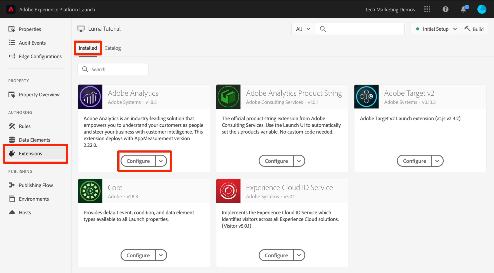

# Adicionar o Adobe Audience Manager

Esta lição o guiará pelas etapas para habilitar o Adobe Audience Manager usando o encaminhamento pelo lado do servidor.

O [Adobe Audience Manager](https://docs.adobe.com/content/help/pt-BR/experience-cloud/user-guides/home.translate.html) (AAM) fornece serviços líderes do setor para o gerenciamento online de dados de público-alvo, proporcionando aos anunciantes e editores as ferramentas necessárias para controlar e aproveitar seus ativos de dados e ajudar a aumentar o sucesso das vendas.

>[!WARNING]
>
> O site do Luma usado neste tutorial deve ser substituído durante a semana de 16 de fevereiro de 2026. O trabalho realizado como parte deste tutorial pode não se aplicar ao novo site.

>[!NOTE]
>
>O Adobe Experience Platform Launch está sendo integrado à Adobe Experience Platform como um conjunto de tecnologias de coleção de dados. Várias alterações de terminologia foram implementadas na interface do que você deve estar ciente ao usar esse conteúdo:
>
> * O Platform Launch (lado do cliente) agora é **[[!DNL tags]](https://experienceleague.adobe.com/docs/experience-platform/tags/home.html?lang=pt-BR)**
> * O Platform Launch Server Side agora é **[[!DNL event forwarding]](https://experienceleague.adobe.com/docs/experience-platform/tags/event-forwarding/overview.html)**
> * As configurações do Edge agora são **[[!DNL datastreams]](https://experienceleague.adobe.com/docs/experience-platform/edge/fundamentals/datastreams.html?lang=pt-BR)**

## Objetivos de aprendizagem

No final desta lição, você poderá:

1. Descrever as duas principais maneiras de implementar o Audience Manager em um site
1. Adicionar o Audience Manager usando o encaminhamento pelo lado do servidor do sinalizador do Analytics
1. Validar a implementação do Audience Manager

## Pré-requisitos

Para concluir esta lição, será necessário:

1. Para concluir as lições em [Configurar marcas](create-a-property.md), [Adicionar Adobe Analytics](analytics.md) e [Adicionar o Serviço de Identidade](id-service.md).

1. Acesso de administrador ao Adobe Analytics para que você possa habilitar o encaminhamento pelo lado do servidor para o conjunto de relatórios que estiver usando neste tutorial. Como alternativa, você pode solicitar que um administrador na sua organização faça isso seguindo as instruções abaixo.

1. Seu &quot;Subdomínio do Audience Manager&quot; (também conhecido como &quot;Nome do parceiro&quot;, &quot;ID do parceiro&quot; ou &quot;Subdomínio do parceiro&quot;). Se você já implementou o Audience Manager em seu site, a maneira mais fácil de obter essa informação é acessar seu site e abrir o Debugger. O subdomínio está disponível na guia Resumo, localizada na seção Audience Manager:

   

Se ainda não tiver o Audience Manager implementado, siga estas instruções para [obter seu Subdomínio do Audience Manager](https://experienceleague.adobe.com/docs/audience-manager-learn/tutorials/web-implementation/how-to-identify-your-partner-id-or-subdomain.html).

## Opções de implementação

Há duas maneiras de implementar o Audience Manager em um site:

* **Encaminhamento pelo lado do servidor (SSF)**: para clientes com o Adobe Analytics, esta é a maneira mais fácil e recomendada de implementar. O Adobe Analytics encaminha dados para o AAM no backend da Adobe, permitindo uma solicitação a menos na página. Isso também permite acesso a importantes recursos de integração e está em conformidade com as práticas recomendadas para a implementação e implantação do código do Audience Manager.

* **DIL do lado do cliente:** essa abordagem é para clientes que não têm o Adobe Analytics. O código DIL (como o código da biblioteca de integração de dados ou o código de configuração do JavaScript do AAM) envia dados diretamente da página da Web para o Audience Manager.

Como você já implantou o Adobe Analytics neste tutorial, você implantará o Audience Manager usando o encaminhamento pelo lado do servidor. Para obter uma descrição completa e uma lista de requisitos para o encaminhamento pelo lado do servidor, consulte a [documentação](https://experienceleague.adobe.com/docs/analytics/admin/admin-tools/server-side-forwarding/ssf.html?lang=pt-BR) para que possa se familiarizar com o funcionamento, além de saber o que é necessário e como validar o recurso.

## Habilitar encaminhamento pelo lado do servidor

Há duas etapas principais para executar uma implementação do SSF:

1. Ativar um &quot;alternador&quot; no Admin Console do Analytics para encaminhar dados do Analytics para o Audience Manager *por conjunto de relatórios*.
1. Colocar o código no lugar, que é feito por meio de tags. Para que isso funcione corretamente, será necessário ter a extensão do Serviço de identidade da Adobe Experience Platform instalada, bem como a extensão do Analytics (na verdade, você *não* precisará da extensão AAM, descrita abaixo).

### Habilitar o encaminhamento pelo lado do servidor no Admin Console do Analytics

É necessária uma configuração no Admin Console do Adobe Analytics para iniciar o encaminhamento de dados do Adobe Analytics para o Adobe Audience Manager. Como pode levar até quatro horas para o encaminhamento dos dados ser iniciado, é indicado fazer essa etapa primeiro.

#### Para habilitar o SSF no Admin Console do Analytics

1. Faça logon no Analytics por meio da interface do usuário da Experience Cloud. Se você não tiver acesso de Administrador ao Analytics, precisará conversar com o administrador da Experience Cloud ou do Analytics para atribuir acesso ou concluir essas etapas para você.

   

1. Na navegação superior do Analytics, escolha **[!UICONTROL Admin > Conjuntos de relatórios]** e, na lista, selecione (selecione várias vezes) os conjuntos de relatórios que deseja encaminhar para o Audience Manager.

   

1. Na tela Conjuntos de relatórios e com os conjuntos de relatórios selecionados, escolha **[!UICONTROL Editar configurações > Geral > Encaminhamento pelo lado do servidor]**.

   

   >[!WARNING]
   >
   >Conforme dito acima, será necessário ter privilégios de administrador para ver este item de menu.

1. Uma vez na página Encaminhamento pelo lado do servidor, leia as informações e marque a caixa para **[!UICONTROL Habilitar o Encaminhamento pelo lado do servidor]** para os conjuntos de relatórios.

1. Clique em **[!UICONTROL Salvar]**

   

>[!NOTE]
>
>Como o SSF precisa ser ativado por conjunto de relatórios, repita esta etapa para seus conjuntos de relatórios reais quando implantar o SSF em seu conjunto de relatórios do site.
>
>Além disso, se a opção SSF estiver acinzentada, será necessário &quot;mapear os conjuntos de relatórios para sua organização na Experience Cloud para habilitar a opção. Isso é explicado [na documentação](https://experienceleague.adobe.com/docs/analytics/admin/data-governance/gdpr-view-settings.html).

Uma vez concluída essa etapa, e se você tiver o Serviço de identidade da Adobe Experience Platform habilitado, os dados serão encaminhados do Analytics para o AAM. No entanto, para concluir o processo de forma que a resposta retorne corretamente do AAM à página (e também ao Analytics por meio do recurso do Audience Analytics), você deve concluir a etapa a seguir nas tags também. Não se preocupe, é super fácil.

### Ativar o encaminhamento pelo lado do servidor nas tags

Esta é a segunda de duas etapas para habilitar o SSF. Você já inverteu o switch no Analytics Admin Console e agora precisa apenas adicionar o código, o que as tags farão se você simplesmente marcar a caixa correta.

>[!NOTE]
>
>Para implementar o encaminhamento pelo lado do servidor dos dados do Analytics na AAM, editaremos/configuraremos a extensão Analytics em tags, **não** a extensão AAM. A extensão AAM é usada exclusivamente para implementações DIL do lado do cliente, para aqueles que não têm o Adobe Analytics. Portanto, as etapas a seguir estão corretas quando o enviam para a extensão Analytics para configurar isso.

#### Para ativar o SSF em tags

1. Vá para **[!UICONTROL Extensões > Instalado]** e clique para configurar a extensão do Analytics.

   

1. Expanda a seção `Adobe Audience Manager`

1. Marque a caixa para **[!UICONTROL Compartilhar automaticamente dados do Analytics com o Audience Manager]**. Isso adicionará o &quot;Módulo&quot; (código) do Audience Manager à implementação `AppMeasurement.js` do Analytics.

1. Adicione o &quot;Subdomínio do Audience Manager&quot; (também conhecido como &quot;Nome do parceiro&quot;, &quot;ID do parceiro&quot;, &quot;Subdomínio do parceiro&quot;). Siga estas instruções para [obter o subdomínio do Audience Manager](https://experienceleague.adobe.com/docs/audience-manager-learn/tutorials/web-implementation/how-to-identify-your-partner-id-or-subdomain.html).

1. Clique em **[!UICONTROL Salvar na biblioteca e na build]**

   

O código de encaminhamento pelo lado do servidor foi implementado!

### Validar o encaminhamento pelo lado do servidor

A forma principal de validar que o encaminhamento pelo lado do servidor está em execução é observar a resposta a qualquer uma das ocorrências do Adobe Analytics. Chegaremos a isso em um minuto. Enquanto isso, vamos verificar outras coisas que podem nos ajudar a ter a certeza de que estão funcionando como queremos.

#### Verifique se o código está sendo carregado corretamente

O código que as tags instalam para lidar com o encaminhamento e, especialmente, com a resposta do AAM à página, é chamado de Audience Manager
&quot;Módulo.&quot; Podemos usar o Experience Cloud Debugger para garantir que ele foi carregado.

1. Abra o site Luma
1. Clique no ícone do depurador no navegador para abrir o Experience Cloud Debugger
1. Permanecendo na guia Resumo, role até a seção Analytics
1. Verifique se **Gerenciamento de público-alvo** está listado na seção.

   

#### Verifique a ID do parceiro no depurador

Em seguida, também podemos verificar se o depurador está coletando a &quot;ID do parceiro&quot; correta (subdomínio do parceiro AKA etc.) do código.

1. Ainda no depurador e ainda na guia Resumo, role para baixo até a seção Audience Manager
1. Verifique a ID/o subdomínio do parceiro em &quot;Parceiro&quot;

   

>[!WARNING]
>
>Observe que a seção Audience Manager do depurador se refere à &quot;DIL&quot;, que é a &quot;Data Integration Library&quot;, e geralmente se refere a uma implementação do lado do cliente, em oposição à abordagem do lado do servidor que implementamos aqui. A verdade é que o &quot;Módulo&quot; do AAM (usado nesta abordagem SSF) usa muito do mesmo código da biblioteca DIL do lado do cliente e, portanto, esse depurador está reportando como tal. Se você seguir as etapas deste tutorial e o restante dos itens nesta seção de validação estiver correto, esteja certo de que o encaminhamento pelo lado do servidor está funcionando.

#### Verifique a solicitação e a resposta do Analytics

Ok, este é o maior. Se você não estiver fazendo o encaminhamento de dados pelo lado do servidor do Analytics para o Audience Manager, então não há resposta para o sinal do Analytics (fora um pixel com dimensões 2x2). No entanto, se estiver fazendo SSF, há itens que você pode verificar na solicitação e resposta do Analytics que informam que o recurso está funcionando corretamente. 
Infelizmente, neste momento, a Experience Cloud não suporta a exibição da resposta aos sinais. Portanto, você deve usar outro depurador/analisador de pacotes, como o Charles Proxy ou as Ferramentas do desenvolvedor do navegador.

1. Abra as Ferramentas do desenvolvedor em seu navegador e acesse a guia Rede.
1. No campo de filtro, digite `b/ss`, que limitará o que você vê às solicitações do Adobe Analytics
1. Atualize a página para ver a solicitação do Analytics.

   

1. No sinal do Analytics (solicitação), procure por um parâmetro &quot;callback&quot;. Será definido como algo assim: `s_c_il[1].doPostbacks`

   

1. Você terá uma resposta ao sinal do Analytics. Ele vai conter referências ao doPostbacks, como chamado na solicitação e, mais importante, ele deve ter um objeto &quot;stuff&quot;. Aqui, as IDs de segmento do AAM são enviadas de volta ao navegador. Se você tiver o objeto &quot;stuff&quot;, o SSF está funcionando!

   

>[!WARNING]
>
>Cuidado com o falso &quot;sucesso&quot; - se houver uma resposta e tudo parece estar funcionando, **verifique** se você tem esse objeto &quot;stuff&quot;. Caso não tenha, você poderá ver uma mensagem na resposta que diz &quot;status&quot;: &quot;SUCCESS&quot;. Por mais louco que isso pareça, isso é prova de que **NÃO** está funcionando corretamente. Caso esteja lendo isso, significa que você concluiu esta segunda etapa (o código nas tags), mas que o encaminhamento no Analytics Admin Console (a primeira etapa desta seção) ainda não foi concluído. Nesse caso, é necessário verificar se o SSF foi habilitado no Admin Console do Analytics. Se tiver ativado e ainda não tiver passado quatro horas, aguarde.

[Próximos &quot;Integrações da Experience Cloud&quot; >](integrations.md)
