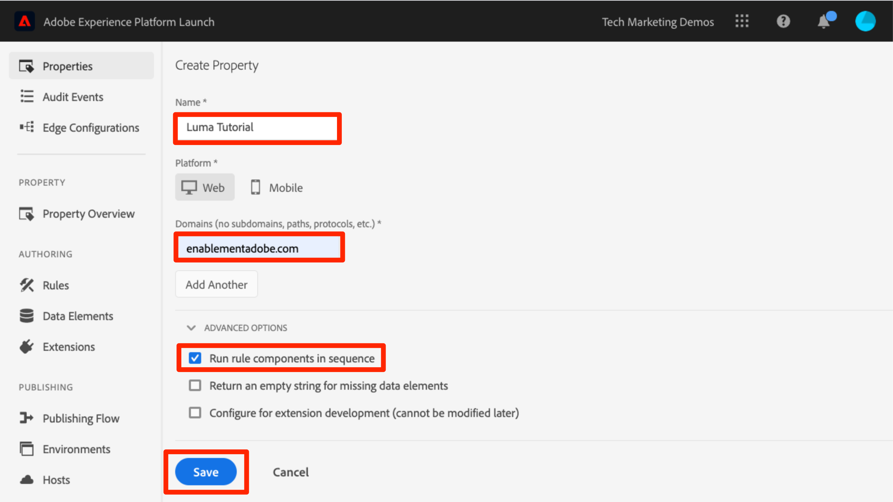

# Criar uma propriedade de tag

Nesta lição, você criará sua primeira propriedade de tag.

Basicamente, uma propriedade é basicamente um container que você preenche com extensões, regras, elementos de dados e bibliotecas à medida que implanta tags no site.

## Pré-requisitos

Para concluir as próximas lições, é necessário ter permissão para desenvolver, aprovar, Publish, gerenciar extensões e gerenciar ambientes nas tags. Se você não conseguir concluir nenhuma dessas etapas porque as opções da interface do usuário não estão disponíveis, entre em contato com o administrador da Experience Cloud para solicitar acesso. Para obter mais informações sobre permissões de usuário de marca, consulte [a documentação](https://experienceleague.adobe.com/docs/experience-platform/tags/admin/user-permissions.html).

>[!NOTE]
>
>O Adobe Experience Platform Launch está sendo integrado à Adobe Experience Platform como um conjunto de tecnologias de coleção de dados. Várias alterações de terminologia foram implementadas na interface do que você deve estar ciente ao usar esse conteúdo:
>
> * O Platform Launch (lado do cliente) agora é **[[!DNL tags]](https://experienceleague.adobe.com/docs/experience-platform/tags/home.html?lang=pt-BR)**
> * O Platform Launch Server Side agora é **[[!DNL event forwarding]](https://experienceleague.adobe.com/docs/experience-platform/tags/event-forwarding/overview.html)**
> * As configurações do Edge agora são **[[!DNL datastreams]](https://experienceleague.adobe.com/docs/experience-platform/edge/fundamentals/datastreams.html?lang=pt-BR)**

## Objetivos de aprendizagem

No final desta lição, você poderá:

* Fazer logon na interface da Coleção de dados
* Criar uma nova propriedade de tag
* Configurar uma propriedade de tag

## Vá para a interface da Coleção de dados

**Para obter a Coleção de Dados**

1. Faça logon na [Adobe Experience Cloud](https://experiencecloud.adobe.com)

1. Clique no ícone  para abrir o alternador de aplicativos

1. Selecione **[!UICONTROL Iniciar/Coleção de Dados]** no menu 

Deve aparecer a tela `Tags Properties` (se nenhuma propriedade tiver sido criada na conta, essa tela pode estar vazia):

## Criar uma propriedade

Basicamente, uma propriedade é basicamente um container que você preenche com extensões, regras, elementos de dados e bibliotecas à medida que implanta tags no site. Uma propriedade pode ser qualquer agrupamento de um ou mais domínios e subdomínios. É possível gerenciar e rastrear esses ativos da mesma maneira. Por exemplo, suponhamos que você tenha vários sites baseados em um só modelo e queira rastrear os mesmos recursos em todos. É possível aplicar uma propriedade a vários domínios. Para obter mais informações sobre como criar propriedades, consulte [&quot;Empresas e propriedades&quot;](https://experienceleague.adobe.com/docs/experience-platform/tags/admin/companies-and-properties.html) na documentação do produto.

**Para criar uma propriedade**

1. Clique no botão **[!UICONTROL Nova propriedade]**:

   

1. Nomeie a propriedade (por exemplo, `Luma Tutorial` ou `Luma Tutorial - Daniel`)
1. Como o domínio, insira `enablementadobe.com`, pois este é o domínio onde o site de demonstração do Luma está hospedado. Embora o campo &quot;Domínio&quot; seja obrigatório, a propriedade da tag funcionará em qualquer domínio que for implementada. A principal finalidade desse campo é preencher previamente as opções de menu no Construtor de regras.
1. Expanda a seção **[!UICONTROL Opções Avançadas]** e marque a caixa para **[!UICONTROL Executar componentes da regra em sequência]**
1. Clique no botão **[!UICONTROL Salvar]**

   

Sua nova propriedade deve ser exibida na página Propriedades. Observe que se você marcar a caixa ao lado do nome da propriedade, as opções **[!UICONTROL Configurar]** ou **[!UICONTROL Excluir]** da propriedade serão exibidas acima da lista de propriedades. Clique no nome da propriedade (por exemplo, `Luma Tutorial`) para abrir a tela `Overview`. 

[Próximo: &quot;Adicionar o código incorporado&quot; >](add-embed-code.md)
