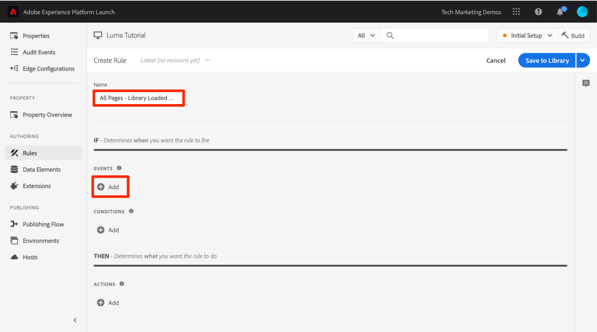
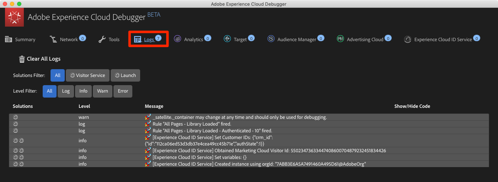

# Adicionar o Serviço de identidade da Adobe Experience Platform

Esta lição guiará você pelas etapas necessárias para implementar a extensão [Serviço de identidade da Adobe Experience Platform](https://experienceleague.adobe.com/docs/experience-platform/tags/extensions/adobe/id-service/overview.html) e enviar as IDs do cliente.

O [Adobe Experience Platform Identity Service](https://experienceleague.adobe.com/docs/id-service/using/home.html?lang=pt-BR) define uma ID de visitante comum em todas as soluções da Adobe para potencializar recursos da Experience Cloud como o compartilhamento de público-alvo entre soluções. Você também pode enviar suas próprias IDs do cliente para o Serviço para habilitar o direcionamento entre dispositivos e integrações com os sistemas de CRM (relacionamento com o cliente).


>[!WARNING]
>
> O site do Luma usado neste tutorial deve ser substituído durante a semana de 16 de fevereiro de 2026. O trabalho realizado como parte deste tutorial pode não se aplicar ao novo site.

>[!NOTE]
>
>O Adobe Experience Platform Launch está sendo integrado à Adobe Experience Platform como um conjunto de tecnologias de coleção de dados. Várias alterações de terminologia foram implementadas na interface do que você deve estar ciente ao usar esse conteúdo:
>
> * O Platform Launch (lado do cliente) agora é **[[!DNL tags]](https://experienceleague.adobe.com/docs/experience-platform/tags/home.html?lang=pt-BR)**
> * O Platform Launch Server Side agora é **[[!DNL event forwarding]](https://experienceleague.adobe.com/docs/experience-platform/tags/event-forwarding/overview.html)**
> * As configurações do Edge agora são **[[!DNL datastreams]](https://experienceleague.adobe.com/docs/experience-platform/edge/fundamentals/datastreams.html?lang=pt-BR)**

## Objetivos de aprendizagem

No final desta lição, você poderá:

* Adicionar a extensão Serviço de Identidade
* Criar um elemento de dados para coletar as IDs do cliente
* Crie uma regra que use a ação “Definir IDs do cliente” para enviar as IDs do cliente para a Adobe
* Use o recurso de solicitação de regra para sequenciar regras que são acionadas no mesmo evento

## Pré-requisitos

É necessário que você tenha completado as lições na seção [Configurar tags](create-a-property.md).

## Adicionar a extensão Serviço de identidade

Como esta é a primeira extensão que você está adicionando, esta é uma rápida visão geral das extensões. As extensões são um dos recursos principais das tags. Uma extensão é uma integração criada pela Adobe, por um parceiro da Adobe ou por qualquer cliente da Adobe que adiciona opções novas e infinitas para as tags que você pode implantar em seu site. Se você pensar nas tags como um sistema operacional, as extensões são os aplicativos que você instala para que as tags possam fazer o que é necessário.

**Para adicionar a extensão Serviço de identidade**

1. Na navegação à esquerda, clique em **[!UICONTROL Extensões]**

1. Clique em **[!UICONTROL Catálogo]** para ir para a página Catálogo de extensões

1. Observe a variedade de extensões disponíveis no Catálogo

1. No filtro na parte superior, digite &quot;id&quot; para filtrar o catálogo

1. No cartão do Adobe Experience Platform Identity Service, clique em **[!UICONTROL Instalar]**

   

1. Observe que a sua ID da organização na Experience Cloud foi detectada automaticamente para você

1. Deixe todas as configurações padrão e clique em **[!UICONTROL Salvar na Biblioteca e na Build]**

   

>[!NOTE]
>
>Cada versão da extensão do Serviço de identidade vem com uma versão específica do VisitorAPI.js anotada na descrição da extensão. Atualize a versão VisitorAPI.js atualizando a extensão do Serviço de identidade.

### Validar a extensão

A extensão do Serviço de identidade é uma das poucas extensões de tag que fazem uma solicitação sem precisar usar uma ação de regra. A extensão faz uma solicitação automaticamente para o Serviço de identidade no primeiro carregamento de página da primeira visita a um site. Uma vez que a ID for solicitada, ela será armazenada em um cookie primário com &quot;AMCV_&quot;.

**Para validar a extensão do Serviço de Identidade**

1. Abra o [site Luma](https://luma.enablementadobe.com/content/luma/us/en.html).

1. Certifique-se de que o Depurador está mapeando a propriedade da tag para o *seu* ambiente de desenvolvimento, conforme descrito na [lição anterior](switch-environments.md).

1. Na guia Resumo do Debugger, a seção de tags deve indicar que a extensão Adobe Experience Platform Identity Service está implementada.

1. Além disso, na guia Resumo, a seção Serviço de identidade deve se preenchida com a mesma ID de organização mostrada na tela de configuração de extensões na interface da Coleção de dados:

   

1. A solicitação inicial para recuperar a ID do visitante pode aparecer na guia Serviço de identidade do Debugger. Contudo, ela já pode ter sido solicitada, portanto, não se preocupe se você não vê-la:
   

1. Depois da solicitação inicial para buscar a ID do visitante, a ID é armazenada em um cookie cujo nome começa com `AMCV_`. Você pode confirmar que o cookie foi configurado ao fazer o procedimento a seguir:
   1. Abra as Ferramentas do desenvolvedor do seu navegador.
   1. Acesse a guia `Application`.
   1. Expanda `Cookies` no lado esquerdo.
   1. Clique no domínio `https://luma.enablementadobe.com`
   1. Procure o cookie AMCV_ no lado direito. Você pode ver vários desde que carregou o site Luma usando a propriedade de tag codificada, bem como mapeada para a sua.
      

Pronto! Você adicionou sua primeira extensão! Para obter mais detalhes sobre as opções de configuração do Serviço de identidade, consulte [a documentação](https://experienceleague.adobe.com/docs/id-service/using/id-service-api/configurations/function-vars.html).

## Enviar IDs do cliente

Em seguida, você enviará uma [ID do cliente](https://experienceleague.adobe.com/docs/id-service/using/reference/authenticated-state.html) ao Serviço de identidade. Isso permite que você [integre seu CRM](https://experienceleague.adobe.com/docs/core-services/interface/customer-attributes/attributes.html?lang=pt-BR) à Experience Cloud e rastreie os visitantes em todos os dispositivos.

Na lição anterior, [Adicionar elementos de dados, regras e bibliotecas](add-data-elements-rules.md), você criou um elemento de dados e o usou em uma regra. Agora, você usará as mesmas técnicas para enviar uma ID do cliente quando o visitante é autenticado.

### Criar elementos de dados para IDs do cliente

Comece criando dois elementos de dados:

1. `Authentication State`—para capturar se o visitante estiver ou não conectado
1. `Email (Hashed)`—para capturar a versão com hash do endereço de email (usado como ID do cliente) da camada de dados

**Para criar o elemento de dados para o Estado de autenticação**

1. Clique em **[!UICONTROL Elementos de dados]** na navegação à esquerda
1. Clique no botão **[!UICONTROL Adicionar elemento de dados]**

   

1. Nomeie o elemento de dados `Authentication State`
1. Para o **[!UICONTROL Tipo de elemento de dados]**, selecione **[!UICONTROL Código personalizado]**
1. Clique no botão **[!UICONTROL Abrir Editor]**

   

1. Na janela [!UICONTROL Editar código], use o seguinte código para retornar valores de &quot;conectado&quot; ou &quot;desconectado&quot; com base em um atributo na camada de dados do site Luma:

   ```javascript
   if (digitalData.user[0].profile[0].attributes.loggedIn)
       return "logged in"
   else
       return "logged out"
   ```

1. Clique em **[!UICONTROL Salvar]** para salvar o código personalizado

   

1. Deixe todas as outras configurações em seus valores padrão
1. Clique em **[!UICONTROL Salvar na Biblioteca]** para salvar o elemento de dados e retornar à página de elementos de dados. Não precisaremos fazer um &quot;Build&quot; até que todas as alterações sejam feitas e que estejamos prontos para validar.

   

Ao conhecer o estado de autenticação do usuário, você sabe quando uma ID do cliente deve existir na página para ser enviada ao Serviço de identidade. A próxima etapa é criar um elemento de dados para a própria ID do cliente. No site de demonstração Luma, você usará a versão com hash do endereço de email do visitante.

**Para adicionar o elemento de dados do email com hash**

1. Clique no botão **[!UICONTROL Adicionar elemento de dados]**

   

1. Nomeie o elemento de dados `Email (Hashed)`
1. Para o **[!UICONTROL Tipo de Elemento de Dados]**, selecione **[!UICONTROL Variável JavaScript]**
1. Como o **[!UICONTROL nome da variável do JavaScript]**, use o seguinte ponteiro para obter uma variável na camada de dados do site Luma: `digitalData.user.0.profile.0.attributes.username`
1. Deixe todas as outras configurações em seus valores padrão
1. Clique em **[!UICONTROL Salvar na biblioteca]** para salvar o elemento de dados

   

### Adicionar uma regra para enviar as IDs do cliente

O Serviço de identidade da Adobe Experience Platform transmite as IDs do cliente em regras usando uma ação chamada &quot;Definir IDs do cliente&quot;.  Agora você criará uma regra para acionar essa ação quando o visitante for autenticado.

**Para criar uma regra para enviar as IDs do cliente**

1. Na navegação à esquerda, clique em **[!UICONTROL Regras]**
1. Clique em **[!UICONTROL Adicionar regra]** para abrir o Construtor de regras

   

1. Atribua um nome à regra `All Pages - Library Loaded - Authenticated - 10`

   >[!TIP]
   >
   >Essa convenção de nomenclatura indica que você está acionando essa regra na parte superior de todas as páginas quando o usuário é autenticado e terá uma ordem de &quot;10&quot;. Usar uma convenção de nomenclatura como essa (em vez de nomeá-la para as soluções acionadas nas ações) permitirá minimizar o número geral de regras necessárias para sua implementação.

1. Em **[!UICONTROL Eventos]**, clique em **[!UICONTROL Adicionar]**

   

   1. Para o **[!UICONTROL Tipo de Evento]**, selecione **[!UICONTROL Biblioteca Carregada (Início da Página)]**
   1. Expanda a seção **[!UICONTROL Opções Avançadas]** e, para o **[!UICONTROL Pedido]**, digite `10`. A ordem controla a sequência de regras acionadas pelo mesmo evento. Regras com uma ordem menor serão acionadas antes de regras com uma ordem maior. Nesse caso, é necessário definir a ID do cliente antes de acionar a solicitação do Target, o que você fará na próxima lição com uma regra com ordem de `50`
   1. Clique no botão **[!UICONTROL Manter alterações]** para retornar ao Construtor de regras

   

1. Em **[!UICONTROL Condições]**, clique em **[!UICONTROL Adicionar]**

   

   1. Para o **[!UICONTROL Tipo de Condição]**, selecione **[!UICONTROL Comparação de Valores]**
   1. Clique no  para abrir o modal do Elemento de dados

      

   1. No Modal do elemento de dados, clique em **[!UICONTROL Estado de autenticação]** e em **[!UICONTROL Selecionar]**

      

1. Certifique-se de que `Equals` seja o operador
1. Digite &quot;conectado&quot; no campo de texto; isso faz com que a regra seja acionada sempre que o elemento de dados &quot;Estado de autenticação&quot; tiver um valor &quot;conectado&quot;

1. Clique em **[!UICONTROL Manter alterações]**

   

1. Em **[!UICONTROL Ações]**, clique em **[!UICONTROL Adicionar]**

   

   1. Para a **[!UICONTROL Extensão]**, selecione o **[!UICONTROL Serviço da Experience Cloud ID]**
   1. No **[!UICONTROL Tipo de ação]**, selecione **[!UICONTROL Definir IDs do cliente]**
   1. Para o **[!UICONTROL Código de integração]**, digite `crm_id`
   1. Para o **[!UICONTROL Valor]**, insira Abrir o seletor de Elemento de Dados e selecione o `Email (Hashed)`
   1. Para o **[!UICONTROL Estado de autenticação]**, selecione **[!UICONTROL Autenticado]**
   1. Clique no botão **[!UICONTROL Manter alterações]** para salvar a ação e retornar ao Construtor de regras

      

1. Clique no botão **[!UICONTROL Salvar na Biblioteca e na Build]** para salvar a regra

   

Agora você criou uma regra que enviará a ID do cliente como uma variável `crm_id` quando o visitante for autenticado. Como você especificou a Ordem como `10` esta regra será acionada antes da regra `All Pages - Library Loaded` ser criada na lição [Adicionar elementos de dados, regras e bibliotecas](add-data-elements-rules.md) que usa o valor padrão da Ordem de `50`.

### Validar as IDs do cliente

Para validar seu trabalho, você fará logon no site Luma para confirmar o comportamento da nova regra.

**Para acessar o site Luma**

1. Abra o [site Luma](https://luma.enablementadobe.com/content/luma/us/en.html).

1. Certifique-se de que o Depurador está mapeando a propriedade da tag para o *seu* ambiente de desenvolvimento, conforme descrito na [lição anterior](switch-environments.md)

   

1. Clique no link **[!UICONTROL LOGON]** no canto superior direito do site Luma

   

1. Digite `test@test.com` como nome de usuário
1. Digite `test` como senha
1. Clique no botão **[!UICONTROL LOGON]**

   

1. Retorne à Página inicial

Agora, confirme se a ID do cliente foi enviada para o Serviço usando a extensão Debugger.

**Para validar se o serviço de identidade está transmitindo a ID do cliente**

1. Verifique se a guia com o site Luma está em foco
1. No Debugger, acesse a guia Serviço de identidade da Adobe Experience Platform
1. Expanda a ID da organização
1. Clique na célula com o valor `Customer ID - crm_id`
1. No modal, observe o valor da ID do cliente e que o estado `AUTHENTICATED` foi refletido:

   

1. Observe que pode confirmar o valor de email com hash exibindo o código de origem da página do Luma e observando a propriedade de nome de usuário. A propriedade deve corresponder ao valor que você vê no Debugger:

   

### Dicas adicionais de validação

As tags também têm recursos avançados de registro no console. Para ativá-las, vá para a guia **[!UICONTROL Ferramentas]** no Debugger e ative a opção **[!UICONTROL Logon do Console de tags]**.


Isso ativa o logon do console, tanto no console do navegador quanto na guia Logs do Debugger. Você deve ver o registro de todas as regras criadas até agora! Observe que as novas entradas de log são adicionadas à parte superior da lista; portanto, a regra &quot;Todas as páginas - Biblioteca carregada - 10&quot; deve ser acionada antes da regra “Todas as páginas - Biblioteca carregada” e aparecer abaixo dele no registro do console do Debugger:



[Próximo: &quot;Adicionar o Adobe Target&quot; >](target.md)
