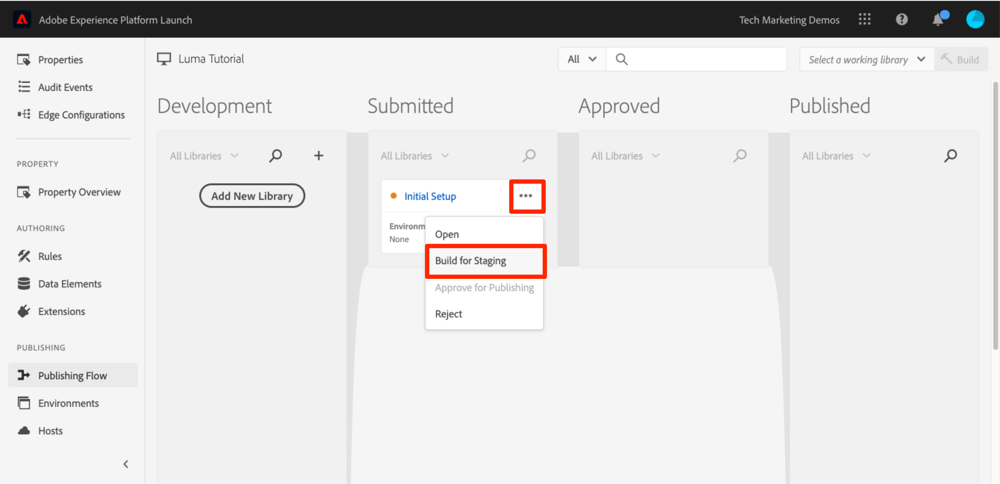

# Publish sua propriedade de tag

Depois de implementar algumas das soluções principais da Adobe Experience Cloud no ambiente de desenvolvimento, é hora de aprender o fluxo de trabalho de publicação.

>[!NOTE]
>
>O Adobe Experience Platform Launch está sendo integrado à Adobe Experience Platform como um conjunto de tecnologias de coleção de dados. Várias alterações de terminologia foram implementadas na interface do que você deve estar ciente ao usar esse conteúdo:
>
> * O Platform Launch (lado do cliente) agora é **[[!DNL tags]](https://experienceleague.adobe.com/docs/experience-platform/tags/home.html?lang=pt-BR)**
> * O Platform Launch Server Side agora é **[[!DNL event forwarding]](https://experienceleague.adobe.com/docs/experience-platform/tags/event-forwarding/overview.html)**
> * As configurações do Edge agora são **[[!DNL datastreams]](https://experienceleague.adobe.com/docs/experience-platform/edge/fundamentals/datastreams.html?lang=pt-BR)**

## Objetivos de aprendizagem

No final desta lição, você poderá:

1. Publicar uma biblioteca de desenvolvimento no ambiente de preparo
1. Mapear uma biblioteca de preparo para seu site de produção usando o Depurador
1. Publicar uma biblioteca de preparo para o ambiente de produção

## Publicar no ambiente de preparo

Agora que você criou e validou sua biblioteca no ambiente de desenvolvimento, é hora de publicá-la no ambiente de preparo.

1. Vá para a página **[!UICONTROL Fluxo de Publicação]**

1. Abra a lista suspensa ao lado da biblioteca e selecione **[!UICONTROL Enviar para aprovação]**

   

1. Clique no botão **[!UICONTROL Enviar]** na caixa de diálogo:

   

1. Sua biblioteca agora aparecerá na coluna [!UICONTROL Enviado] em um estado não construído:

1. Abra a lista suspensa e selecione **[!UICONTROL Compilação para Preparo]**:

   

1. Quando o ícone de ponto verde é exibido, a biblioteca pode ser visualizada no ambiente de preparo.

Em um cenário da vida real, a próxima etapa do processo normalmente deve ser a validação das alterações por parte da sua equipe de controle de qualidade na biblioteca de Preparo. Eles podem fazer isso usando o Debugger.

**Para validar as alterações na biblioteca de Preparo**

1. Na propriedade da tag, abra a página [!UICONTROL Ambientes]

1. Na linha [!UICONTROL Armazenamento], clique no  para abrir o modal

   

1. Clique no  para copiar o código incorporado na área de transferência

1. Clique em **[!UICONTROL Fechar]** para fechar a modal

   

1. Abra o [site de demonstração Luma](https://luma.enablementadobe.com/content/luma/us/en.html) no navegador Chrome

1. Abra a [Extensão do depurador do Experience Platform](https://chromewebstore.google.com/detail/adobe-experience-platform/bfnnokhpnncpkdmbokanobigaccjkpob) clicando no ícone 

   

1. Acesse a guia Ferramentas

1. Adobe Na seção **[!UICONTROL Iniciar > Substituir código incorporado do Launch]**, cole o código incorporado de armazenamento temporário que está na área de transferência
1. Ative a opção **[!UICONTROL Aplicar através da luma.enablementadobe.com]**

1. Clique no ícone do disco para salvar

   

1. Recarregue e verifique a guia Resumo do Debugger. Na seção Launch, você pode ver que sua propriedade de armazenamento temporário está implementada, mostrando o nome da propriedade (por exemplo, &quot;Tutorial de tags&quot; ou o nome que você tenha dado à propriedade)!

   

Na vida real, uma vez que a sua equipe de controle de qualidade tenha se desconectado após analisar as alterações no ambiente de preparo, é hora de publicar na produção.

## Publicar na produção

1. Vá para a página [!UICONTROL Publicação]

1. Na lista suspensa, clique em **[!UICONTROL Aprovar para publicação]**:

   

1. Clique no botão **[!UICONTROL Aprovar]** na caixa de diálogo:

   

1. A biblioteca agora aparecerá na coluna [!UICONTROL Aprovado] no estado não criado (ponto amarelo):

1. Abra a lista suspensa e selecione **[!UICONTROL Build e Publish para produção]**:

   

1. Clique no **[!UICONTROL Publish]** na caixa de diálogo:

   

1. A biblioteca será exibida na coluna [!UICONTROL Publicado]:

   

Pronto! Você concluiu o tutorial e publicou sua primeira propriedade nas tags!
