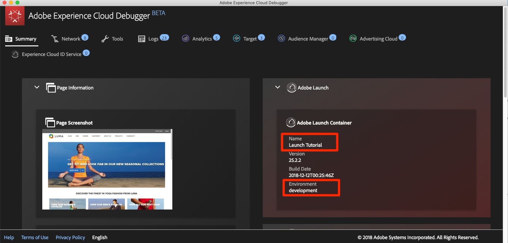
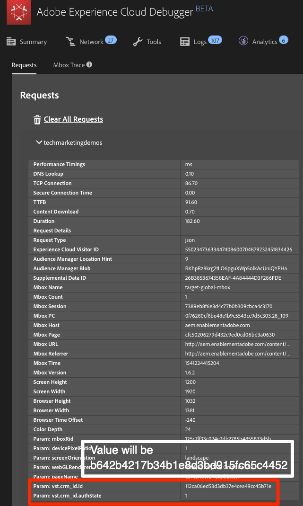
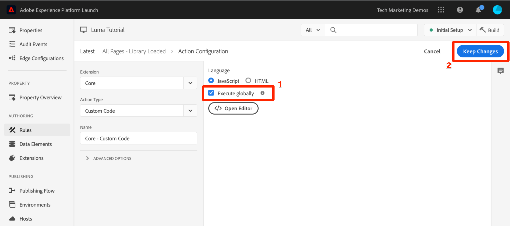
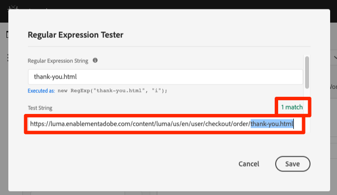

# Adicionar o Adobe Target

Nesta lição, implementaremos a extensão [Adobe Target](https://experienceleague.adobe.com/docs/experience-platform/tags/extensions/adobe/target/overview.html?lang=pt-BR) com uma solicitação de carregamento de página e parâmetros personalizados.

O [Adobe Target](https://docs.adobe.com/content/help/pt-BR/experience-cloud/user-guides/home.translate.html) é a solução da Adobe Experience Cloud que oferece tudo o que você precisa para ajustar e personalizar a experiência do cliente e maximizar a receita em sites da Web e para dispositivos móveis, aplicativos, redes sociais e outros canais digitais.

>[!NOTE]
>
>O Adobe Experience Platform Launch está sendo integrado à Adobe Experience Platform como um conjunto de tecnologias de coleção de dados. Várias alterações de terminologia foram implementadas na interface do que você deve estar ciente ao usar esse conteúdo:
>
> * O Platform Launch (lado do cliente) agora é **[!DNL tags]**
> * O Platform Launch Server Side agora é **[!DNL event forwarding]**
> * As configurações do Edge agora são **[!DNL datastreams]**

## Objetivos de aprendizagem

No final desta lição, você poderá:

* Adicionar o trecho de pré-ocultação usado para gerenciar a oscilação quando se usa o Target com códigos incorporados de tag assíncrona
* Adicionar a extensão Target v2
* Acionar a solicitação de carregamento de página (anteriormente chamada de &quot;mbox global&quot;)
* Adicionar parâmetros à solicitação de carregamento de página
* Explicar como os parâmetros de perfil e de entidade podem ser adicionados à solicitação de carregamento de página
* Acionar a solicitação de confirmação do pedido com parâmetros obrigatórios
* Explica como adicionar configurações avançadas, como Cabeçalho de biblioteca e Código do rodapé da biblioteca
* Validar uma implementação do Target

## Pré-requisitos

Para concluir as lições nesta seção, primeiro conclua as lições em [Configurar tags](create-a-property.md) e [Adicionar o Serviço de Identidade](id-service.md).

## Adicionar o trecho de pré-ocultação do Target

Antes de começarmos, precisamos fazer uma pequena atualização nos códigos incorporados das tags. Quando os códigos incorporados de tag são carregados de forma assíncrona, a página pode terminar a renderização antes da biblioteca do Target ser totalmente carregada e ter realizado a troca de conteúdo. Isso pode levar ao que é conhecido como &quot;oscilação&quot;, onde o conteúdo padrão é exibido brevemente antes de ser substituído pelo conteúdo personalizado especificado pelo Target. Caso deseje evitar essa oscilação, recomendamos codificar um trecho especial de pré-ocultação imediatamente antes dos códigos incorporados assíncronos das tags.

Isso já foi feito no site Luma, mas vamos fazer isso na página de amostra para que você entenda a implementação. Copie as linhas de código a seguir:

```html
<script>
   //prehiding snippet for Adobe Target with asynchronous tags deployment
   ;(function(win, doc, style, timeout) {
   var STYLE_ID = 'at-body-style';
   function getParent() {
      return doc.getElementsByTagName('head')[0];
   }
   function addStyle(parent, id, def) {
      if (!parent) {
      return;
      }
      var style = doc.createElement('style');
      style.id = id;
      style.innerHTML = def;
      parent.appendChild(style);
   }
   function removeStyle(parent, id) {
      if (!parent) {
      return;
      }
      var style = doc.getElementById(id);
      if (!style) {
      return;
      }
      parent.removeChild(style);
   }
   addStyle(getParent(), STYLE_ID, style);
   setTimeout(function() {
      removeStyle(getParent(), STYLE_ID);
   }, timeout);
   }(window, document, "body {opacity: 0 !important}", 3000));
</script>
```

Abra a página de exemplo e a cole antes de seu código incorporado de tag, como é mostrado abaixo (não se preocupe se os números de linha forem diferentes). Nesta captura de tela, o trecho pré-ocultação foi minimizado:


Recarregue sua página de exemplo. Você observará que a página ficará oculta por três segundos antes de ser exibida. Esse comportamento é temporário e desaparecerá depois de implantar o Target. Esse comportamento de pré-ocultação é controlado por duas configurações no final do trecho, que pode ser personalizado, mas que, geralmente, é melhor se deixado nas configurações padrão:

* `body {opacity: 0 !important}` especifica a definição de CSS a ser usada para a pré-ocultação até o Target ser carregado. Por padrão, o corpo inteiro fica oculto. Se você tiver uma estrutura DOM consistente com um elemento de contêiner de fácil identificação que abranja todo o conteúdo em sua navegação, e se nunca quiser testar ou personalizar sua navegação, você poderá usar essa configuração para limitar a pré-ocultação a esse elemento do contêiner.
* `3000` que especifica a configuração de tempo-limite para a pré-ocultação. Por padrão, se o Target não tiver sido carregado em três segundos, a página será exibida. Esse cenário deverá ser extremamente raro.

Para obter mais detalhes e obter o trecho de pré-ocultação unificado, consulte a [extensão do Adobe Target com uma implantação assíncrona](https://experienceleague.adobe.com/docs/experience-platform/tags/extensions/adobe/target/overview.html#adobe-target-extension-with-an-asynchronous-deployment).

## Adicionar a extensão do Target

A extensão do Adobe Target suporta implementações do lado do cliente usando a biblioteca at.js de JavaScript do Target. Para implementações do Web SDK do Adobe Target, consulte o [Tutorial do Experience Platform Web SDK](https://experienceleague.adobe.com/pt-br/docs/platform-learn/implement-web-sdk/applications-setup/setup-target).

A extensão do Target v2 consiste em duas partes principais:

1. A configuração da extensão, que gerencia as principais configurações da biblioteca
1. Ações de regras responsáveis pelos itens a seguir:
   1. Carregar Target (at.js 2.x)
   1. Adicionar parâmetros às solicitações de carregamento de página
   1. Adicionar params a todas as solicitações
   1. Acionar solicitação de carregamento de página

Neste primeiro exercício, adicionaremos a extensão e observaremos as configurações. Em exercícios posteriores, utilizaremos as ações.

**Para adicionar a extensão**

1. Ir para **[!UICONTROL Extensões > Catálogo]**
1. Digite `target` no filtro para localizar rapidamente as extensões do Adobe Target. Há duas extensões: Adobe Target e Adobe Target v2. Este tutorial usará a versão v2 da extensão que usa a versão mais recente do at.js (atualmente 2.x), ideal para sites tradicionais e aplicativos de página única (SPA).
1. Clique em **[!UICONTROL Instalar]**

   

1. Ao adicionar a extensão, ela importará muitas, mas não todas as suas configurações do at.js da interface do Target, como mostrado abaixo. Uma configuração que não será importada é o Tempo-limite, que é sempre de 3000 ms depois de adicionar a extensão. No tutorial, mantenha as configurações padrão. Observe que, no lado esquerdo, será exibida a versão at.js fornecida com a versão atual da extensão.

1. Clique em **[!UICONTROL Salvar na biblioteca]**

   

Neste momento, o Target ainda não está fazendo nada, portanto não há nada para ser validado.

>[!NOTE]
>
>Cada versão da extensão do Target vem com uma versão específica do at.js, que está listada na descrição da extensão. Atualize a versão do at.js atualizando a extensão do Target.

## Carregar o Target e acionar a solicitação de carregamento de página

Os profissionais de marketing usam o Target para controlar a experiência do visitante na página na fase de testes e ao direcionar conteúdo. Devido a essa importante função na exibição da página, você deve carregar o Target o mais rápido possível para minimizar o impacto na visibilidade da página. Nesta seção, carregaremos a biblioteca JavaScript do Target, o at.js, e acionaremos a solicitação de carregamento de página (chamada de &quot;mbox global&quot; em versões anteriores do at.js).

Use a regra `All Pages - Library Loaded` criada na lição &quot;[Adicionar elementos de dados, regras e bibliotecas](add-data-elements-rules.md)&quot; para implementar o Target, pois ele já é acionado o mais cedo possível em carregamentos de página.

**Para carregar o Target**

1. Vá para as **[!UICONTROL Regras]** na navegação à esquerda e clique em `All Pages - Library Loaded` para abrir o editor de regras

   

1. Em Ações, clique em  para adicionar uma nova ação

   

1. Selecionar **[!UICONTROL Extensão > Adobe Target v2]**

1. Selecione **[!UICONTROL Tipo de ação > Carregar destino]**

1. Clique em **[!UICONTROL Manter alterações]**

   

Com a ação `Load Target` adicionada, o at.js será carregado na página. No entanto, nenhuma solicitação do Target será acionada até que a ação `Fire Page Load Request` seja adicionada.

**Para acionar solicitação de carregamento de página**

1. Em Ações, clique no  novamente para adicionar outra ação

   

1. Selecionar **[!UICONTROL Extensão > Adobe Target v2]**

1. Selecione **[!UICONTROL Tipo de ação > Solicitação de carregamento de página de acionamento]**

1. Há algumas configurações disponíveis para a solicitação de carregamento de página relacionada à ocultação ou não da página e ao seletor de CSS para uso na pré-ocultação. Essas configurações funcionam juntamente com o trecho de pré-ocultação codificado na página. Mantenha as configurações padrão.

1. Clique em **[!UICONTROL Manter alterações]**

   

1. A nova ação é adicionada em sequência após a ação `Load Target` e as ações serão executadas nessa ordem. Você pode arrastar e soltar as ações para reorganizar a ordem, mas nesse cenário, `Load Target` precisa estar antes de `Fire Page Load Request`.

1. Clique em **[!UICONTROL Salvar na biblioteca e na build]**

   

### Validar a solicitação de carregamento de página

Agora que você adicionou a extensão Target v2 e acionou as ações `Load Target` e `Fire Page Load Request`, deve haver uma solicitação de carregamento de página feita em todas as páginas em que a propriedade da tag é usada.

**Para validar as ações Carregar Target e Acionar solicitação de carregamento de página**

1. Recarregue sua página de exemplo. Você não deve mais ver um atraso de três segundos antes da página estar visível. Se você estiver carregando página de exemplo usando o protocolo `file://`, é indicado fazer essa etapa em um navegador Firefox ou Safari, porque o Chrome não aciona uma solicitação do Target ao usar o protocolo `file://`.

1. Abra o [site Luma](https://luma.enablementadobe.com/content/luma/us/en.html).

1. Certifique-se de que o Depurador está mapeando a propriedade da tag para o *seu* ambiente de desenvolvimento, conforme descrito na [lição anterior](switch-environments.md)

   

1. Vá para a guia Resumo do Debugger

1. Na seção `Launch`, confirme se o `Target` aparece abaixo do cabeçalho `Extensions`.

1. Na seção `Target`, confirme se a versão da biblioteca do at.js é exibida

   

1. Finalmente, acesse a guia `Target`, expanda o código do cliente e confirme se a solicitação de carregamento de página é exibida:

   

Parabéns! Você implementou o Target!

## Adicionar parâmetros

Transmitir parâmetros na solicitação do Target adiciona recursos avançados as suas atividades de direcionamento, de testes e de personalização. A extensão de tag fornece duas ações para transmitir parâmetros:

1. `Add Params to Page Load Request`, que adiciona parâmetros às solicitações de carregamento de página (equivalente ao método [targetPageParams()](https://experienceleague.adobe.com/docs/target/using/implement-target/client-side/functions-overview/cmp-atjs-functions.html))

1. `Add Params to All Requests`, que adiciona parâmetros em todas as solicitações do Target, por exemplo, a solicitação de carregamento de página mais solicitações adicionais feitas a partir de ações de Código personalizado ou codificadas no site (equivalente ao método [targetPageParamsAll()](https://experienceleague.adobe.com/docs/target/using/implement-target/client-side/functions-overview/cmp-atjs-functions.html))

Essas ações podem ser usadas *antes* da ação `Load Target` e podem definir diferentes parâmetros em páginas diferentes com base nas configurações de regras. Use o recurso de ordenação de regras usado ao definir IDs do cliente com o Serviço de identidade para definir parâmetros adicionais no evento `Library Loaded` antes da regra disparar a solicitação de carregamento de página.
>[!TIP]
>
>Como a maioria das implementações usa a solicitação de carregamento de página para a entrega da atividade, geralmente é suficiente apenas usar a ação `Add Params to Page Load Requests`.

### Parâmetros de solicitação (mbox)

Os parâmetros são usados para transmitir dados personalizados para o Target, enriquecendo seus recursos de personalização. Eles são ideais para atributos que mudam frequentemente durante uma sessão de navegação, como nome da página, modelo etc. e não persistem.

Vamos adicionar o elemento de dados `Page Name` criado anteriormente na lição [Adicionar elementos de dados, regras e bibliotecas](add-data-elements-rules.md) como parâmetro de solicitação.

**Para adicionar o parâmetro de solicitação**

1. Vá para as **[!UICONTROL Regras]** na navegação à esquerda e clique em `All Pages - Library Loaded` para abrir o editor de regras.

   

1. Em Ações, clique em  para adicionar uma nova ação

   

1. Selecionar **[!UICONTROL Extensão > Adobe Target v2]**

1. Selecione **[!UICONTROL Tipo de ação > Adicionar parâmetros à solicitação de carregamento de página]**

1. Digite `pageName` como **[!UICONTROL Nome]**

1. Clique no  para abrir a modal do elemento de dados

1. Clique no elemento de dados `Page Name`

1. Clique no botão **[!UICONTROL Selecionar]**

   

1. Clique em **[!UICONTROL Manter alterações]**

   

1. Clique e arraste na borda esquerda da ação `Add Params to Page Load Request` para reorganizar as ações antes da ação `Fire Page Load Request` (pode ser antes ou depois de `Load Target`)

1. Clique em **[!UICONTROL Salvar na biblioteca e na build]**

   

#### Validar parâmetros de solicitação

Por enquanto, os parâmetros personalizados transmitidos com solicitações at.js 2.x não são facilmente visíveis no Debugger, portanto, utilizaremos as ferramentas do desenvolvedor do navegador.

**Para validar o parâmetro de solicitação pageName**

1. Recarregue o site Luma, certificando-se de que ele esteja mapeado para sua própria propriedade de tag
1. Abra as ferramentas do desenvolvedor do seu navegador.
1. Clique na guia Rede
1. Filtrar as solicitações para `tt.omtrdc` (ou seu domínio CNAME&#39;d para solicitações do Target)
1. Expanda a seção `Headers` > `Request Payload` > `execute.pageLoad.parameters` para validar o parâmetro e o valor `pageName`


<!--Now go to the **[!UICONTROL Target]** tab in the Debugger. Expand your client code and look at the requests. You should see the new `pageName` parameter passed in the request:

-->

### Parâmetros do perfil

Semelhante aos parâmetros de solicitação, os parâmetros do perfil também são transmitidos por meio da solicitação do Target. No entanto, os parâmetros de perfil são armazenados no banco de dados de perfis de visitantes do Target e persistem pela [duração do perfil do visitante](https://experienceleague.adobe.com/docs/target/using/audiences/visitor-profiles/visitor-profile-lifetime.html). É possível defini-los em uma página do seu site e usá-los em atividades do Target em outra página. Este é um exemplo de um site de automóveis. Quando um visitante acessa uma página de veículos, é possível transmitir um parâmetro de perfil &quot;profile.lastViewed=sportscar&quot; para registrar o interesse do cliente nesse veículo específico. Quando o visitante navega para outras páginas que não sejam de veículos, você pode direcionar o conteúdo com base no último veículo visualizado.  Parâmetros de perfil são ideais para atributos que raramente mudam ou que estão disponíveis apenas em determinadas páginas

Você não vai transmitir parâmetros de perfil neste tutorial, mas o fluxo de trabalho é quase idêntico ao que você fez ao transmitir o parâmetro `pageName`. A diferença é que você precisa dar nomes de perfil aos parâmetros de perfil com um prefixo `profile.`. É assim que um parâmetro de perfil chamado &quot;userType&quot; seria na ação `Add Params to Page Load Request`:


### Parâmetros de entidade

Parâmetros de entidade são parâmetros especiais usados em [implementações do Recomendações](https://experienceleague.adobe.com/docs/target/using/recommendations/plan-implement.html) por três motivos principais:

1. Como uma chave para acionar as recomendações do produto. Por exemplo, ao usar um algoritmo de recomendações como o &quot;Pessoas que visualizaram o Produto X, também visualizaram Y&quot;, &quot;X&quot; é a &quot;chave&quot; da recomendação. Normalmente, é o SKU (`entity.id`) ou a categoria (`entity.categoryId`) do produto que o visitante está visualizando atualmente.
1. Para coletar o comportamento do visitante e incrementar os algoritmos de recomendações, como &quot;Produtos visualizados recentemente&quot; ou &quot;Produtos mais visualizados&quot;
1. Para preencher o catálogo de Recomendações. As Recomendações contêm um banco de dados de todos os produtos ou artigos do site para que possam ser oferecidos na oferta de recomendação. Por exemplo, ao recomendar produtos, normalmente deseja-se exibir atributos como o nome do produto (`entity.name`) e a imagem (`entity.thumbnailUrl`). Alguns clientes preenchem o catálogo usando feeds de backend, mas também podem ser preenchidos usando parâmetros de entidade em solicitações do Target.

Você não precisa transmitir nenhum parâmetro de entidade neste tutorial, mas o fluxo de trabalho é idêntico ao que você fez anteriormente ao transmitir o parâmetro de solicitação `pageName`, basta dar ao parâmetro um nome com prefixo &quot;entity&quot;. e mapeá-lo para o elemento de dados relevante. Observe que algumas entidades comuns têm nomes reservados que devem ser usados (por exemplo, entity.id para o SKU do produto). Esta é a aparência ao definir parâmetros de entidade na ação `Add Params to Page Load Request`:


### Adicionar parâmetros de ID do cliente

A coleta de IDs do cliente com o Serviço de identidade da Adobe Experience Platform facilita a importação de dados do CRM para o Target usando o recurso [Atributos do cliente](https://experienceleague.adobe.com/docs/target/using/audiences/visitor-profiles/working-with-customer-attributes.html?lang=pt-BR) da Adobe Experience Cloud. Ela também permite a identificação de [visitantes em vários dispositivos](https://experienceleague.adobe.com/docs/target/using/integrate/experience-cloud-device-co-op.html), permitindo manter uma experiência de usuário consistente à medida que seus clientes alternam entre um laptop e um dispositivo móvel.

É imperativo definir a ID do cliente na ação `Set Customer IDs` do Serviço de identidade antes de acionar a solicitação de carregamento de página. Para esse fim, verifique se você tem os recursos a seguir no site:

* A ID do cliente deve estar disponível na página antes do código incorporado das tags
* A extensão do Serviço de identidade da Adobe Experience Platform deve ser instalada
* Você deve usar a ação `Set Customer IDs` em uma regra que é acionada no evento “Biblioteca carregada (parte superior da página)”
* Use a ação `Fire Page Load Request` em uma regra que é acionada *depois* da ação “Definir IDs de cliente”

Na lição anterior, [Adicionar o Serviço de identidade da Adobe Experience Platform](id-service.md), você criou a regra `All Pages - Library Loaded - Authenticated - 10` para acionar a ação &quot;Definir ID do cliente&quot;. Como essa regra tem uma configuração `Order` de `10`, as IDs do cliente são definidas antes que nossa solicitação de carregamento de página seja acionada a partir da regra `All Pages - Library Loaded` com sua configuração `Order` de `50`. Assim, você já implementou a coleção de IDs de cliente do Target!

#### Validar as IDs do cliente

Por enquanto, os parâmetros personalizados transmitidos com solicitações at.js 2.x não são facilmente visíveis no Debugger, portanto, utilizaremos as ferramentas do desenvolvedor do navegador.

**Para validar as IDs do cliente**

1. Abra o [site Luma](https://luma.enablementadobe.com/content/luma/us/en.html).

1. Certifique-se de que o Depurador está mapeando a propriedade da tag para o *seu* ambiente de desenvolvimento, conforme descrito na [lição anterior](switch-environments.md)

   

1. Faça logon no site Luma usando as credenciais `test@test.com`/`test`
1. Retorne à [página inicial do Luma](https://luma.enablementadobe.com/content/luma/us/en.html)

1. Abra as ferramentas do desenvolvedor do seu navegador.
1. Clique na guia Rede
1. Filtrar as solicitações para `tt.omtrdc` (ou seu domínio CNAME&#39;d para solicitações do Target)
1. Expanda a seção `Headers` > `Request Payload` > `id.customerIds.0` para validar as configurações e o valor da ID do cliente:


<!--
1. Open the Debugger
1. Go to the Target tab
1. Expand your client code
1. You should see parameters in the latest Target request for `vst.crm_id.id` and `vst.crm_id.authState`. `vst.crm_id.id` should have a value of the hashed email address and `vst.crm_id.authState` should have a value of `1` to represent `authenticated`. Note that `crm_id` is the `Integration Code` you specified in the Identity Service configuration and must align with the key you use in your [Customer Attributes data file](https://experienceleague.adobe.com/docs/core-services/interface/customer-attributes/t-crs-usecase.html):


-->

>[!WARNING]
>
>O Serviço de identidade da Adobe Experience Platform permitirá o envio de várias IDs para o Serviço. No entanto, somente a primeira será enviada para o Target.

### Adicionar o parâmetro de Token de propriedade

>[!NOTE]
>
>Isso é um exercício opcional para clientes do Target Premium.

O token de propriedade é um parâmetro reservado usado com o recurso [Permissões de usuário empresarial](https://experienceleague.adobe.com/docs/target/using/administer/manage-users/enterprise/property-channel.html?lang=pt-BR) do Target Premium. É usado para definir diferentes propriedades digitais que membros distintos de uma organização da Experience Cloud possam receber diferentes permissões para cada propriedade. Por exemplo, você pode querer que um grupo de usuários possa configurar atividades do Target em seu site, mas não em seu aplicativo móvel.

As propriedades do Target são análogas às propriedades de tags e aos conjuntos de relatórios do Analytics. Uma empresa com várias marcas, sites e equipes de marketing pode usar uma propriedade do Target, de tag e um conjunto de relatórios do Analytics diferentes para cada site ou aplicativo móvel. As propriedades das tags são diferenciadas por seus códigos incorporados, os conjuntos de relatórios do Analytics são diferenciados por sua ID do conjunto de relatórios e as propriedades do Target são diferenciadas pelo parâmetro de token de propriedade.


O token de propriedade deve ser implementado usando uma ação de código personalizado nas marcas com a função `targetPageParams()`. Se estiver implementando vários sites com diferentes valores de at_property usando diferentes valores de at_property com uma única propriedade de tag, você poderá gerenciar o valor de at_property por meio de um elemento de dados.

Este é um exercício opcional, caso seja um cliente do Target Premium e deseje implementar um token de propriedade na sua propriedade Tutorial:

1. Em uma guia separada, abra a interface do usuário do Target

1. Ir para **[!UICONTROL Administração > Propriedades]**

1. Identifique a Propriedade que deseja usar e clique em **[!UICONTROL &lt;/>]** (ou crie uma nova propriedade)

1. Copie o trecho de código dentro de `<script></script>` para a área de transferência

   

1. Na guia Marcas, vá para as **[!UICONTROL Regras]** na navegação à esquerda e clique em `All Pages - Library Loaded` para abrir o editor de regras.

   

1. Em Ações, clique na ação `Core - Custom Code` para abrir a variável `Action Configuration`

   

1. Abra o editor de código e cole o código da interface do Target que contém a função `targetPageParams()`
1. Clique no botão **[!UICONTROL Salvar]**

   

1. Marque a caixa **[!UICONTROL Executar globalmente]** para que `targetPageParams()` seja declarado no escopo global
1. Clique em **[!UICONTROL Manter alterações]**

   

1. Clique em **[!UICONTROL Salvar na biblioteca e na build]**
   

>[!WARNING]
>
>Se você tentar adicionar o parâmetro `at_property` por meio da ação **[!UICONTROL Adicionar parâmetros à solicitação de carregamento de página]**, o parâmetro será preenchido na solicitação de rede, mas o Visual Experience Composer (VEC) do Target não poderá detectá-lo automaticamente ao carregar a página. Sempre preencha `at_property` usando a função `targetPageParams()` em uma ação de Código personalizado.

#### Validar o token de propriedade

Por enquanto, os parâmetros personalizados transmitidos com solicitações at.js 2.x não são facilmente visíveis no Debugger, portanto, utilizaremos as ferramentas do desenvolvedor do navegador.

**Para validar o parâmetro do token de propriedade**

1. Abra o [site Luma](https://luma.enablementadobe.com/content/luma/us/en.html).
1. Certifique-se de que o Depurador está mapeando a propriedade da tag para o *seu* ambiente de desenvolvimento, conforme descrito na [lição anterior](switch-environments.md)

   

1. Abra as ferramentas do desenvolvedor do seu navegador.
1. Clique na guia Rede
1. Filtrar as solicitações para `tt.omtrdc` (ou seu domínio CNAME&#39;d para solicitações do Target)
1. Expanda a seção `Headers` > `Request Payload` > `property.token` para validar o valor
   

<!--
1. Go to the `Target` tab
1. Expand your client code
1. You should see the parameter for "at_property" in every page load request request as you browse the site:

-->

## Adicionar solicitações personalizadas

### Adicionar uma solicitação de confirmação de pedido

A solicitação de confirmação do pedido é um tipo especial de solicitação usada para enviar detalhes do pedido ao Target. A inclusão de três parâmetros de solicitação específicos (orderId, orderTotal e productPurchasedId) é o que transforma uma solicitação regular do Target em uma solicitação de pedido. Além de gerar relatórios de receita, a solicitação de pedido também faz o seguinte:

1. Corrige a duplicação de reenvios de pedidos acidentais
1. Filtra pedidos extremos (qualquer pedido cujo total tenha mais de três desvios padrão na média)
1. Usa um algoritmo diferente em segundo plano para calcular a confiança estatística
1. Cria um relatório de auditoria especial de detalhes de pedidos individuais disponível para download

A prática recomendada é usar uma solicitação de confirmação de pedido em todos os funis de pedido, mesmo em sites que não sejam de varejo. Por exemplo, os sites de geração de leads geralmente possuem funis de leads com uma “id de lead” exclusiva gerada no fim. Esses sites devem implementar uma solicitação de pedido, usando um valor estático (como &quot;1&quot;) para o orderTotal.

Os clientes que usam a integração Analytics for Target (A4T) para a maioria de seus relatórios também podem querer implementar a solicitação de pedido se estiverem usando atividades do Automated Personalization, que não são compatíveis com o A4T. Além disso, a solicitação de pedido é um elemento essencial em implementações do Recommendations, alimentando algoritmos com base no comportamento de compra. Para obter as informações mais recentes sobre o suporte ao A4T, consulte [a documentação](https://experienceleague.adobe.com/docs/target/using/integrate/a4t/a4t.html?lang=en#section_F487896214BF4803AF78C552EF1669AA).

A solicitação de confirmação de pedido deve ser acionada a partir de uma regra que é acionada somente na página ou evento de confirmação do pedido. Geralmente, pode ser combinado com uma regra que define o evento de compra do Adobe Analytics. Ela deve ser configurada usando a ação Código personalizado da extensão principal, usando os elementos de dados apropriados para definir os parâmetros orderId, orderTotal e productPurchasedId.

Vamos adicionar os elementos de dados e a regra que precisamos para acionar uma solicitação de confirmação de pedido no site Luma. Como você já criou vários elementos de dados, essas instruções estarão abreviadas.

**Para criar o elemento de dados para a ID do pedido**

1. Clique em **[!UICONTROL Elementos de dados]** na navegação à esquerda
1. Clique em **[!UICONTROL Adicionar elemento de dados]**
1. Nomeie o elemento de dados `Order Id`
1. Selecione **[!UICONTROL Tipo de elemento de dados > Variável JavaScript]**
1. Use `digitalData.cart.orderId` como `JavaScript variable name`
1. Marque a opção `Clean text`
1. Clique em **[!UICONTROL Salvar na biblioteca]**
(Não criaremos a biblioteca até que todas as alterações sejam feitas na solicitação de confirmação do pedido)

**Para criar o elemento de dados para a Quantidade do carrinho**

1. Clique em **[!UICONTROL Adicionar elemento de dados]**
1. Nomeie o elemento de dados `Cart Amount`
1. Selecione **[!UICONTROL Tipo de elemento de dados > Variável JavaScript]**
1. Use `digitalData.cart.cartAmount` como `JavaScript variable name`
1. Marque a opção `Clean text`
1. Clique em **[!UICONTROL Salvar na biblioteca]**

**Para criar o elemento de dados dos SKUs do carrinho (Target)**

1. Clique em **[!UICONTROL Adicionar elemento de dados]**
1. Nomeie o elemento de dados `Cart SKUs (Target)`
1. Selecione **[!UICONTROL Tipo de elemento de dados > Código personalizado]**
1. Para o Target, as SKUs devem estar em uma lista separada por vírgulas. Esse código personalizado reformatará a matriz da camada de dados no formato apropriado. No editor de código personalizado, cole o seguinte:

   ```javascript
   var targetProdSkus="";
   for (var i=0; i<digitalData.cart.cartEntries.length; i++) {
     if(i>0) {
       targetProdSkus = targetProdSkus + ",";
     }
     targetProdSkus = targetProdSkus + digitalData.cart.cartEntries[i].sku;
   }
   return targetProdSkus;
   ```

1. Marque a opção `Force lowercase value`
1. Marque a opção `Clean text`
1. Clique em **[!UICONTROL Salvar na biblioteca]**

Agora precisamos criar uma regra para acionar a solicitação de confirmação de pedido com esses elementos de dados como parâmetros na página de confirmação de pedido.

**Para criar a regra da página Confirmação de pedido**

1. Clique em **[!UICONTROL Regras]** na navegação à esquerda
1. Clique em **[!UICONTROL Adicionar regra]**
1. Atribua um nome à regra `Order Confirmation Page - Library Loaded - 60`
1. Clique em **[!UICONTROL Eventos > Adicionar]**
   1. Selecione **[!UICONTROL Tipo de evento > Biblioteca carregada (Parte superior da página)]**
   1. Em **[!UICONTROL Opções Avançadas]**, altere `Order` para `60` para que seja acionado após a ação `Load Target` (que está em nossa regra `All Pages - Library Loaded`, em que `Order` está definido como `50`)
   1. Clique em **[!UICONTROL Manter alterações]**
1. Clique em **[!UICONTROL Condições > Adicionar]**
   1. Selecione **[!UICONTROL Tipo De Condição > Caminho Sem Cadeia De Caracteres De Consulta]**
   1. Para `Path equals` insira `thank-you.html`
   1. Alterne a opção Regex para alterar a lógica de `equals` para `contains` (você pode usar o recurso `Test` para confirmar se o teste será aprovado com o URL `https://luma.enablementadobe.com/content/luma/us/en/user/checkout/order/thank-you.html`

      

   1. Clique em **[!UICONTROL Manter alterações]**
1. Clique em **[!UICONTROL Ações > Adicionar]**
   1. Selecione **[!UICONTROL Tipo de ação > Código personalizado]**
   1. Clique em **[!UICONTROL Abrir editor]**
   1. Cole o código a seguir no modal `Edit Code`:

      ```javascript
      adobe.target.getOffer({
        "mbox": "orderConfirmPage",
        "params":{
           "orderId": _satellite.getVar('Order Id'),
           "orderTotal": _satellite.getVar('Cart Amount'),
          "productPurchasedId": _satellite.getVar('Cart SKUs (Target)')
        },
        "success": function(offer) {
          adobe.target.applyOffer({
            "mbox": "orderConfirmPage",
            "offer": offer
          });
        },
        "error": function(status, error) {
          console.log('Error', status, error);
        }
      });
      ```

   1. Clique em **[!UICONTROL Salvar]** para salvar o código personalizado
   1. Clique em **[!UICONTROL Manter alterações]** para manter a ação
1. Clique em **[!UICONTROL Salvar na biblioteca e na build]**

#### Validar a solicitação de confirmação do pedido

Por enquanto, os parâmetros personalizados transmitidos com solicitações at.js 2.x não são facilmente visíveis no Debugger, portanto, utilizaremos as ferramentas do desenvolvedor do navegador.

1. Abra o [site Luma](https://luma.enablementadobe.com/content/luma/us/en.html).

1. Certifique-se de que o Depurador está mapeando a propriedade da tag para o *seu* ambiente de desenvolvimento, conforme descrito na [lição anterior](switch-environments.md)

   

1. Navegue pelo site e adicione vários produtos ao carrinho
1. Prossiga para o check-out
1. Durante o processo de check-out, os únicos campos obrigatórios são `First Name` e `Last Name`

   

1. Na página Revisar pedido, clique no botão `Place Order`.
1. Abra as ferramentas do desenvolvedor do seu navegador.
1. Clique na guia Rede
1. Filtrar as solicitações para `tt.omtrdc` (ou seu domínio CNAME&#39;d para solicitações do Target)
1. Clique na segunda solicitação
1. Expanda a seção `Headers` > `Request Payload` > `execute.mboxes.0` para validar o nome da solicitação e os parâmetros do pedido:


<!--
1. Look in the Debugger
1. Go to the Target tab
1. Expand your client code
1. You should see the `orderConfirmPage` request as the latest Target request with the orderId, orderTotal, and productPurchasedId parameters populated with the details of your order

   link to "orderConfirmPage request with required parameters": images/target-debugger-orderConfirmPage.png 
-->

### Solicitações personalizadas

Há raras ocasiões em que você precisa fazer solicitações do Target diferentes das solicitações de carregamento de página e de confirmação de pedido. Por exemplo, às vezes, os dados importantes que você gostaria de usar na personalização não são definidos na página antes dos códigos incorporados da tag. Eles podem ser codificados na parte inferior da página ou retornados de uma solicitação assíncrona de API. Esses dados podem ser enviados para o Target usando uma solicitação adicional, embora não seja ideal usar essa solicitação para entrega de conteúdo, já que a página já está visível. Esses dados podem ser usados para aprimorar o perfil do visitante para uso posterior (usando parâmetros de perfil) ou para preencher o catálogo de recomendações.

Nessas circunstâncias, use a ação Código personalizado na extensão principal para acionar uma solicitação usando os métodos [getOffer()](https://experienceleague.adobe.com/docs/target-dev/developer/client-side/at-js-implementation/functions-overview/adobe-target-getoffer.html)/[applyOffer()](https://experienceleague.adobe.com/docs/target-dev/developer/client-side/at-js-implementation/functions-overview/adobe-target-applyoffer.html) e [trackEvent()](https://experienceleague.adobe.com/docs/target-dev/developer/client-side/at-js-implementation/functions-overview/adobe-target-trackevent.html). Isso é muito semelhante ao que você fez na [Solicitação de confirmação de pedido](#order-confirmation-request) exercício, mas você usará um nome de solicitação diferente e não usará os parâmetros de pedido especiais. Certifique-se de usar a ação **[!UICONTROL Carregar Target]** antes de fazer solicitações do Target a partir do código personalizado.

## Cabeçalho da biblioteca e Rodapé da biblioteca

A tela Editar at.js na interface do usuário do Target possui locais em que você pode colar o JavaScript personalizado que será executado imediatamente antes ou depois do arquivo at.js. O cabeçalho da biblioteca às vezes é usado para substituir configurações do at.js por meio da função
[targetGlobalSettings()](https://experienceleague.adobe.com/docs/target/using/implement-target/client-side/functions-overview/targetgobalsettings.html) ou para transmitir dados de terceiros usando o recurso [Provedores de dados](https://experienceleague.adobe.com/docs/target-learn/tutorials/integrations/use-data-providers-to-integrate-third-party-data.html). Às vezes, o rodapé da biblioteca é usado para adicionar ouvintes de eventos [personalizados at.js](https://experienceleague.adobe.com/docs/target-dev/developer/client-side/at-js-implementation/functions-overview/atjs-custom-events.html).

Para replicar esse recurso em tags, use a ação Código personalizado na extensão principal e sequencie a ação antes (Cabeçalho da biblioteca) ou depois (Rodapé da biblioteca) da ação Carregar meta. Isso pode ser feito na mesma regra da ação `Load Target` (como mostrado abaixo) ou em regras separadas, com eventos ou configurações de pedido que são acionados de maneira confiável antes ou depois da regra que contém `Load Target`:


Para saber mais sobre os casos de uso para cabeçalhos e rodapés personalizados, consulte os seguintes recursos:

* [Usar dataProviders para integrar dados de terceiros ao Adobe Target](https://experienceleague.adobe.com/docs/target-learn/tutorials/integrations/use-data-providers-to-integrate-third-party-data.html)
* [Implementar de dataProviders para integrar dados de terceiros ao Adobe Target](https://experienceleague.adobe.com/docs/target-learn/tutorials/integrations/implement-data-providers-to-integrate-third-party-data.html)
* [Usar Tokens de resposta e Eventos personalizados do at.js com o Adobe Target](https://experienceleague.adobe.com/docs/target-learn/tutorials/integrations/use-response-tokens-and-atjs-custom-events.html)

[Próximo: &quot;Adicionar o Adobe Analytics&quot; >](analytics.md)
